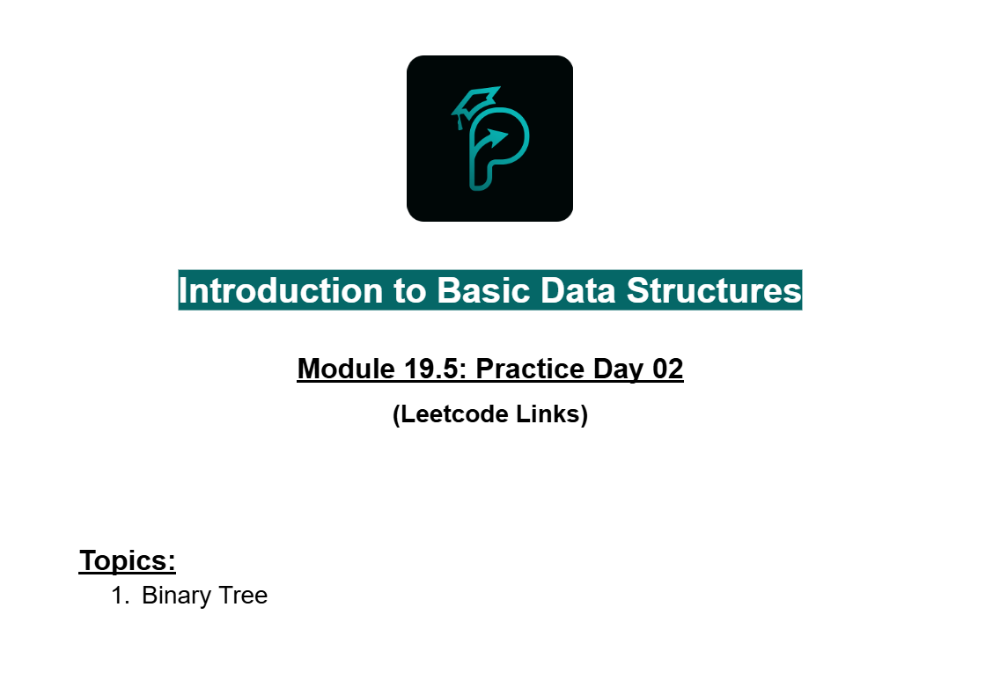
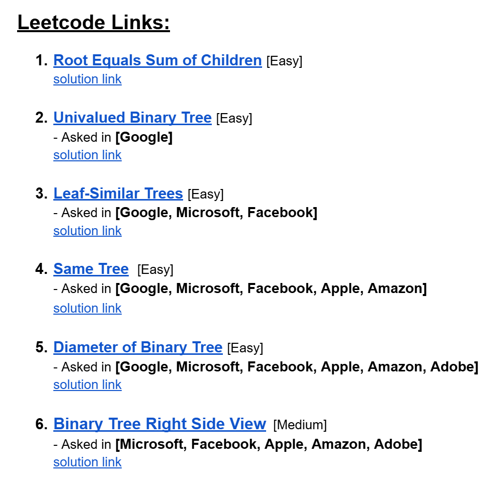

# Date: 30 July, 2025 - Wednesday

## Topics:
- Practice Problem Set: Module 19.5
- 1 Practice

## Practice Problem Set: Module 19.5
- [Practice Problem Link](https://docs.google.com/document/d/1-c1LMMR8-mpqFAAwtfXRrgMkaObAlb-k/edit?usp=drivesdk&ouid=112433310488936743525&rtpof=true&sd=true)
- 
- 
- [Problem 1](https://leetcode.com/problems/root-equals-sum-of-children/)
    - [Solution Link](https://leetcode.com/problems/root-equals-sum-of-children/solutions/7013110/1-line-solution-no-need-any-explanation-583mv/)
- [Problem 2](https://leetcode.com/problems/univalued-binary-tree/)
    - [Solution Link](https://leetcode.com/problems/univalued-binary-tree/solutions/7013153/simple-recursion-beats-100-by-piaaaas-cvne/)
- [Problem 3](https://leetcode.com/problems/leaf-similar-trees/)
    - [Solution Link](https://leetcode.com/problems/leaf-similar-trees/solutions/7013188/simple-preorder-beats-100-by-piaaaas-x7o0/)
- [Problem 4](https://leetcode.com/problems/same-tree/)
    - [Solution Link](https://leetcode.com/problems/same-tree/solutions/7016469/simple-5-liner-soluiton-beats-100-by-pia-hv16/)
- [Problem 5](https://leetcode.com/problems/diameter-of-binary-tree/description/)
    - [Solution Link](https://leetcode.com/problems/diameter-of-binary-tree/solutions/6979539/simple-recursion-by-piaaaas-o3qk/)
- [Problem 6](https://leetcode.com/problems/binary-tree-right-side-view/description/)
    - [Solution Link](https://leetcode.com/problems/binary-tree-right-side-view/solutions/6979528/simple-clean-tracking-visited-by-piaaaas-dcxm/)

## 1 Practice
- Explanation those whole practice problems in this video.
- 