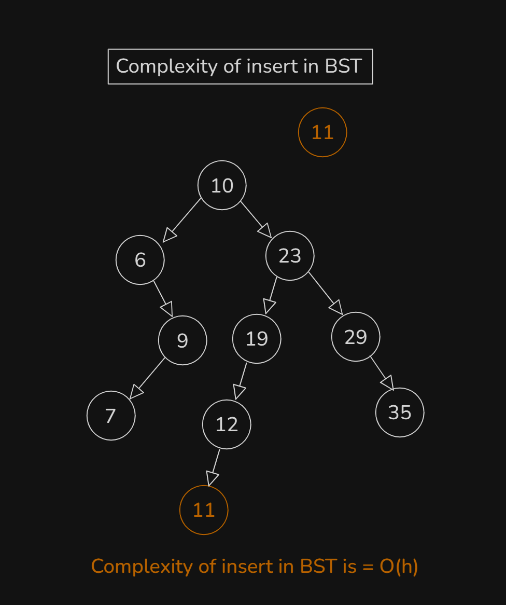
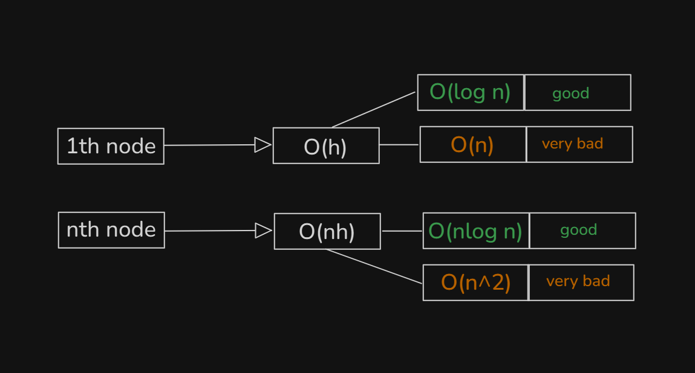
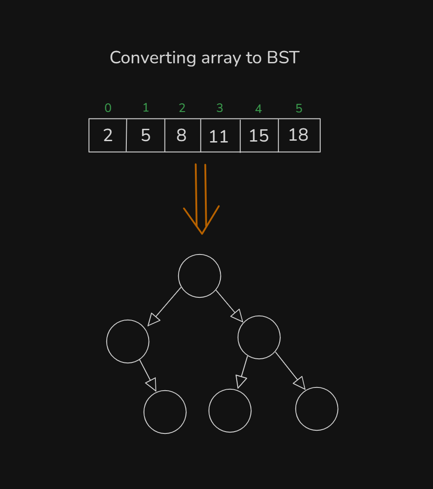
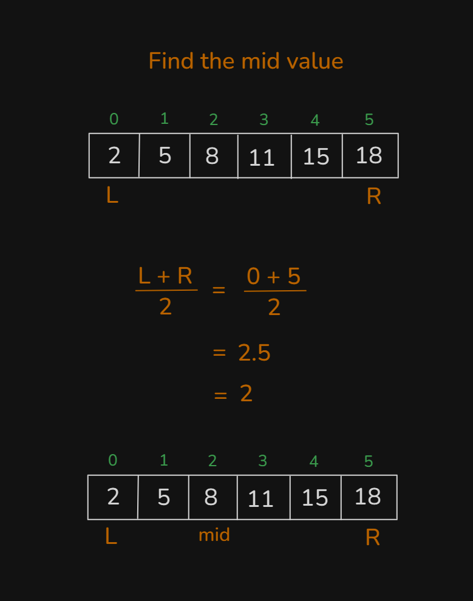
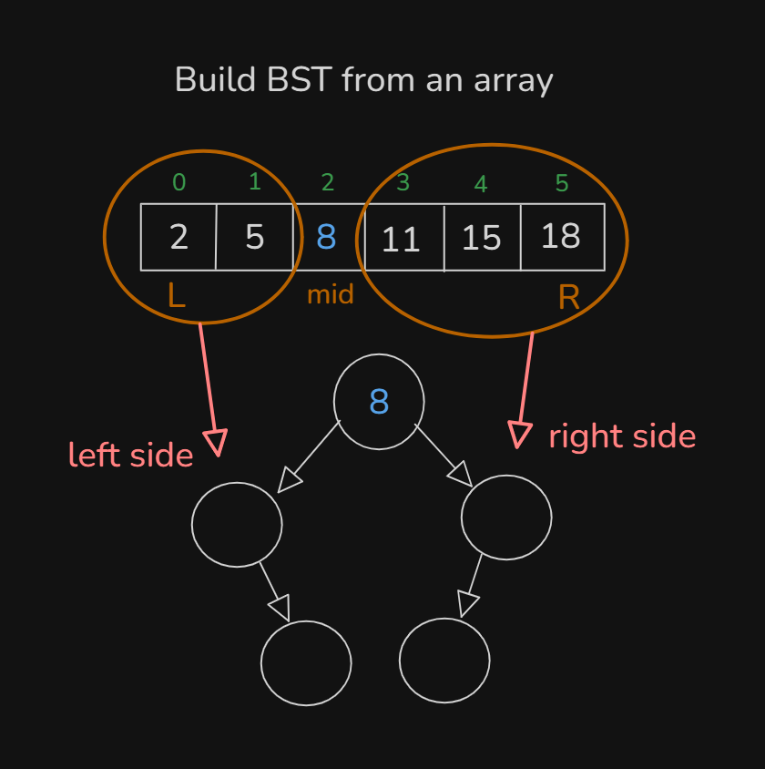
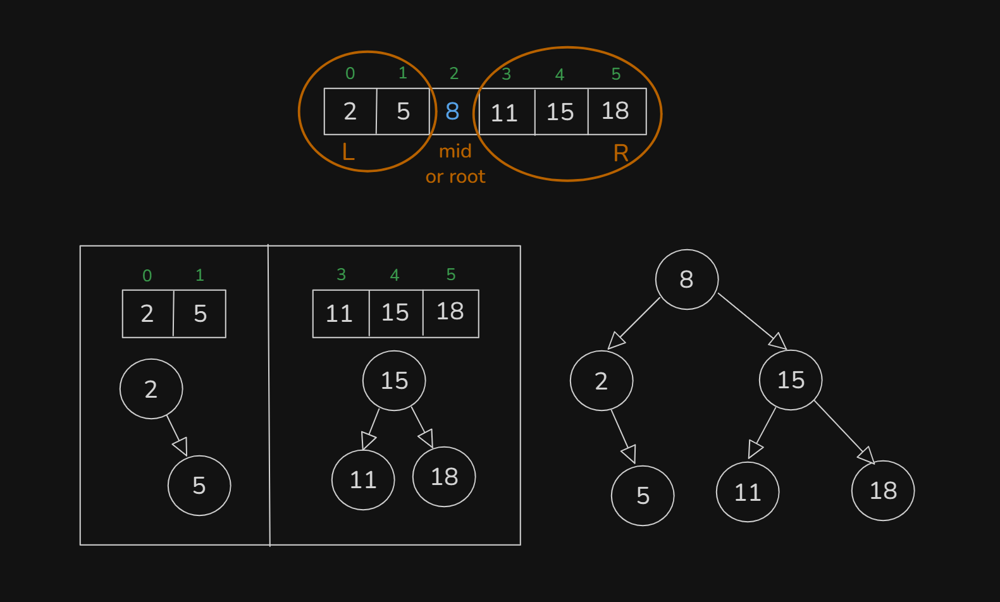
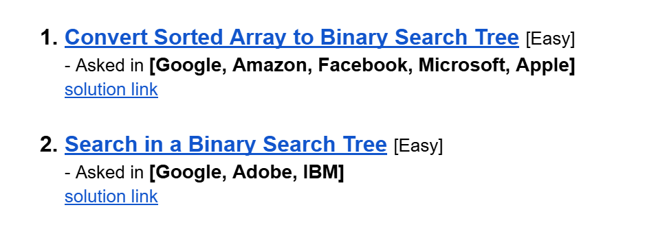

# Date: 02 August, 2025 - Saturday

## Topics:
0. Introduction
1. What is BST
2. How to handle duplicate in BST
3. Searching in BST
4. Searching in BST Animated
5. Complexity of searching in BST
6. Insert in BST
7. Insert in BST Animated
8. Complexity of insert in BST
9. Idea of converting array to BST
10. Converting array to BST implementation
11. Converting array to BST Animated
12. Summary
- Quiz: Module 21
- Extra Practice Problem and Quiz Explanation
- Feedback Form: Module 21

## 0. Introduction
- `Navigating` Binary Search Tree
- Understanding the Structure
- `Handling Duplicates` in Binary Search Tree
- `Searching` in Binary Search Tree
- `Inserting Nodes` in Binary Search Tree
- Converting Arrays to `BSTs`
- Key Takeaways - `Balanced Structure`, `Real-World Application` and `Further Exploration`

## 1. What is BST
- `BST - Binary Search Tree`
- What is `BST`?
    - `Binary search` + `binary tree` they are two combined to make `binary search tree`.
    - BST is binary tree and you can search into binary search in binary tree.
- `BST` two conditions are maintain:
    - `all values of left sub-tree < node->val`
    - `all values of right sub-tree > node->val`
- 
- Binary Tree have two child or less than 2. Like - `0, 1, 2` Child's.
- 
- `BST - Binary Search Tree` - left side child are smaller than root and right side child are bigger than root.

## 2. How to handle duplicate in BST
- `BST` two conditions are maintain:
    - `all values of left sub-tree < node->val`
    - `all values of right sub-tree > node->val`
    - But if the nodes are both equal then?
        - `Handle duplicate in BST`
- 
- 
- `Duplicate value are not insert to node. Just count in root`. Like this:
    - 

## 3. Searching in BST
- Logic building or idea making with Drawing:
    - 
    - 
- Program: `search_in_BST.cpp`

## 4. Searching in BST Animated
- Explanation those code in this video with animated way:
    ```
    bool search(Node* root, int val) {
        if(root == NULL) return false;      // Base case
        if(root->val == val) return true;

        // Recursion call with condition
        if(root->val > val) return search(root->left, val);
        else return search(root->right, val);
    }
    ```

## 5. Complexity of searching in BST
- Binary Search Complexity is `O(log n)`
- Binary Search Tree Complexity is `O(Log n)`
- 
- 
- Binary Tree was good then complexity was `O(log n)` and Binary Tree was very bad then complexity was `O(n)`.
- `Binary Search Tree` going to every node with `height` that's why is complexity called by `O(h)`.
    - `BST -> O(h)`
- The Time Complexity:
    - `[Good] => [h =~ O(log n)] (~ Equivalent)`
    - `[Very Bad] => [h =~ O(n)] (~ Equivalent)`

## 6. Insert in BST
- Implementation logic with drawing:
    - 
- Program: `insert_in_BST.cpp`

## 7. Insert in BST Animated
- Explanation those program in this video with animated way:
    ```
    void insert(Node* &root, int val) {
        if(root == NULL) root = new Node(val);
        if(root->val > val) {
            if(root->left == NULL) root->left = new Node(val);
            else insert(root->left, val);
        }
        else {
            if(root->right == NULL) root->right = new Node(val);
            else insert(root->right, val);
        }
    }
    ```

## 8. Complexity of insert in BST
- Logic build up with drawing:
    - 
- `Going from root to NULL` then time complexity is `O(h)`
- Understanding time complexity of BST:
    - 

## 9. Idea of converting array to BST
- How to an array convert into a BST. Build logic or concept understanding with drawing:
    - 
    - 
    - 
    - 
- It's totally make or build with `Recursion`.

## 10. Converting array to BST implementation
- Program: `array_to_BST.cpp`

## 11. Converting array to BST Animated
- Explanation those program in this video with animated way:
    ```
    Node* convert(int a[], int n, int l, int r) {
        if(l > r) return NULL;
        int mid = (l + r) / 2;
        Node* root = new Node(a[mid]);
        Node* leftRoot = convert(a, n, l, mid-1);
        Node* rightRoot = convert(a, n, mid+1, r);
        root->left = leftRoot;
        root->right = rightRoot;
        return root;
    }
    ```

## 12. Summary
- Learn and explore new Data Structure `BST - Binary Search Tree` and how they work.
- Search in `BST - Binary Search Tree`.
- Insertion in `BST - Binary Search Tree`.
- Array convert to `BST - Binary Search Tree`.
- This whole programs build with `Recursion`.
- Code thinking with draw or drawings and then implementation with code.

## Quiz: Module 21
- `Total Questions: 10`
- `Total Marks: 10`

## Extra Practice Problem and Quiz Explanation
- [Quiz Explanation:](https://docs.google.com/document/d/1pu8tzTn3rjJryq_jsOZFxSCNXE6pGE0QqugZXdCx7_4/edit?usp=sharing)
- [Extra Practice Problem (Optional):](https://docs.google.com/document/d/1eqBtMKpZg6j-32nKxeViq51SLK5bBtCdxG8QwVX99XM/edit?usp=sharing)
#### 1. How do we handle duplicates in a BST?
**a)** Insert duplicates on the right subtree  
**b)** Insert duplicates on the left subtree  
**c)** Do not allow duplicates  
**d)** Any of the above, depending on implementation ✅
> **Explanation:** মডিউলে বলা হইছিলো, BST তে ডুপ্লিকেট ভ্যালু নিয়ে সরাসরি কাজ করা হয় না। তবে, ডুপ্লিকেট ভ্যালু ও কাউন্ট ট্রি তে pair হিসেবে রাখা যায়। এর উপর ভিত্তি করে কুইজ করা হয়েছে। তবে, ডুপ্লিকেট ভ্যালু BST-তে বিভিন্নভাবে হ্যান্ডেল করা যায়: ডান সাবট্রিতে, বাম সাবট্রিতে, বা ডুপ্লিকেট এলাউ না করেও।
---
#### 2. In a BST, which property is true for any node?
**a)** Left child is always smaller, and right child is always larger ✅  
**b)** Left child is always larger, and right child is always smaller  
**c)** All nodes have two children  
**d)** All nodes are equal
> **Explanation:** প্রতিটি নোডের বাম সাবট্রিতে ছোট মান এবং ডান সাবট্রিতে বড় মান থাকে। এটাই BST-এর মূল নিয়ম।
---
#### 3. How do you insert a value in a BST?
**a)** Traverse to the leftmost node and insert the value  
**b)** Traverse to the rightmost node and insert the value  
**c)** Compare the value with nodes and insert it in the correct position to maintain BST property ✅  
**d)** Replace the root node with the new value
> **Explanation:** BST-এর ডান ও বাম সাবট্রির তুলনা করে উপযুক্ত স্থানে ইনসার্ট করা হয়।
---
#### 4. What happens to the left subtree during a BST insertion?
**a)** It remains unchanged  
**b)** The new value is inserted only if it's smaller than the current node ✅  
**c)** The new value is inserted only if it's larger than the current node  
**d)** The entire tree is restructured
> **Explanation:** BST-তে কোনো মান ইনসার্ট করার সময়, BST-এর নিয়ম মেনে চলতে হয়। এই নিয়মে প্রতিটি নোডের বাম সাবট্রিতে কেবলমাত্র ছোট মান ইনসার্ট করা হয় এবং ডান সাবট্রিতে বড় মান ইনসার্ট করা হয়।
---
#### 5. If the input array is empty, what should be returned when converting to a BST?
**a)** An empty tree (nullptr Or NULL) ✅  
**b)** A root node with value 0  
**c)** An exception  
**d)** A tree with all nodes as nullptr
> **Explanation:** যদি ইনপুট অ্যারে খালি থাকে, তাহলে কোনো নোড তৈরি করার মতো মান থাকবে না। ফলে, ফাংশনকে একটি NULL pointer বা nullptr রিটার্ন করতে হবে, যা একটি খালি tree কে বোঝায়।
---
#### 6. In the process of converting a sorted array to a BST, which element is chosen as the root?
**a)** The smallest element  
**b)** The largest element  
**c)** The middle element ✅  
**d)** Any random element
> **Explanation:** অ্যারের মাঝখানের উপাদান রুট হিসেবে নির্বাচন করা হয়। এতে অ্যারেটি দুইভাগে বিভক্ত হয়: বাম দিকের অংশটি বাম সাবট্রি হবে এবং ডান দিকের অংশটি ডান সাবট্রি হবে।
---
#### 7. What is the average-case time complexity of searching in a BST?
**a)** O(1)  
**b)** O(log⁡ n) ✅  
**c)** O(n)  
**d)** O(n^2)
> **Explanation:** BST-তে সার্চ করার গড় টাইম কমপ্লেক্সিটি হল O(log n), যেখানে n হলো tree এর নোড সংখ্যা।
---
#### 8. What happens if a value greater than the root is inserted in a BST?
**a)** It becomes the root  
**b)** It is inserted in the left subtree  
**c)** It is inserted in the right subtree ✅  
**d)** It replaces the smallest value in the tree
> **Explanation:** এটি BST-এর মূল বৈশিষ্ট্য, যেখানে প্রতি নোডের বাম সাবট্রিতে ছোট মান এবং ডান সাবট্রিতে বড় মান থাকে। যদি আপনি একটি মান ইনসার্ট করতে চান এবং সেই মান রুটের চেয়ে বড় হয়, তবে সেটি ডান সাবট্রিতে ইনসার্ট করা হবে।
---
#### 9. When converting a sorted array to a BST, which property of the array is crucial?
**a)** The array must be sorted in ascending order ✅  
**b)** The array must have distinct elements  
**c)** The array must have at least one element  
**d)** The array must be sorted in descending order
> **Explanation:** BST তৈরি করার জন্য, অ্যারেটি ঊর্ধ্বমুখীভাবে সজ্জিত (sorted in ascending order) থাকা অত্যন্ত গুরুত্বপূর্ণ। কারণ, একটি সজ্জিত অ্যারে থেকে মাঝের উপাদানটি (middle element) রুট হিসেবে নির্বাচন করা হয়। যদি অ্যারে সজ্জিত না থাকে, তবে এমন tree তৈরি হবে যা ব্যালেন্সড হবে না, এবং সেক্ষেত্রে সার্চ বা অন্যান্য অপারেশন হবে না।
---
#### 10. You are given a sorted array with n elements. You want to build a balanced Binary Search Tree (BST) by using a method where you always choose the middle element as the root, and do this recursively for the left and right halves. What is the time complexity of this conversion?
**a)** O(n2)  
**b)** O(n) ✅  
**c)** O(log⁡n)  
**d)** O(nlog⁡n)
> **Explanation:** যখন একটি sorted অ্যারে থেকে BST তৈরি করা হয়, তখন রূপান্তর প্রক্রিয়া সাধারণত O(n) সময় নিবে। এর কারণ হল: অ্যারেটির প্রতিটি উপাদান থেকে একটি নতুন নোড তৈরি করা হয় এবং এটি BST tree এর সাথে যুক্ত করা হয়। যদি অ্যারেটিতে n সংখ্যক উপাদান থাকে তাহলে n সংখ্যক বার নতুন নোড বানাতে হবে এবং তা BST তে যুক্ত করতে হবে।
---

### Extra Practice Problem
- 
- [Problem 1](https://leetcode.com/problems/convert-sorted-array-to-binary-search-tree/)
    - [Solution Link](https://leetcode.com/problems/convert-sorted-array-to-binary-search-tree/solutions/7032523/simple-recursion-by-piaaaas-ry11/)
- [Problem 2](https://leetcode.com/problems/search-in-a-binary-search-tree/)
    - [Solution Link](https://leetcode.com/problems/search-in-a-binary-search-tree/solutions/7032531/simple-traverse-with-recursion-beats-100-d37b/)

## Feedback Form: Module 21
- মডিউল রিলেটেড তোমার যে কোন ফিডব্যাক থাকলে এই ফর্মে লিখে দিতে পারো। আমরা তোমার ফিডব্যাক গুরুত্বসহকার দেখব।
- [Form Links](https://forms.gle/DH5mjuGD1x2EZ4z29)