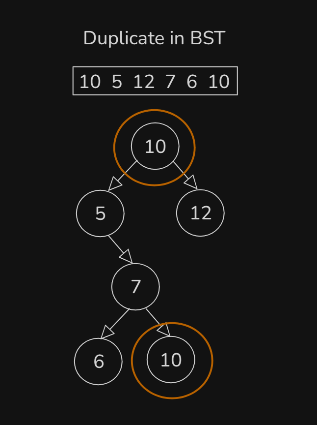

# Date: 02 August, 2025 - Saturday

## Topics:
0. Introduction
1. What is BST
2. How to handle duplicate in BST
3. Searching in BST
4. Searching in BST Animated
5. Complexity of searching in BST
6. Insert in BST
7. Insert in BST Animated
8. Complexity of insert in BST
9. Idea of converting array to BST
10. Converting array to BST implementation
11. Converting array to BST Animated
12. Summary
- Quiz: Module 21
- Extra Practice Problem and Quiz Explanation
- Feedback Form: Module 21

## 0. Introduction
- `Navigating` Binary Search Tree
- Understanding the Structure
- `Handling Duplicates` in Binary Search Tree
- `Searching` in Binary Search Tree
- `Inserting Nodes` in Binary Search Tree
- Converting Arrays to `BSTs`
- Key Takeaways - `Balanced Structure`, `Real-World Application` and `Further Exploration`

## 1. What is BST
- `BST - Binary Search Tree`
- What is `BST`?
    - `Binary search` + `binary tree` they are two combined to make `binary search tree`.
    - BST is binary tree and you can search into binary search in binary tree.
- `BST` two conditions are maintain:
    - `all values of left sub-tree < node->val`
    - `all values of right sub-tree > node->val`
- 
- Binary Tree have two child or less than 2. Like - `0, 1, 2` Child's.
- 
- `BST - Binary Search Tree` - left side child are smaller than root and right side child are bigger than root.

## 2. How to handle duplicate in BST
- `BST` two conditions are maintain:
    - `all values of left sub-tree < node->val`
    - `all values of right sub-tree > node->val`
    - But if the nodes are both equal then?
        - `Handle duplicate in BST`
- 
- 
- `Duplicate value are not insert to node. Just count in root`. Like this:
    - 

## 3. Searching in BST
- Logic building or idea making with Drawing:
    - 
    - 
- Program: `search_in_BST.cpp`

## 4. Searching in BST Animated
- Explanation those code in this video with animated way:
    ```
    bool search(Node* root, int val) {
        if(root == NULL) return false;      // Base case
        if(root->val == val) return true;

        // Recursion call with condition
        if(root->val > val) return search(root->left, val);
        else return search(root->right, val);
    }
    ```

## 5. Complexity of searching in BST
- Binary Search Complexity is `O(log n)`
- Binary Search Tree Complexity is `O(Log n)`
- 
- 
- Binary Tree was good then complexity was `O(log n)` and Binary Tree was very bad then complexity was `O(n)`.
- `Binary Search Tree` going to every node with `height` that's why is complexity called by `O(h)`.
    - `BST -> O(h)`
- The Time Complexity:
    - `[Good] => [h =~ O(log n)] (~ Equivalent)`
    - `[Very Bad] => [h =~ O(n)] (~ Equivalent)`

## 6. Insert in BST
- Implementation logic with drawing:
    - 
- Program: `insert_in_BST.cpp`
- There have so much notes have not yet note