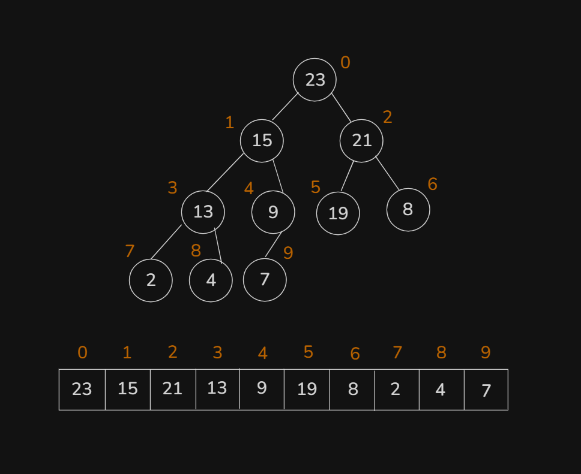
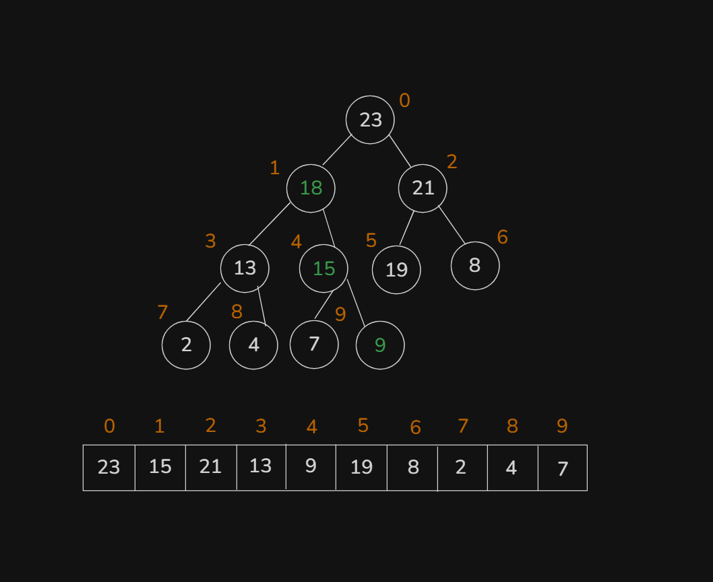
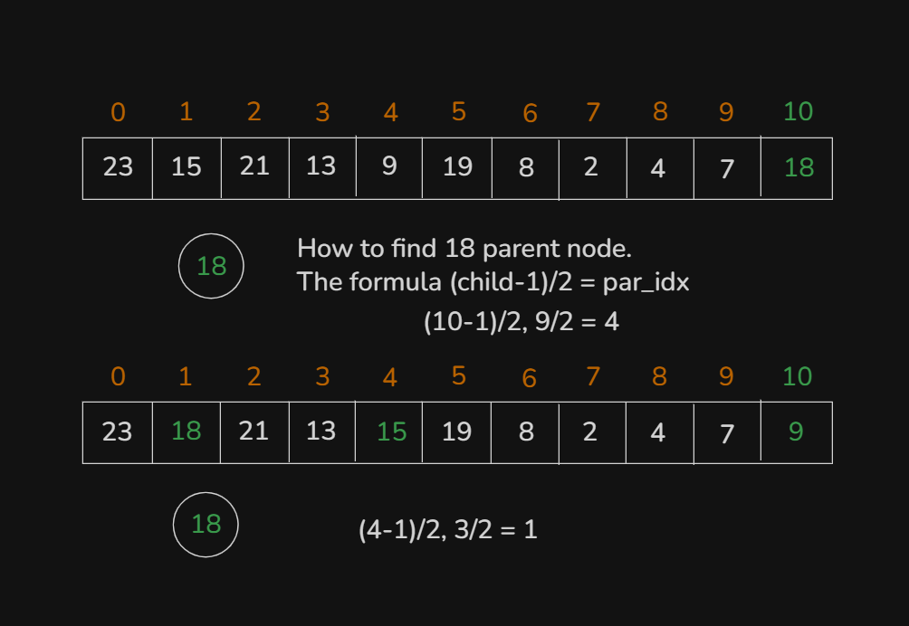
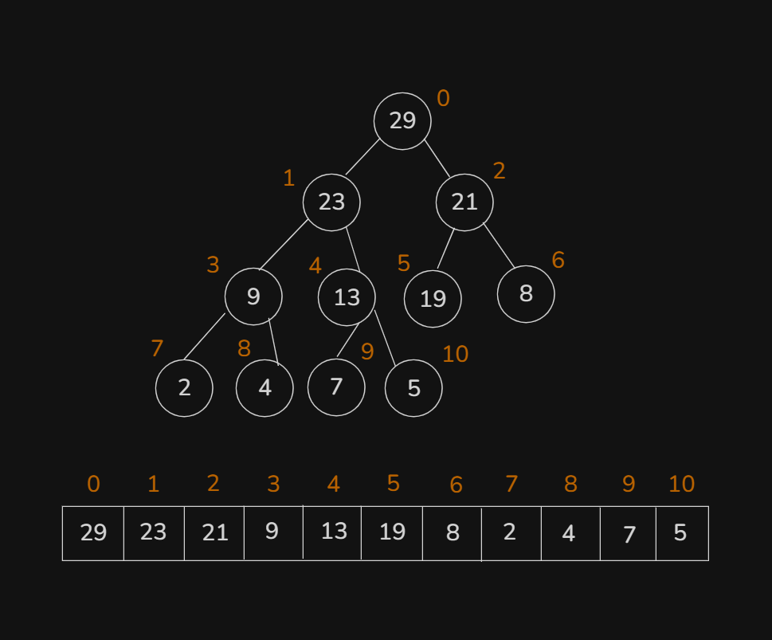
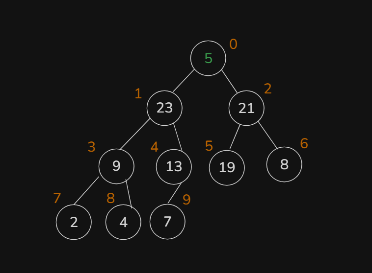
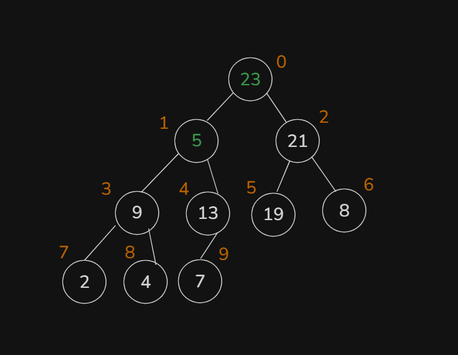
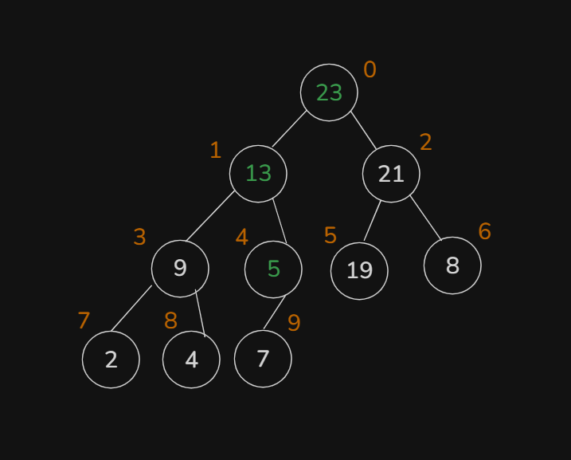
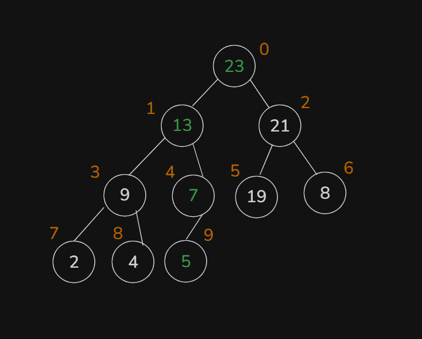
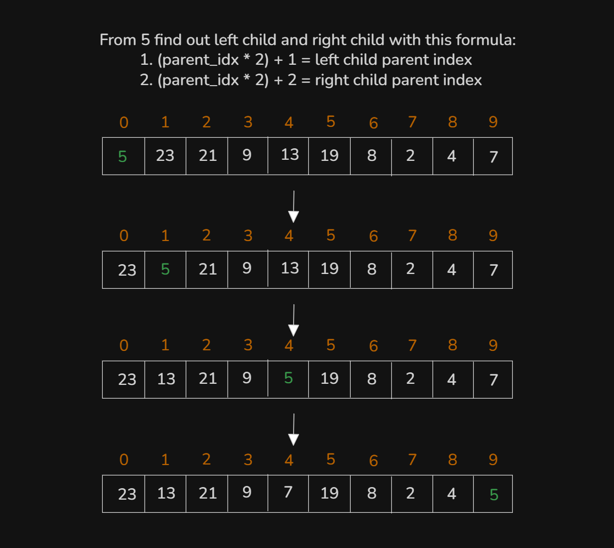

# Date: 03 August, 2025 - Sunday

## Topics:
0. Introduction
1. What is Complete Binary Tree
2. Array representation of complete binary tree
3. What is heap
4. Insert in heap theory
5. Insert in heap Implementation
6. Insert in heap Animated
7. Complexity of insert in heap
8. Delete from heap theory
9. Delete from heap Implementation
10. Delete from heap Animated
11. Summary
- Quiz: Module 22
- Extra Practice Problem and Quiz Explanation
- Feedback Form: Module 22

## 0. Introduction
- Learn and explore to Complete `Binary Trees` and `Heaps`
- Complete Binary Trees: `A Primer`
- Array Representation of Complete Binary Trees
- Introducing Heaps: A Specialized Binary Tree
- All programming languages have `Heaps STL`
- `Insertion` into a Heap
- `Deletion` from a Heap

## 1. What is Complete Binary Tree
- Complete Binary Trees have must be a left child
    - 
- Complete Binary Tree hight are `h -> O(log n)`

## 2 Array representation of complete binary tree
- A Complete Binary Tree convert to Arrays:
    - 
    - 
    - The Formula (Go to parent to child):
        - `parentIndex * 2 + 1 = leftIndex`
        - `parentIndex * 2 + 2 = rightIndex`
    - The Formula (Go to child to parent):
        - `(childIndex - 1) / 2 = parentIndex`

## 3 What is heap
- Heap are two types:
    - `Max Heap`
    - `Min Heap`
- `Max Heap`
    - `Max heap return to a big value` and `Max Heap` also better than `sort()`.
- `Min Heap`
    - `Min heap return to a small value`
- 

## 4. Insert in heap theory
- 
- Insert in heap in there have two (2) conditions:
    1. A complete Binary Tree
    2. Be a Max Heap
- Heap means array not a tree, we are tree drawing for better understanding.
- A complete Binary Tree & Be a Max Heap:
    - 
- Now array's:
    - 

## 5. Insert in heap Implementation
- 
- From this image logic and idea convert into this code:
    - Program: `insert_in_max_heap.cpp`
    - Program: `insert_in_min_heap.cpp`

## 6. Insert in heap Animated
- Explanation in this video with max heap program or this code logics:
    ```
    int val;
    cin >> val;
    v.push_back(val);

    int current_idx = v.size() - 1;
    while(current_idx != 0) {
        int parent_idx = (current_idx - 1) / 2;
        if(v[parent_idx] < v[current_idx])
            swap(v[parent_idx], v[current_idx]);
        else
            break;
        current_idx = parent_idx;
    }

    for(int x : v)
        cout << x << " ";
    cout << endl;
    ```

## 7. Complexity of insert in heap
- This program loops or complexity analysis:
    ```
    while(current_idx != 0) {
        int parent_idx = (current_idx - 1) / 2;
        if(v[parent_idx] < v[current_idx])
            swap(v[parent_idx], v[current_idx]);
        else
            break;
        current_idx = parent_idx;
    }
    ```
    - this is `O(h) equivalent O(logN)` and this is a `Complete Binary Tree`. That why, that time complexity is `O(logN)`.
- `1 value add -> O(logN)`
- `n'th value add -> O(NlogN)`
- `1 sort() -> O(NlogN)`
- `n'th sort() -> O(N^2logN)` - This thing using heap then `O(NlogN)` and without using heap then `O(N^2logN)`.

## 8. Delete from heap theory
- 
- Here is `29 root value` you can't delete min in heap. But you can delete min value in heap with this steps:
    - 
    - 
    - 
    - 
- And Array's:
    - 

## 9. Delete from heap Implementation
- Program: `delete_in_max_heap.cpp`

## 10. Delete from heap Animated
- Explanation this code in this video:
    ```
    void delete_heap(vector<int> &v) {
        cout << v[0] << " Deleted. -> ";
        v[0] = v.back(); // Or v[v.size() - 1]
        v.pop_back();
        int current_idx = 0;

        while(true) {
            int left_idx = current_idx * 2 + 1;
            int right_idx = current_idx * 2 + 2;
            int left_val = INT_MIN, right_val = INT_MIN;
            if(left_idx < v.size())
                left_val = v[left_idx];
            if(right_idx < v.size())
                right_val = v[right_idx];

            if(left_val > right_val && left_val > v[current_idx]) {
                swap(v[left_idx], v[current_idx]);
                current_idx = left_idx;
            }
            else if(right_val > left_val && right_val > v[current_idx]) {
                swap(v[right_idx], v[current_idx]);
                current_idx = right_idx;
            }
            else
                break;
        }
    }
    ```

## 11. Summary
- Heap are two part - `Max Heap` and `Min Heap`.
- Heap are two operation - `Insertion` and `Deletion`
- Insertion complexity `O(logN)`. Deletion complexity `O(logN)`.
- Understand the process of `Insertion` and `Deletion`.
- Understand Heap data structure and complete binary tree. How to delete max heap and min heap.

## Quiz: Module 22
- `Total Questions: 10`
- `Total Marks: 10`

## Extra Practice Problem and Quiz Explanation
- [Quiz Explanation:]()
- [Extra Practice Problem (Optional):]()
#### 1. How do we handle duplicates in a BST?
**a)** Insert duplicates on the right subtree  
**b)** Insert duplicates on the left subtree  
**c)** Do not allow duplicates  
**d)** Any of the above, depending on implementation ✅
> **Explanation:** মডিউলে বলা হইছিলো, BST তে ডুপ্লিকেট ভ্যালু নিয়ে সরাসরি কাজ করা হয় না। তবে, ডুপ্লিকেট ভ্যালু ও কাউন্ট ট্রি তে pair হিসেবে রাখা যায়। এর উপর ভিত্তি করে কুইজ করা হয়েছে। তবে, ডুপ্লিকেট ভ্যালু BST-তে বিভিন্নভাবে হ্যান্ডেল করা যায়: ডান সাবট্রিতে, বাম সাবট্রিতে, বা ডুপ্লিকেট এলাউ না করেও।
---