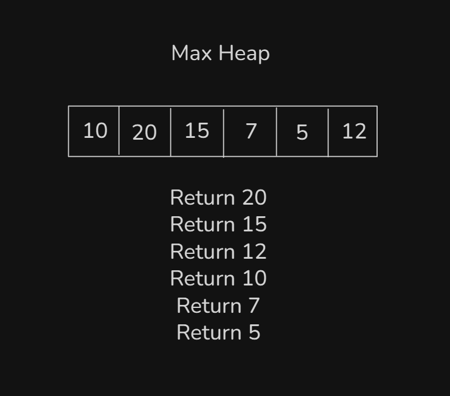

# Date: 03 August, 2025 - Sunday

## Topics:
0. Introduction
1. What is Complete Binary Tree
2. Array representation of complete binary tree
3. What is heap
4. Insert in heap theory
5. Insert in heap Implementation
6. Insert in heap Animated
7. Complexity of insert in heap
8. Delete from heap theory
9. Delete from heap Implementation
10. Delete from heap Animated
11. Summary
- Quiz: Module 22
- Extra Practice Problem and Quiz Explanation
- Feedback Form: Module 22

## 0. Introduction
- Learn and explore to Complete `Binary Trees` and `Heaps`
- Complete Binary Trees: `A Primer`
- Array Representation of Complete Binary Trees
- Introducing Heaps: A Specialized Binary Tree
- All programming languages have `Heaps STL`
- `Insertion` into a Heap
- `Deletion` from a Heap

## 1. What is Complete Binary Tree
- Complete Binary Trees have must be a left child
    - 
- Complete Binary Tree hight are `h -> O(log n)`

## 2 Array representation of complete binary tree
- A Complete Binary Tree convert to Arrays:
    - 
    - 
    - The Formula (Go to parent to child):
        - `parentIndex * 2 + 1 = leftIndex`
        - `parentIndex * 2 + 2 = rightIndex`
    - The Formula (Go to child to parent):
        - `(childIndex - 1) / 2 = parentIndex`

## 3 What is heap
- Heap are two types:
    - `Max Heap`
    - `Min Heap`
- `Max Heap`
    - `Max heap return to a big value` and `Max Heap` also better than `sort()`.
    - 
- `Min Heap`
    - `Min heap return to a small value`
    - 
- This module have too much need to time and practices.
- This module have too much need to time and practices.
- This module have too much need to time and practices.
- This module have too much need to time and practices.