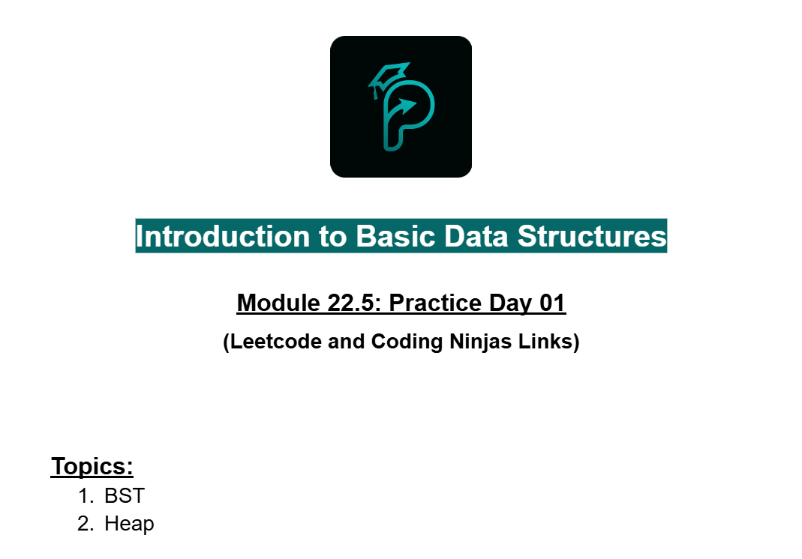
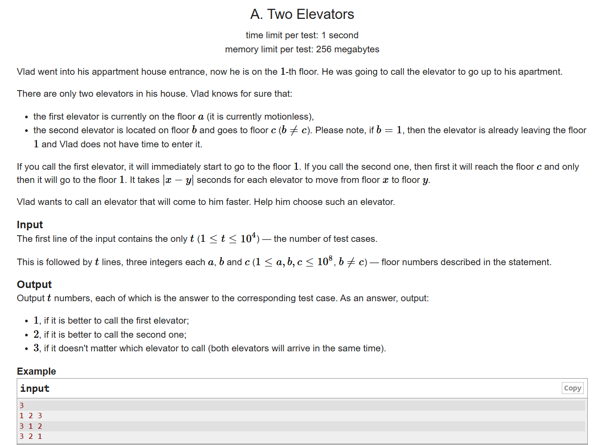
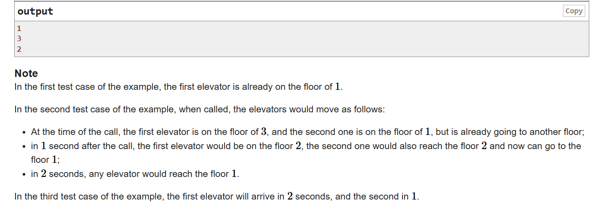

# Date: 04 August, 2025 - Monday

## Topics:
- Practice Problem Set: Module 22.5
- Road to XPSC Module 22.5
1. Practice
2. Road to XPSC Announcement
3. Two Elevators

## Practice Problem Set: Module 22.5
- [Practice Day 1:](https://docs.google.com/document/d/1RNNHSMyVVvzUIWC1zbj_caClY37-tXs5/edit?usp=drivesdk&ouid=112433310488936743525&rtpof=true&sd=true)
- 
- 

## Road to XPSC Module 22.5
- [Road to XPSC:](https://docs.google.com/document/d/1BvYTVJ4leShBnqbUYYJJbYZTAYqTV-XAgsn1VBFtDcs/edit?usp=sharing)
- 

## 1. Practice
- Solve those 8 all practice problems.

## 2. Road to XPSC Announcement
- XPSC is a Phitron Problem Solvers Club. XPSC - Xetabyte Problem Solver Club.
- Practice logical and implementation problems to prepare for the club.

## 3. Two Elevators
- [Two Elevators Problem Link:](https://codeforces.com/contest/1729/problem/A)
- 
- 
- Program: `main.cpp`