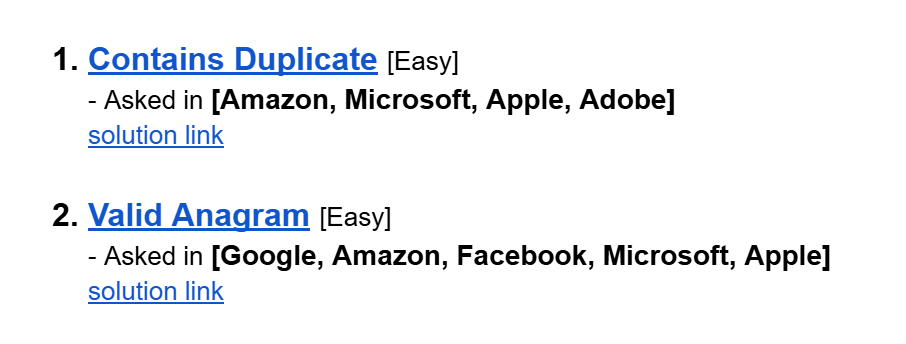

# Date: 05 August, 2025 - Tuesday

## Topics:
0. Introduction
1. What is Priority Queue
2. Difference between array and priority queue
3. STL priority queue
4. Custom compare class
5. Limitations of frequency array
6. STL Map
8. What is set
9. STL Set
10. Summary
- Quiz: Module 23
- Extra Practice Problem and Quiz Explanation
- Feedback Form: Module 23

## 0. Introduction
- Explore STL priority queue
- Known to STL map
- Learn to STL set

## 1. What is Priority Queue
- In priority queue bigger value are always first.
- 

## 2. Difference between array and priority queue
- Let's see difference between array and priority queue:
- 

## 3. STL priority queue
- Program: `priority_queue.cpp`

## 4. Custom compare class
- Program: `custom_compare_class.cpp`

## 5. Limitations of frequency array
- Here is some problems or limitations of Frequency Array:
    - `Only int`
    - `Index (0 - 10^6)`
    - `Memory waste`
- These 3 problem solve with `STL Map`.

## 6. STL Map
- Program: `map.cpp`

## 7. Count words using map
- Program: `count_words.cpp`

## 8. What is set
- Set mainly work for remove duplicate value and have to unique value. All have to sorted. Set is BST STL.
- 

## 9. STL Set
- Program: `stl_set.cpp`

## 10. Summary
- We see those 3 STL:
    - `Priority Queue`
    - `Map`
    - `Set`

## Quiz: Module 23
- `Total Questions: 10`
- `Total Marks: 10`

## Extra Practice Problem and Quiz Explanation
- [Quiz Explanation:](https://docs.google.com/document/d/1zPSrQHEmFtNbQzB1B0R2zlail60t4rHr/edit?usp=sharing&ouid=110071013354717279052&rtpof=true&sd=true)
- [Extra Practice Problem (Optional):](https://docs.google.com/document/d/1eW8FdO3xi6OjBGvgdb-fjQZmA2K3p_dsipvvyyc7huc/edit?usp=sharing)
#### 1. How to insert value in a priority queue?
**a)** pop()  
**b)** top()  
**c)** push() ✅  
**d)** insert()
> **Explanation:** Priority queue-তে নতুন মান যোগ করতে push() ফাংশন ব্যবহার করা হয়।
---
#### 2. How to delete value from a priority queue?
**a)** push()  
**b)** front()  
**c)** pop() ✅  
**d)** insert()
> **Explanation:** Priority queue-এ থেকে top এর ভ্যালু ডিলিট করার জন্য pop() ফাংশন ব্যবহার করা হয়।
---
#### 3. How to insert value in a set?
**a)** push()  
**b)** insert() ✅  
**c)** in()  
**d)** fushfush()
> **Explanation:** Set-এ নতুন মান যোগ করার জন্য insert() ফাংশন ব্যবহার করা হয়।
---
#### 4. How to access value from priority queue?
**a)** front()  
**b)** back()  
**c)** top() ✅  
**d)** down()
> **Explanation:** Priority queue-এর সর্বোচ্চ Priority মানটি দেখতে top() ফাংশন ব্যবহার করা হয়।
---
#### 5. How to access values from a map named “mp”?
**a)** mp.key  
**b)** mp[key] ✅  
**c)** mp[]  
**d)** key.mp
> **Explanation:** Map-এ নির্দিষ্ট key-এর সাথে যুক্ত value দেখতে mp[key] ব্যবহার করা হয়।
---
#### 6. Which syntax is correct to insert a key-value pair in a map name mp?
**a)** mp(make_pair(key,value));  
**b)** mp.insert_at({key,value});  
**c)** mp[key]=value; ✅  
**d)** All of the above
> **Explanation:** Map-এ key-value pair যোগ করার জন্য নিচের তিনটি পদ্ধতিই সঠিক:   1. mp.insert(make_pair(key, value)); পুরোনো পদ্ধতি, যেখানে make_pair() ব্যবহার করে key-value pair তৈরি করা হয়।   2. mp.insert({key, value}); এখানে সরাসরি {key, value} দিয়ে pair যোগ করা হয়।   3. mp[key] = value; এই পদ্ধতিতে, যদি key আগে থেকেই থাকে তাহলে value আপডেট হয়; না থাকলে নতুন key-value pair যোগ হয়।
---
#### 7. Which function is used to check if a value is present in the “set”?
**a)** count() ✅  
**b)** check()  
**c)** present()  
**d)** at()
> **Explanation:** Set-এ একটি নির্দিষ্ট মান উপস্থিত আছে কিনা তা চেক করার জন্য count() ফাংশন ব্যবহার করা হয়।
---
#### 8. Which function is used to check if a key-value pair is present in the “map”?
**a)** count() ✅  
**b)** check()  
**c)** present()  
**d)** at()
> **Explanation:** count() ফাংশন map-এ একটি নির্দিষ্ট key উপস্থিত আছে কিনা তা চেক করতে ব্যবহৃত হয়। Key থাকলে count() 1 রিটার্ন করে। Key না থাকলে count() 0 রিটার্ন করে।
---
#### 9. What happens to the normal queue?
**a)** VIP will go to the front of the queue instantly  
**b)** VIP will stand in the line as usual ✅  
> **Explanation:** Normal queue - FIFO (First In, First Out) পদ্ধতিতে কাজ করে। VIP-দের জন্য কোনো বিশেষ অগ্রাধিকার নেই।
---
#### 10. What is the time complexity of inserting an element into a set (implemented as a balanced binary search tree) in the worst case?
**a)** O(1)  
**b)** O(logN) ✅  
**c)** O(N)  
**d)** O(NlogN)
> **Explanation:** set একটি balanced binary search tree দ্বারা Implement হয়, তাই একটি উপাদান ইনসার্ট করতে Tree অনুসারে O(log n) সময় লাগে। যেখানে, n হচ্ছে নোড সংখ্যা।
---
- [Extra Practice Problem (Optional):](https://docs.google.com/document/d/1eW8FdO3xi6OjBGvgdb-fjQZmA2K3p_dsipvvyyc7huc/edit?usp=sharing)
- 

## Feedback Form: Module 23
- মডিউল রিলেটেড তোমার যে কোন ফিডব্যাক থাকলে এই ফর্মে লিখে দিতে পারো। আমরা তোমার ফিডব্যাক গুরুত্বসহকার দেখব।
- [Form Links](https://forms.gle/DH5mjuGD1x2EZ4z29)