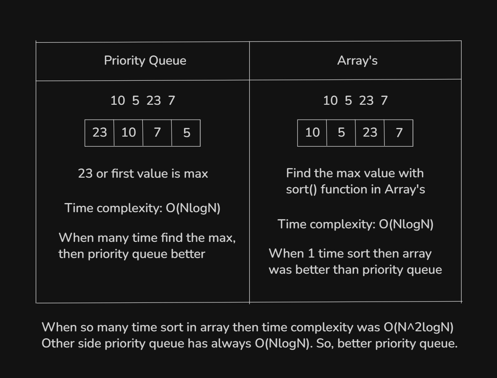
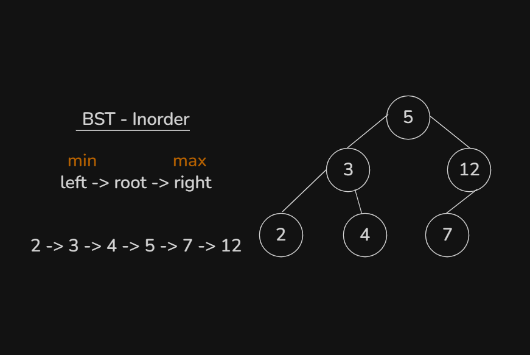

# Date: 05 August, 2025 - Tuesday

## Topics:
0. Introduction
1. What is Priority Queue
2. Difference between array and priority queue
3. STL priority queue
4. Custom compare class
5. Limitations of frequency array
6. STL Map
8. What is set
9. STL Set
10. Summary
- Quiz: Module 23
- Extra Practice Problem and Quiz Explanation
- Feedback Form: Module 23

## 0. Introduction
- Explore STL priority queue
- Known to STL map
- Learn to STL set

## 1. What is Priority Queue
- In priority queue bigger value are always first.
- 

## 2. Difference between array and priority queue
- Let's see difference between array and priority queue:
- 

## 3. STL priority queue
- Program: `priority_queue.cpp`

## 4. Custom compare class
- Program: `custom_compare_class.cpp`

## 5. Limitations of frequency array
- Here is some problems or limitations of Frequency Array:
    - `Only int`
    - `Index (0 - 10^6)`
    - `Memory waste`
- These 3 problem solve with `STL Map`.

## 6. STL Map
- Program: `map.cpp`

## 7. Count words using map
- Program: `count_words.cpp`

## 8. What is set
- Set mainly work for remove duplicate value and have to unique value. All have to sorted. Set is BST STL.
- 