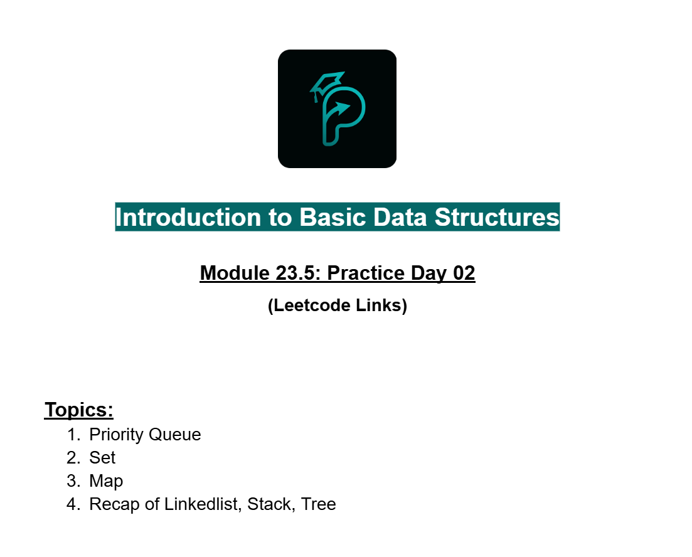
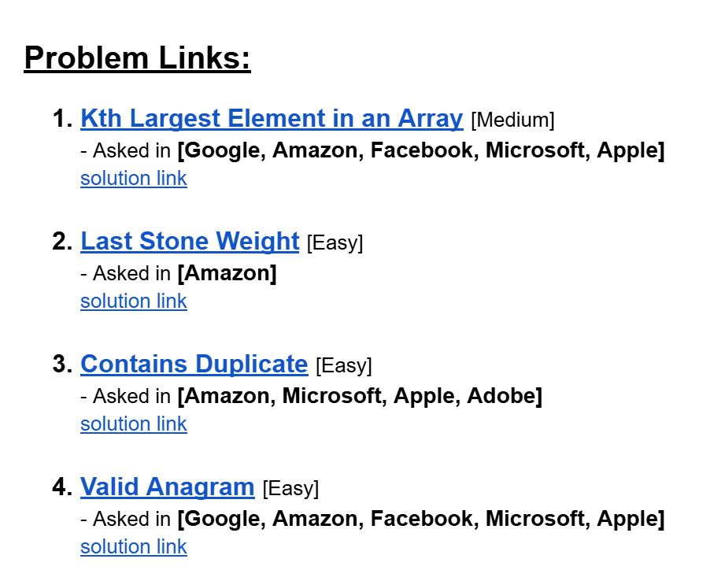
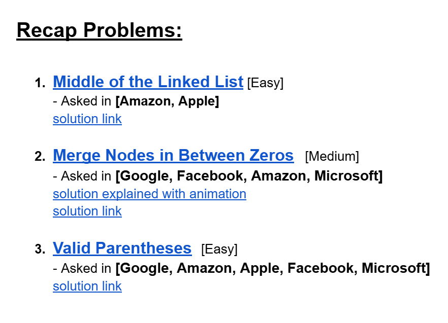
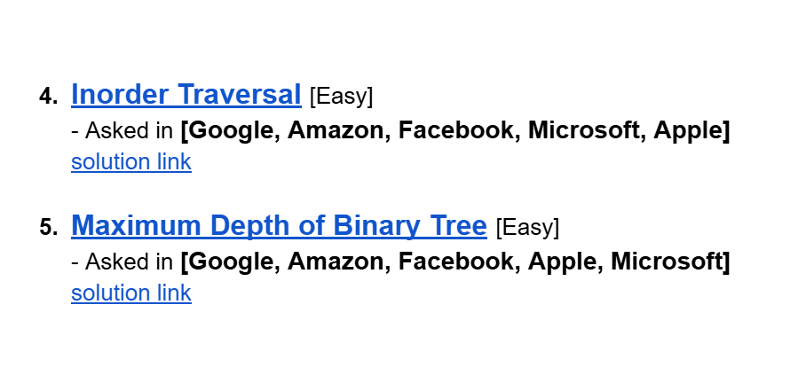
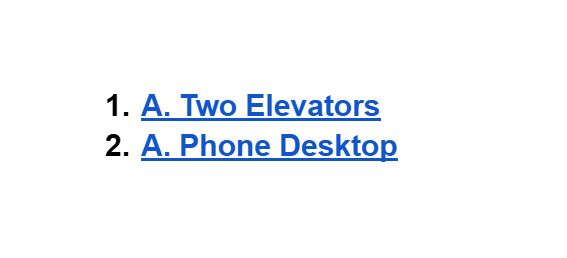
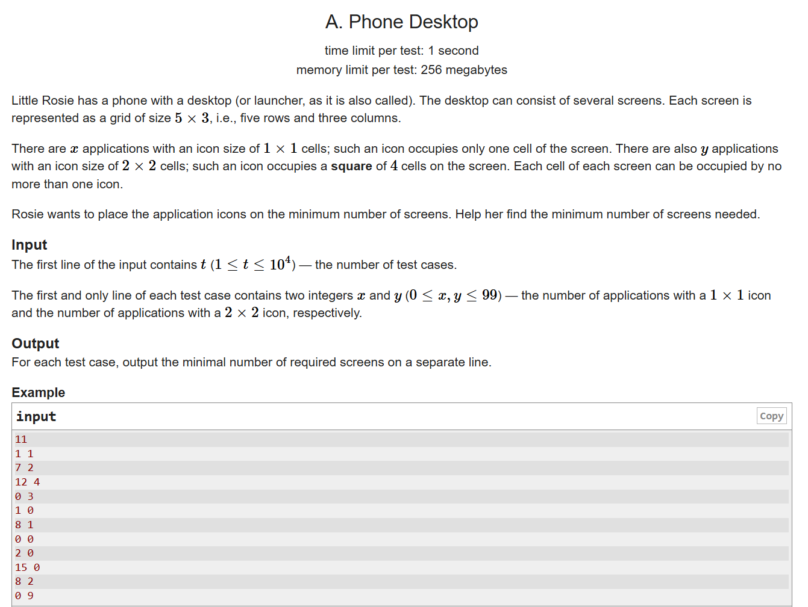
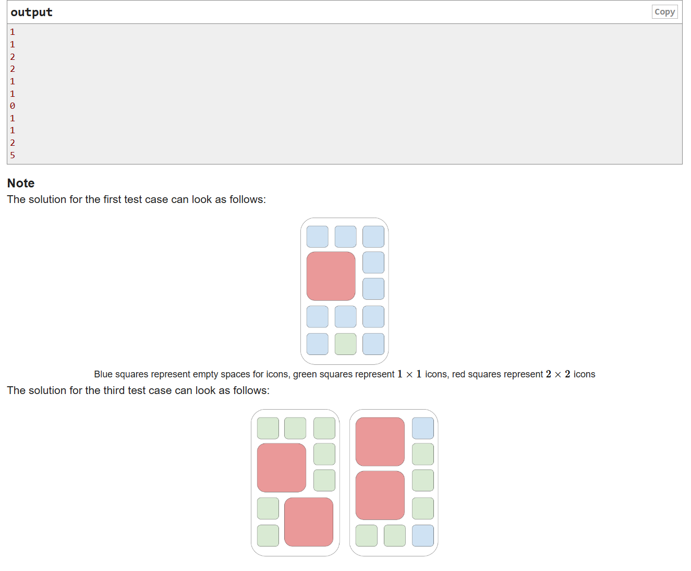

# Date: 06 August, 2025 - Wednesday

## Topics:
- Practice Problem Set: Module 23.5
- Road to XPSC Module 23.5
1. Practice Instructions
2. Phone Desktop

## Practice Problem Set: Module 23.5
- [Practice Problem Set Link:](https://docs.google.com/document/d/1fOCPZd3qMqDr3w0EHfd9bB3W4QLv2bfeCg6KnPJa7mI/edit?usp=sharing)
- 
- 
- 
- 

## Road to XPSC Module 23.5
- [Road to XPSC](https://docs.google.com/document/d/1AFlgESrI3iHDnfJ8dUzIR9R2fudEwUvqIYpd3folYvk/edit?usp=sharing)
- 

## 1. Practice Instructions
- Practice instruction in this video for practice problems

## 2. Phone Desktop
- [Phone Desktop Problem Link](https://codeforces.com/problemset/problem/1974/A)
- 
- 
- Program: `main.cpp`