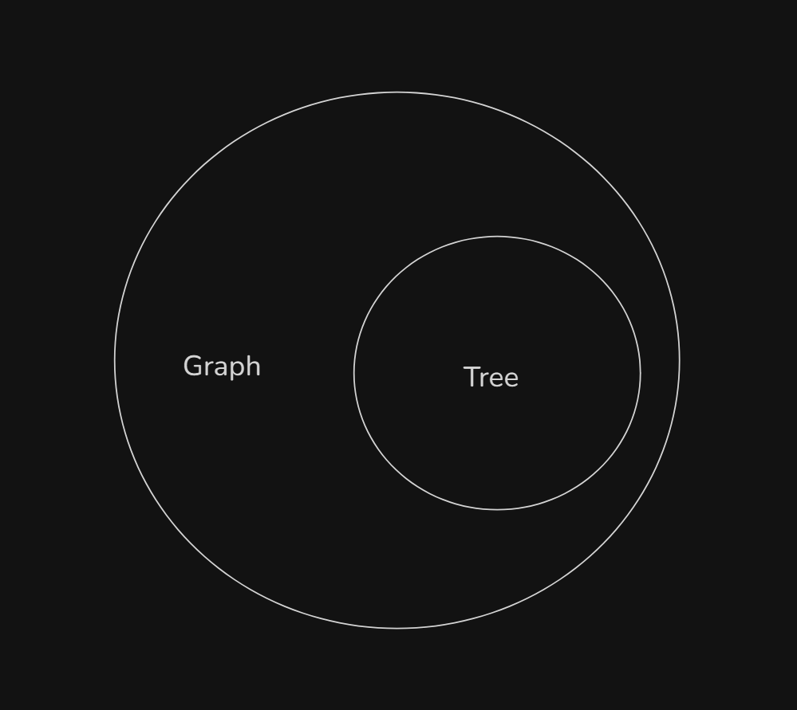
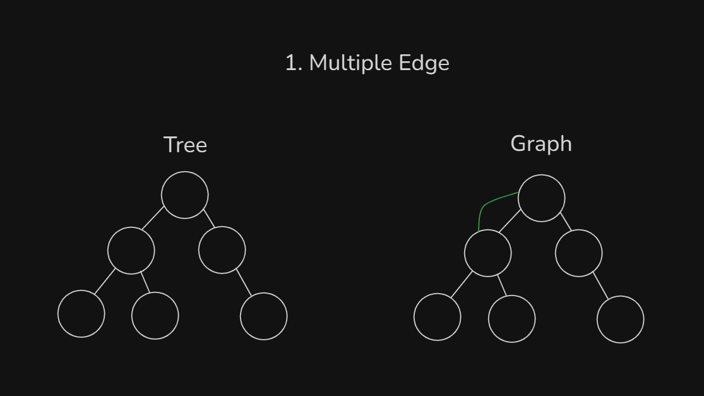
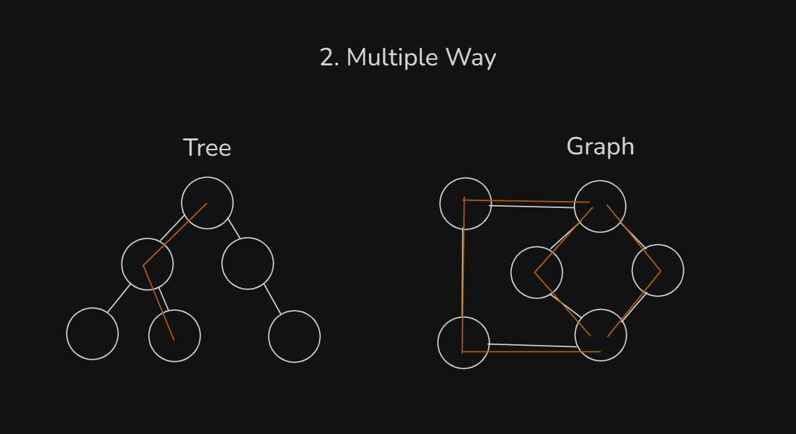
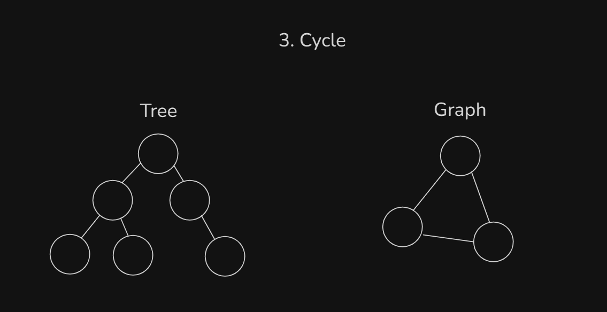
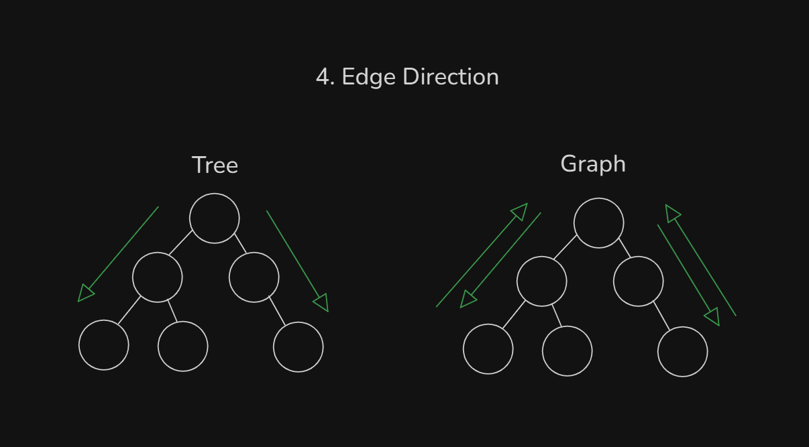
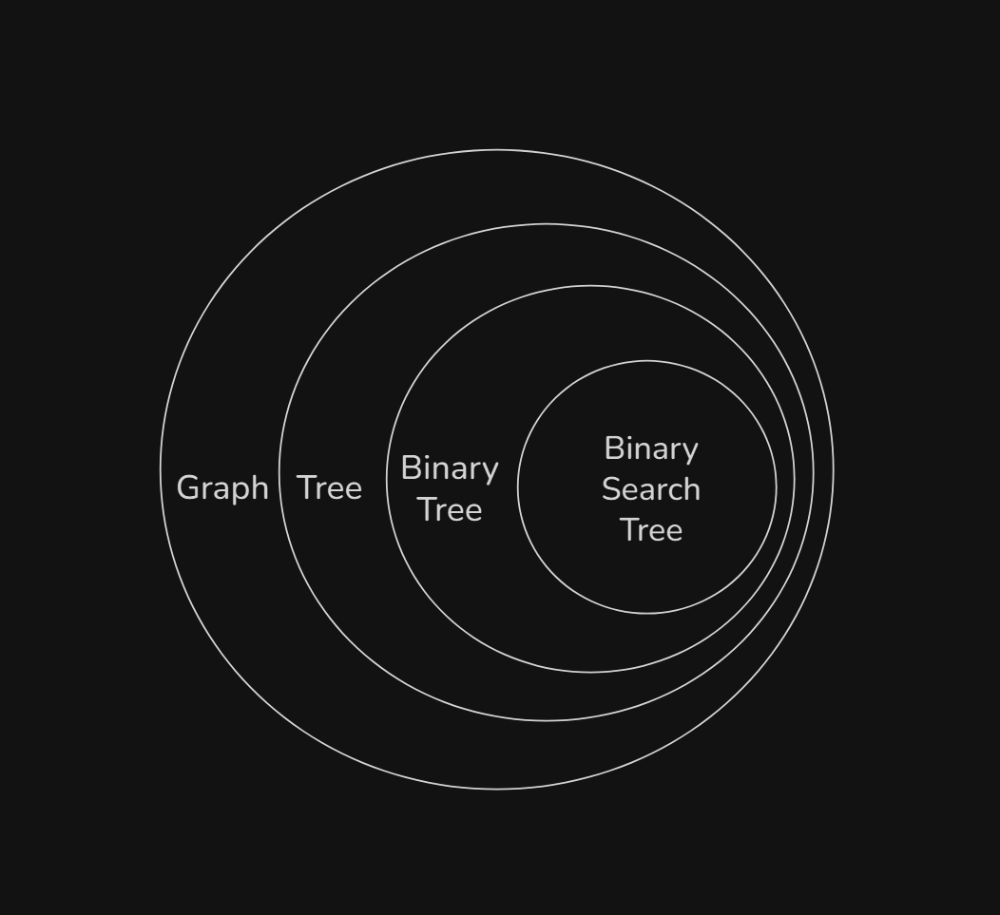
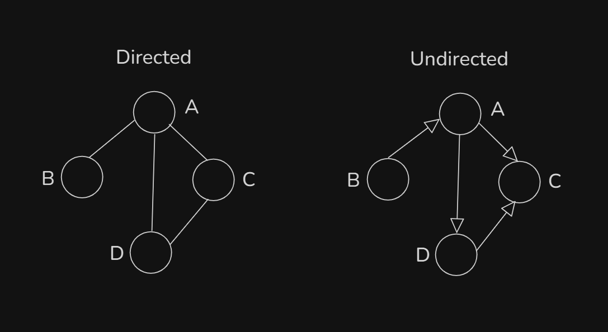
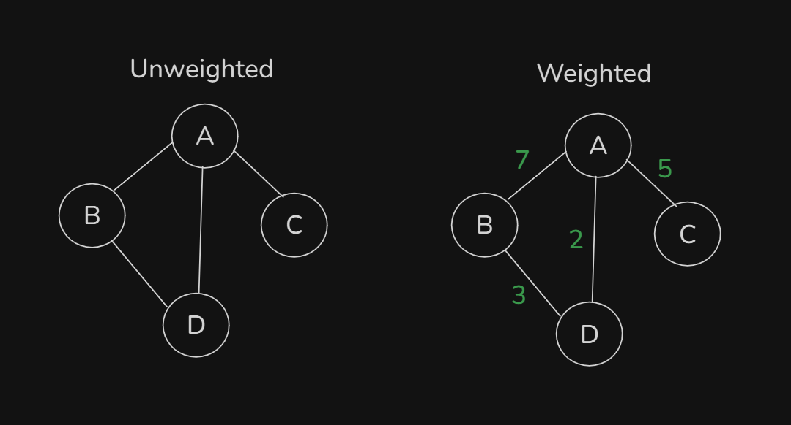
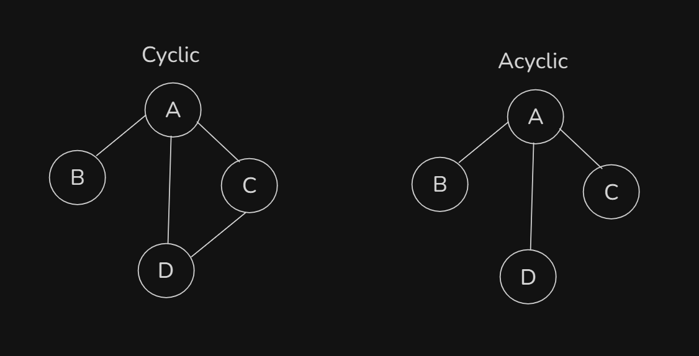

# Date: 16 August, 2025 - Saturday

## Topics:
- Course Introduction
0. Introduction
1. What is Graph
2. Types of Graph
3. Types of Graph Animated
4. Real life example of graph I
5. Real life example of graph II
6. Input graph
7. Adjacency Matrix
8. Adjacency Matrix Implementation
9. Adjacency Matrix Animated
- Quiz: Module 01
- Extra Practice Problem and Quiz Explanation
- Feedback Form

## Course Introduction
- `Introduction to Algorithms`
- This is the process of works. That can also follow to steps. There are algorithms we have already done:
    - `Binary Search`
    - `Binary - Preorder, Inorder, Postorder`
- You can called to `Algorithms` of any process. `Some sequence of steps/instructions to solve a problem`

## 0. Introduction
- `Graph Data Structures`: A Deep Dive
- What is a Graph?
- Types of Graphs
- Understanding `Real-World Applications` of Graphs
- Graph Input
- Graph Representations
    - `Adjacency Matrix`
    - `Adjacency List`
    - `Edge List`
- Comparison: `Adjacency Matrix` VS `Adjacency List` VS `Edge List`

## 1. What is Graph
- `Graph` is a Data Structures and graphs have some algorithms.
- `Graph` is parent and his child also `Tree`
    - 
- `Graph VS Tree`:
    - 
    - 
    - 
    - 
- You can make more differences with `Graph` and `Tree` and main differences `Cycle`. You check are every differences are `Cycle`
- 

## 2. Types of Graph
- `Types of Graph`:
    - `Direction`:
        - `a. Directed`
        - `b. Undirected`
    - `Weight`:
        - `a. Weighted`
        - `b. Unweighted`
    - `Cycle`:
        - `a. Cyclic`
        - `b. Acyclic`
- `Direction`:
    - 
- `Weight`:
    - 
- `Cycle`:
    - 
- `Directed` cycle make with `2 (two) nodes` but `Undirected` cycle make with `3 (three) nodes` needed.