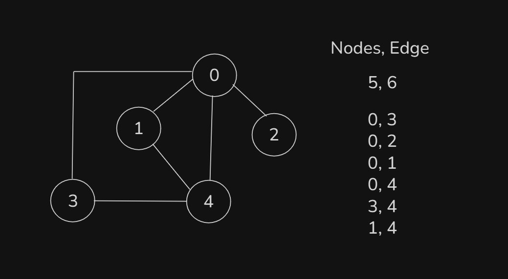
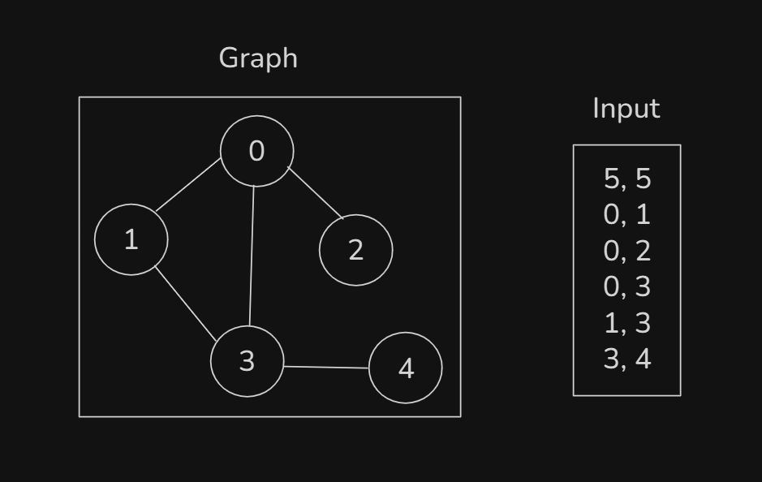
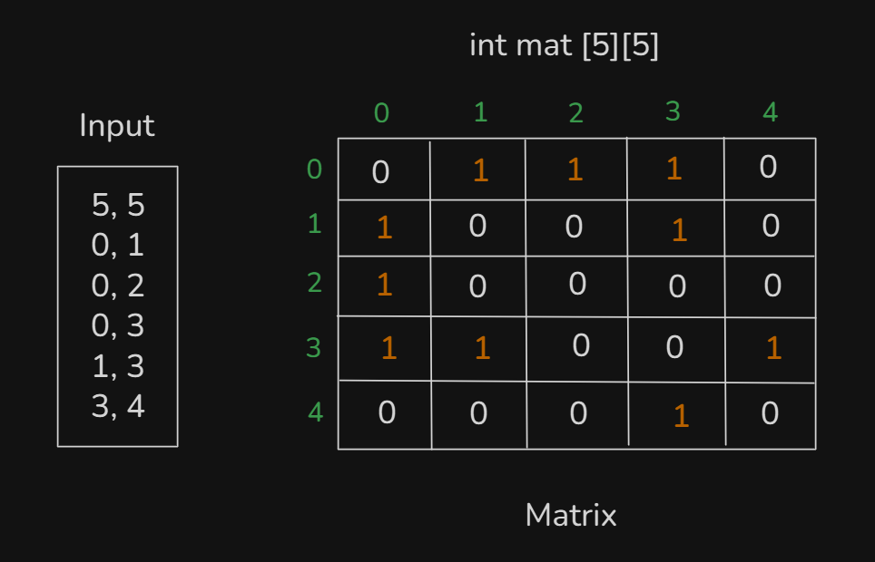
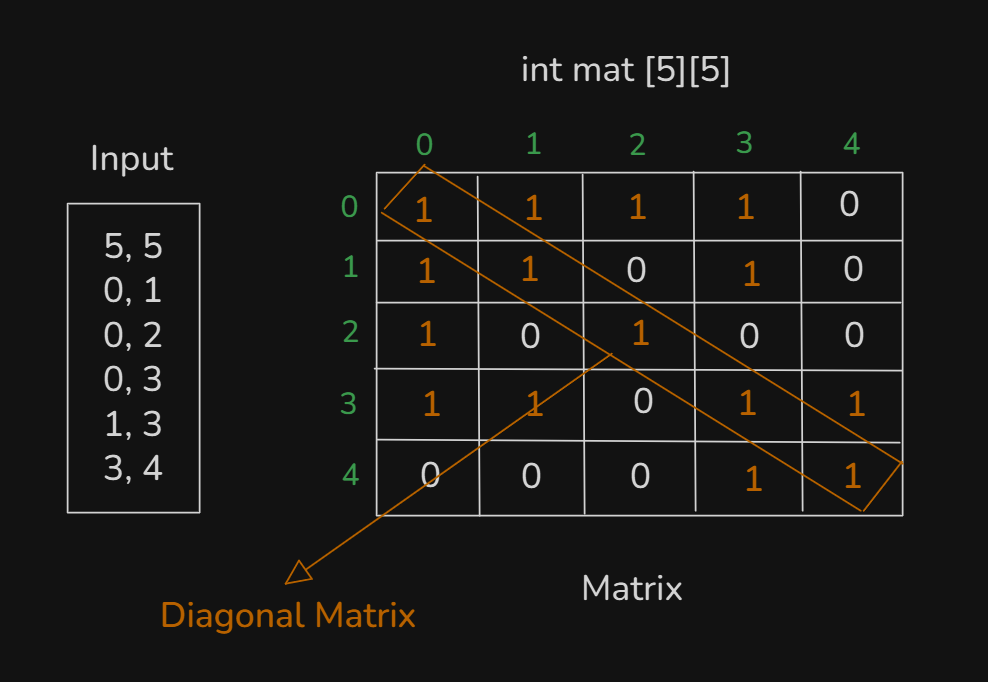
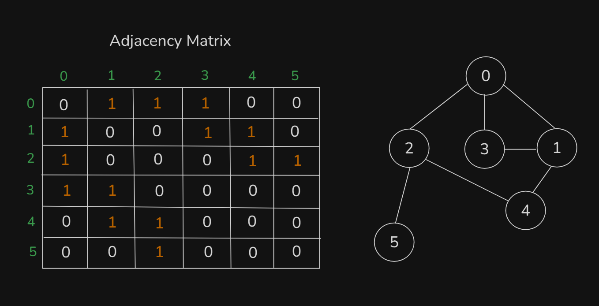
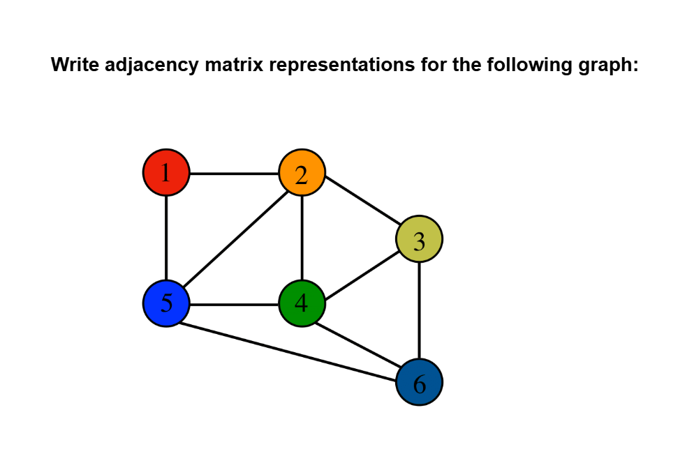

# Date: 16 August, 2025 - Saturday

## Topics:
- Course Introduction
0. Introduction
1. What is Graph
2. Types of Graph
3. Types of Graph Animated
4. Real life example of graph I
5. Real life example of graph II
6. Input graph
7. Adjacency Matrix
8. Adjacency Matrix Implementation
9. Adjacency Matrix Animated
- Quiz: Module 01
- Extra Practice Problem and Quiz Explanation
- Feedback Form

## Course Introduction
- `Introduction to Algorithms`
- This is the process of works. That can also follow to steps. There are algorithms we have already done:
    - `Binary Search`
    - `Binary - Preorder, Inorder, Postorder`
- You can called to `Algorithms` of any process. `Some sequence of steps/instructions to solve a problem`

## 0. Introduction
- `Graph Data Structures`: A Deep Dive
- What is a Graph?
- Types of Graphs
- Understanding `Real-World Applications` of Graphs
- Graph Input
- Graph Representations
    - `Adjacency Matrix`
    - `Adjacency List`
    - `Edge List`
- Comparison: `Adjacency Matrix` VS `Adjacency List` VS `Edge List`

## 1. What is Graph
- `Graph` is a Data Structures and graphs have some algorithms.
- `Graph` is parent and his child also `Tree`
    - 
- `Graph VS Tree`:
    - 
    - 
    - 
    - 
- You can make more differences with `Graph` and `Tree` and main differences `Cycle`. You check are every differences are `Cycle`
- 

## 2. Types of Graph
- `Types of Graph`:
    - `Direction`:
        - `a. Directed`
        - `b. Undirected`
    - `Weight`:
        - `a. Weighted`
        - `b. Unweighted`
    - `Cycle`:
        - `a. Cyclic`
        - `b. Acyclic`
- `Direction`:
    - 
- `Weight`:
    - 
- `Cycle`:
    - 
- `Directed` cycle make with `2 (two) nodes` but `Undirected` cycle make with `3 (three) nodes` needed.

## 3. Types of Graph Animated
- `Types of Graph explanation with animated way in this video`:
    - `Direction`:
        - `a. Directed`
        - `b. Undirected`
    - `Weight`:
        - `a. Weighted`
        - `b. Unweighted`
    - `Cycle`:
        - `a. Cyclic`
        - `b. Acyclic`

## 4. Real life example of graph I
- The real life example of graph is `Google Map`
- `Google Map` using are `Graph Algorithms`. Those locate area are thinking as a google map all are nodes.

## 5. Real life example of graph II
- The real life example of graph is `Facebook Friends`
- They are connected to each other and see the mutual friend.

## 6. Input graph
- How to input in Graph this logic building with drawing:
    - 
- We can input into store are 3 ways:
    - `Adjacency Matrix`
    - `Adjacency List`
    - `Edge List`

## 7. Adjacency Matrix
- Graph and input logic build with drawing:
    - 
    - 
    - 

## 8. Adjacency Matrix Implementation
- Program: `adjacency_matrix.cpp`

## 9. Adjacency Matrix Animated
- Explanation those logic with animated way in this video:
    - 

## Quiz: Module 01
- `Total Questions: 10`
- `Total Marks: 10`

## Extra Practice Problem and Quiz Explanation
- [Explanation:](https://docs.google.com/document/d/1RGPYcm1m-_MBFX-SSf8M0hYqMKtClU688bsJ31pVxmw/edit?usp=sharing)
- [Extra Practice Problem (Optional):](https://docs.google.com/document/d/1NMUBlJLug0ZuF_L_Ni1rN0G32_uqYqc1WlFxHf5RzNA/edit?usp=sharing)
#### 1. Suppose you are traveling from Chittagong to London in a graph. Then, what will be the nodes?
**a)** London  
**b)** The road between Chittagong and London  
**c)** Chittagong  
**d)** Both Chittagong and London ✅
> **Explanation:** এখানে সিটি গুলোকে আমরা একটি গ্রাফের Node ধরে নিতে পারি এবং সিটিগুলো যে রোডের মাধ্যমে যুক্ত তাদের আমরা edge বলতে পারি।
---
#### 2. Depending on the weight of the edges, we can classify the graph as ____
**a)** Directed and Undirected  
**b)** Weighted and Unweighted ✅  
**c)** None of them  
**d)** Both of them
> **Explanation:** যদি গ্রাফের মধ্যে বিদ্যমান edge গুলোর জন্য এক্সট্রা ইনফরমেশন যেমনঃ দূরত্ব, সময় ইত্যাদি দেয়া থাকে তবে সেক্ষেত্রে আমরা বলতে পারি গ্রাফটি weighted এবং এক্সট্রা ইনফরমেশন না থাকলে সেক্ষেত্রে আমরা বলি গ্রাফটি unweighted।
---
#### 3. In a directed graph, edges must have:
**a)** Direction ✅  
**b)** Weight  
**c)** Color  
**d)** Length
> **Explanation:** একটি গ্রাফের দুটি Node এর মধ্যে বিদ্যমান Node গুলোতে যদি direction থাকে তবে সেই গ্রাফকে আমরা directed গ্রাফ বলতে পারি।
---
#### 4. In a tree, what is the relationship between two nodes that are connected by an edge?
**a)** Parent - Child ✅  
**b)** Sibling  
**c)** Neighbor  
**d)** Random connection
> **Explanation:** ট্রিতে দুটি নোড যদি একটি edge দিয়ে সংযুক্ত থাকে, তাহলে এক নোড parent আর অপরটি child। এই parent এবং child নোডের মধ্যে কানেকশন দিয়েই tree তৈরী হয়।
---
#### 5. A —------------- B If we consider this as a graph, then what is the type of this graph?
**a)** Undirected and Unweighted ✅  
**b)** Directed and Weighted  
**c)** Undirected and Weighted  
**d)** Directed and Unweighted
> **Explanation:** যেহেতু উক্ত গ্রাফের Node গুলোর মধ্যে বিদ্যমান edge এর মধ্যে কোনো direction এবং weight নেই, তাই আমরা উক্ত গ্রাফকে undirected এবং unweighted গ্রাফ বলতে পারি।
---
#### 6. Which of the following are the conditions of a tree?
**a)** No cycle  
**b)** One way direction  
**c)** Have multiple ways  
**d)** Both A and B ✅
> **Explanation:** একটি tree structure এ কখনো cycle থাকতে পারে না এবং একটি Node হতে আরেকটি node এ শুধুমাত্র এক ভাবেই যাওয়া সম্ভব।
---
#### 7. Which of the following is a common graph representation technique?
**a)** Adjacency List  
**b)** Adjacency Matrix  
**c)** Edge List  
**d)** All of the above ✅
> **Explanation:** গ্রাফকে মেমোরিতে সংরক্ষণ করার জন্য সাধারণভাবে তিনটি রিপ্রেজেন্টেশন টেকনিক ব্যবহার করা হয়, যা হলো— Adjacency Matrix, Adjacency List এবং Edge List।
---
#### 8. A < - - - - - - - - > B If we consider this as a graph, then what is the type of this graph?
**a)** Undirected and Unweighted  
**b)** Directed and Weighted  
**c)** Undirected and Weighted  
**d)** Directed and Unweighted ✅
> **Explanation:** যেহেতু উক্ত গ্রাফের Node সমুহের মধ্যে বিদ্যমান edge এর মধ্যে direction আছে কিন্তু  weight নেই  তাই আমরা উক্ত গ্রাফকে directed এবং unweighted গ্রাফ বলতে পারি।
---
#### 9. In an undirected graph, what is the minimum number of nodes required to form a cycle?
**a)** 2  
**b)** 3 ✅  
**c)** 4  
**d)** Depends on edges
> **Explanation:** একটি undirected graph-এ সাইকেল তৈরি করতে অন্তত ৩টি নোড প্রয়োজন, কারণ, 2 নোড দিয়ে শুধু একটাই এজ বানানো যায়, যা সাইকেল নয়। কিন্তু, 3 নোড থাকলে, যদি প্রত্যেকটি নোড পরস্পরের সাথে যুক্ত হয় এবং triangle shape হয়, তবে একটি সাইকেল তৈরি করে।
---
#### 10. In a directed graph, what is the minimum number of nodes required to form a cycle?
**a)** 2 ✅  
**b)** 3  
**c)** 4  
**d)** Depends on edges
> **Explanation:** একটি directed graph-এ সাইকেল তৈরি করতে অন্তত ২টি নোড প্রয়োজন। কারণ, যদি নোড A থেকে B তে একটি directed edge থাকে এবং B থেকে A তে আরেকটি directed edge থাকে, তবে ২ নোডের একটি সাইকেল তৈরি হয়।
---
### Extra Practice Problem (Optional):
- 

## Feedback Form
- মডিউল রিলেটেড তোমার যে কোন ফিডব্যাক থাকলে এই ফর্মে লিখে দিতে পারো। আমরা তোমার ফিডব্যাক গুরুত্বসহকার দেখব।
- [Form Links](https://forms.gle/DH5mjuGD1x2EZ4z29)