# Date: 17 August, 2025 - Sunday

## Topics:
0. Adjacency List
1. Adjacency List Implementation
2. Adjacency List Animated
3. Edge List
4. Edge List Animated
5. Comparison of 3 graph representations
6. Graph Visualization
7. Graph Traversal
8. BFS Traversal theory
9. BFS traversal implementation
10. BFS Traversal Animated
11. Complexity Analysis of BFS

## 0. Adjacency List
- `Adjacency List` concept and logic building with drawing:
    - 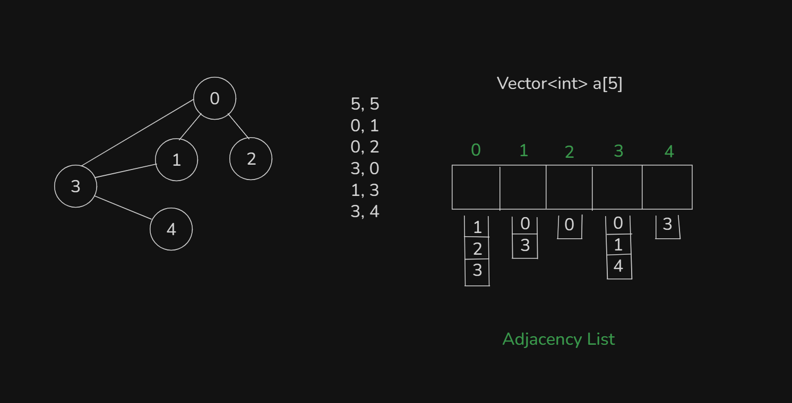

## 1. Adjacency List Implementation
- Program: `adjacency_list.cpp`

## 2. Adjacency List Animated
- Explanation this drawing with animated way in this video:
    - 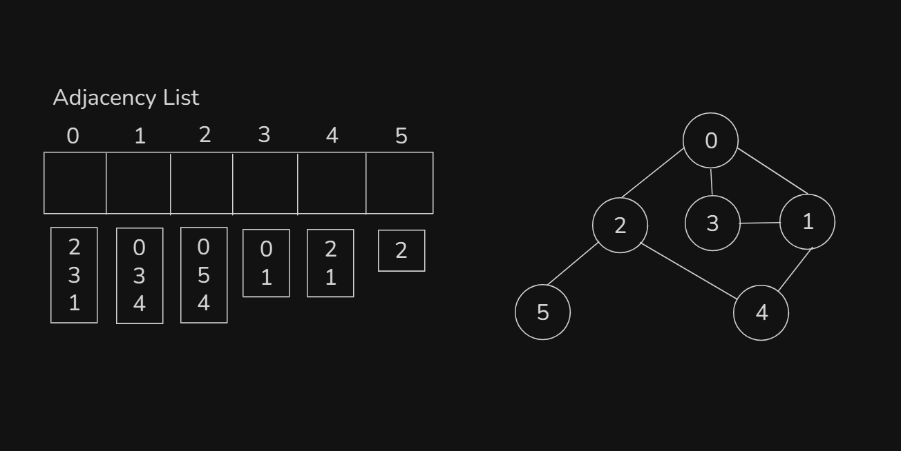

## 3. Edge List
- `Edge List` concept and logic building with drawing:
    - 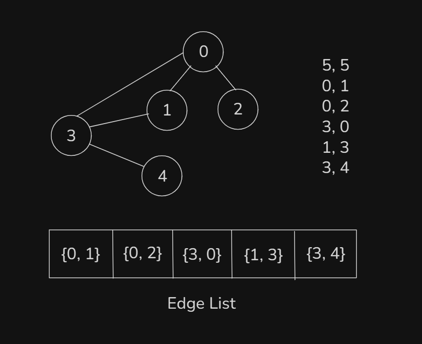
- Program: `edge_list.cpp`

## 4. Edge List Animated
- Explanation this drawing with animated way in this video:
    - 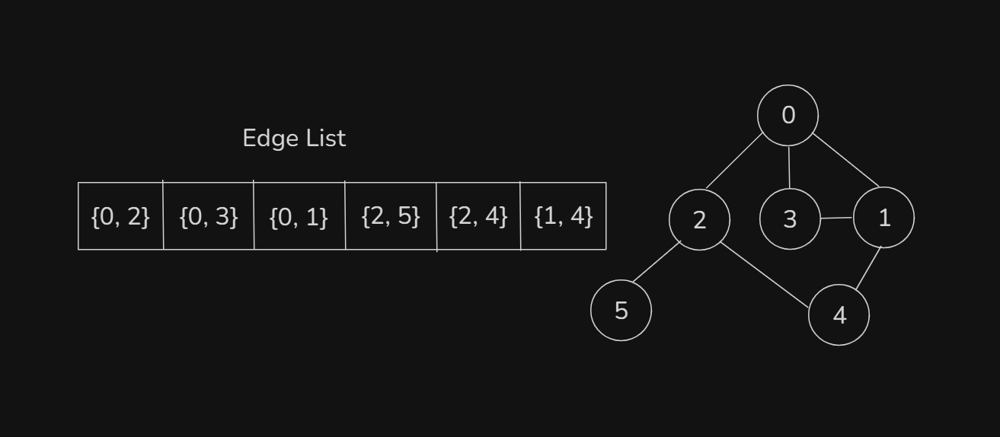

## 5. Comparison of 3 graph representations
- Comparison of 3 graph representations:
    - `Adjacency Matrix`
        - 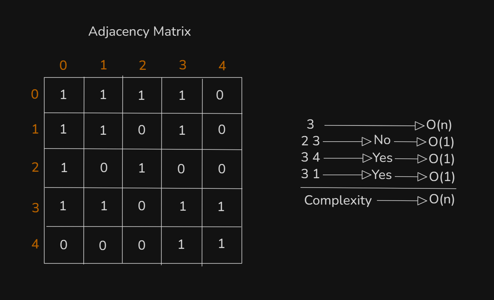
    - `Adjacency List`
        - 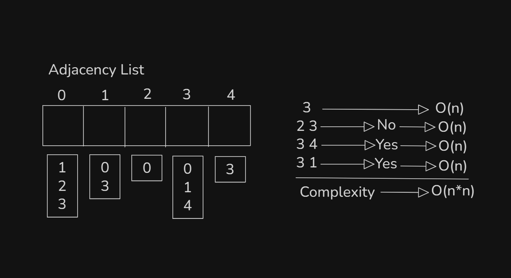
    - `Edge List`
        - 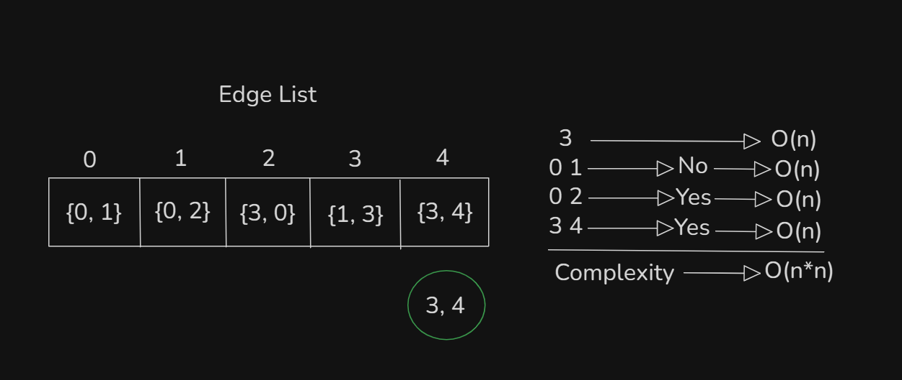
- Check 2 nodes connected or not:
    - `Adjacency Matrix O(1)`
    - `Adjacency List O(n)`
    - `Edge List O(n)`
- All the connected nodes from a node:
    - `Adjacency List O(1)`
    - `Adjacency Matrix O(n)`
    - `Edge List O(n)`
- Need to Edge nodes from a all nodes:
    - `Edge List O(1)`
    - `Adjacency List O(n)`
    - `Adjacency Matrix O(n)`

## 6. Graph Visualization
- [Go to the link](https://csacademy.com/app/graph_editor/)
- This link for `Graph Visualization`

## 7. Graph Traversal
- Two type are Graph Traversal:
    - `Breadth First Search`
    - `Depth First Search`
- `Breadth First Search` done the work with `level order`
    - 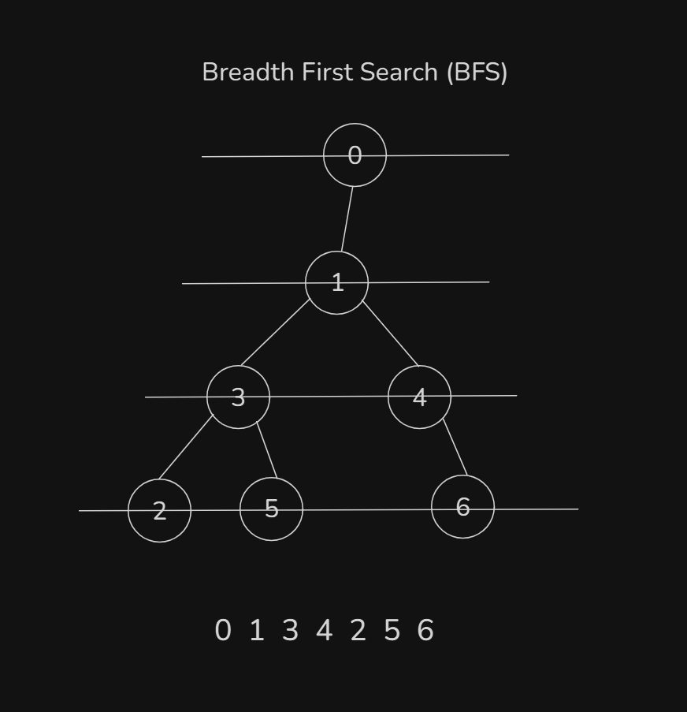
- `Depth First Search` done the work with `Depth wise`
    - 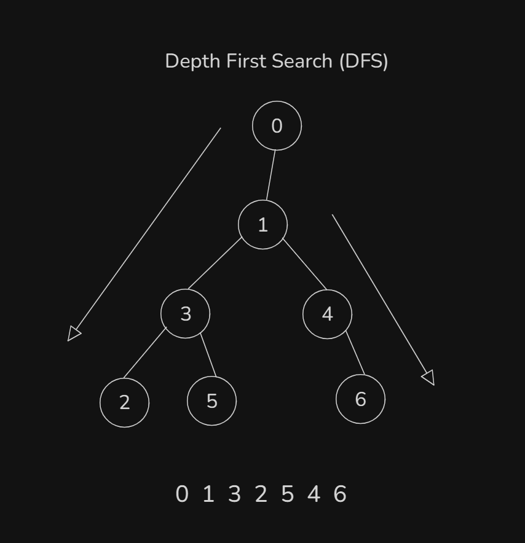

## 8. BFS Traversal theory
- `BFS Traversal` also similar to `Binary tree level order traversal`
    - 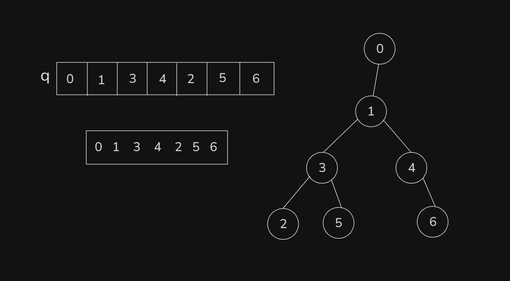
- Tree can't going from children to parent, but Graph can going from children to parent.
- Duplicate value are not stored in Queue:
    - 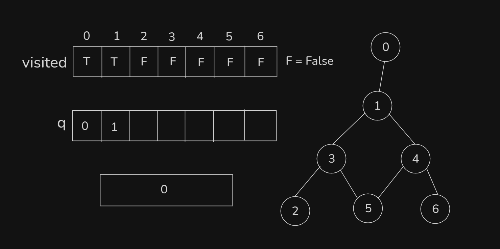
    - 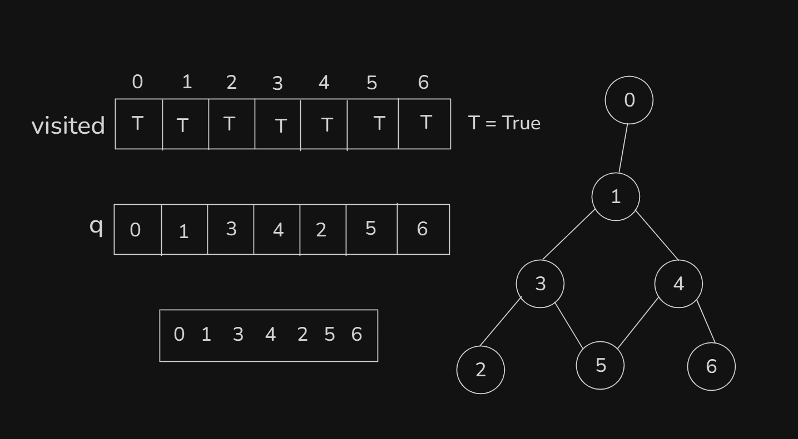

## 9. BFS traversal implementation
- Program: `bfs.cpp`

## 10. BFS Traversal Animated
- Explanation those code in this video with animated way:
    ```
    void bfs(int src) {
        queue<int> q;
        q.push(src);
        vis_arr[src] = true;

        while(!q.empty()) {
            // Ber kore ana
            int parent = q.front();
            q.pop();
            // Oi node ke niye kaj
            cout << parent << " ";
            // Children gulo push kora
            for(int child : adj_list[parent]) {
                if(vis_arr[child] == false) {
                    q.push(child);
                    vis_arr[child] = true;
                }
            }
        }
    }
    ```

## 11. Complexity Analysis of BFS
- Abc

## Quiz: Module 02
- `Total Questions: 10`
- `Total Marks: 10`

## Extra Practice Problem and Quiz Explanation
- [Quiz Explanation:](https://docs.google.com/document/d/1OnDcOECydNTe0yOf0BTuAbNRBguysXHu/edit?usp=sharing&ouid=110071013354717279052&rtpof=true&sd=true)
- [Extra Practice Problem (Optional):](https://docs.google.com/document/d/1yv6zXh9cGeP0owXS71hF_YZlzU8yPAq9fJNcfkC715A/edit?usp=sharing)
#### 1. What does BFS stand for?
**a)** Best-First Search  
**b)** Breadth-First Search ✅  
**c)** Binary-First Search  
**d)** Backward-First Search
> **Explanation:** BFS stands for Breadth First Search।
---
#### 2. Which graph representation is suitable to know if a node is connected with another node?
**a)** Adjacency Matrix ✅  
**b)** Adjacency List  
**c)** Edge List  
**d)** Both Adjacency List and Adjacency Matrix
> **Explanation:** Adjacency Matrix এর সাহায্যে আমরা খুব সহজেই বের করতে পারি দুটি নোড একে অন্যের সাথে কানেক্টেড আছে কিনা। এটি বের করার টাইম কমপ্লেক্সিটি O(1)।
---

## Feedback Form
- মডিউল রিলেটেড তোমার যে কোন ফিডব্যাক থাকলে এই ফর্মে লিখে দিতে পারো। আমরা তোমার ফিডব্যাক গুরুত্বসহকার দেখব।
- [Form Links](https://forms.gle/DH5mjuGD1x2EZ4z29)