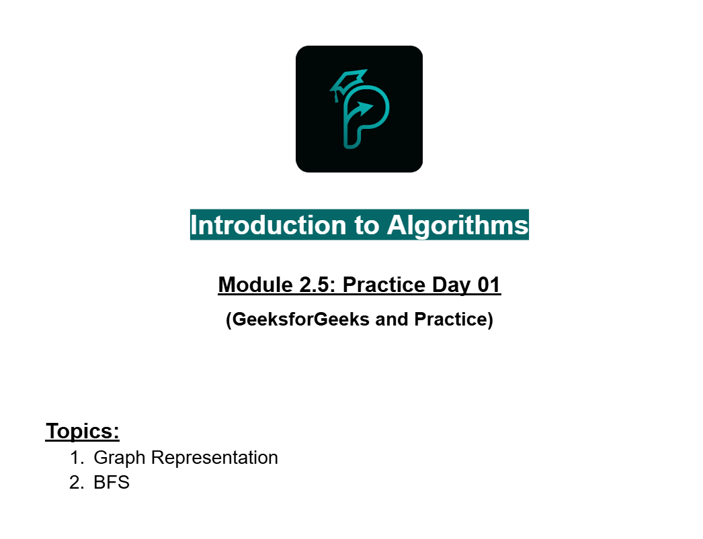
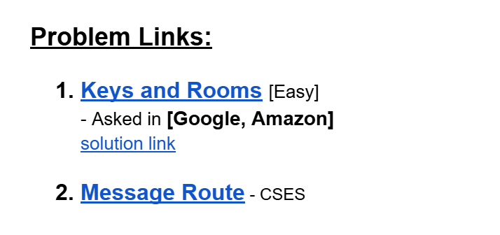
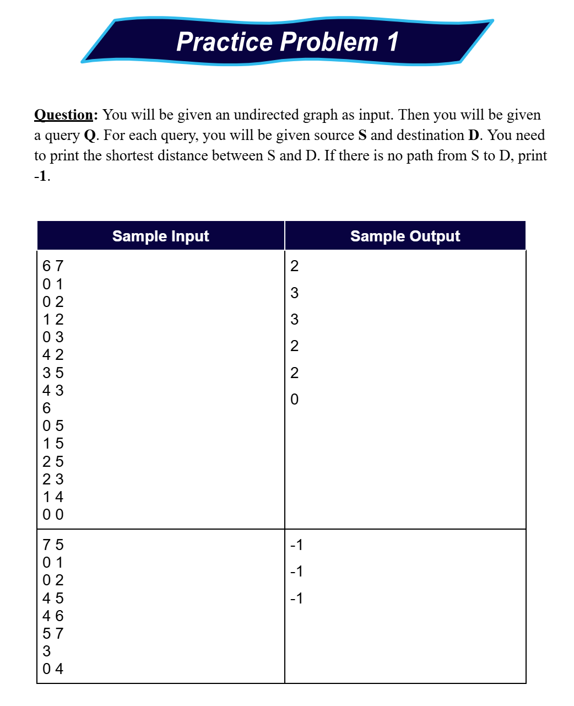
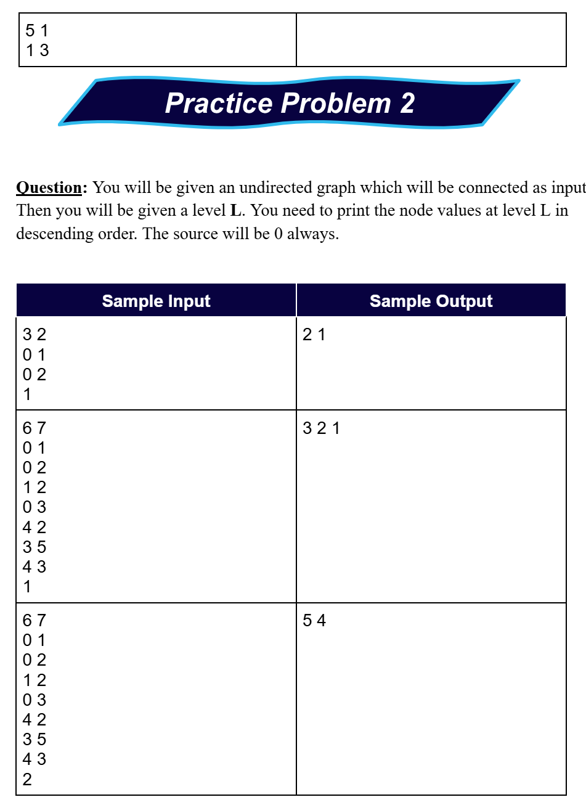
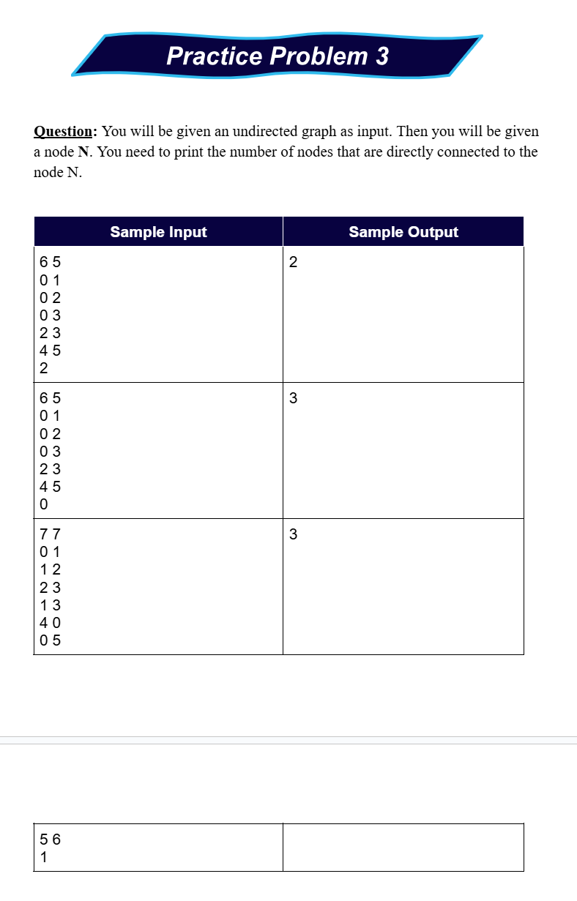

# Date: 18 August, 2025 - Monday

## Topics:
- Practice Problem Set: Module 2.5
0. Check if a node can be visited or not
1. Single Source Shortest Distance using BFS
2. Path printing theory
3. Path printing implementation
4. Path printing using BFS Animated
5. Practice Instructions

## Practice Problem Set: Module 2.5
- [Practice Problem Link:](https://docs.google.com/document/d/1PyDLefzBJ0s9ob5MxfFxUcTM5RB1UaQF/edit?usp=sharing&ouid=110071013354717279052&rtpof=true&sd=true)
- 
- 
- 
- 
- 
- [Problem 1](https://leetcode.com/problems/keys-and-rooms/description/)
    - [Solution Link](https://leetcode.com/problems/keys-and-rooms/solutions/7080245/simple-bfs-beginner-friendly-beats-100-b-lvt4/)
- [Problem 2](https://cses.fi/problemset/task/1667)

## 0. Check if a node can be visited or not
- Abc