# Date: 19 August, 2025 - Tuesday

## Topics:
0. Introduction
1. DFS Traversal
2. DFS Traversal Implementation
3. DFS Animated
4. What is 2D Grid
5. DFS on 2D grid
6. DFS on 2D grid Implementation I
7. DFS on 2D grid Implementation II
8. DFS on 2D grid Animated
- Quiz: Module 03
- Quiz Explanation Module 03
- Feedback Form Module 03

## 0. Introduction
- Graph Traversal Algorithms - `Depth First Search (DFS)`
- Learn and understanding when `BFS` using and when `DFS` using.
- `Depth First Search (DFS)` on a 2D Grid
- `Breadth First Search (BFS)` on a 2D Grid

## 1. DFS Traversal
- You can traversal as your wish:
    - 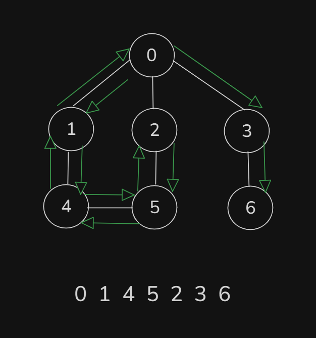
    - 
- `DFS` code implement with `Recursion`

## 2. DFS Traversal Implementation
- Code implementation for this Graph:   
    - 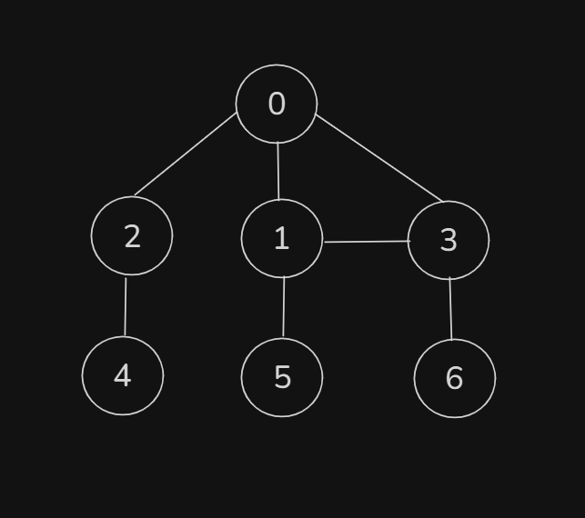
- Program: `dfs.cpp`

## 3. DFS Animated
- Explanation those code in this video with animated way:
    ```
    void dfs(int src) {
        cout << src << " ";
        vis_arr[src] = true;
        for(int child : adj_list[src])
            if(vis_arr[child] == false)
                dfs(child);
    }
    ```

## 4. What is 2D Grid
- `2D Grid` make thinking a `Graph`
    - 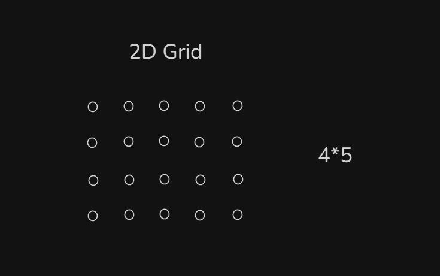
    - 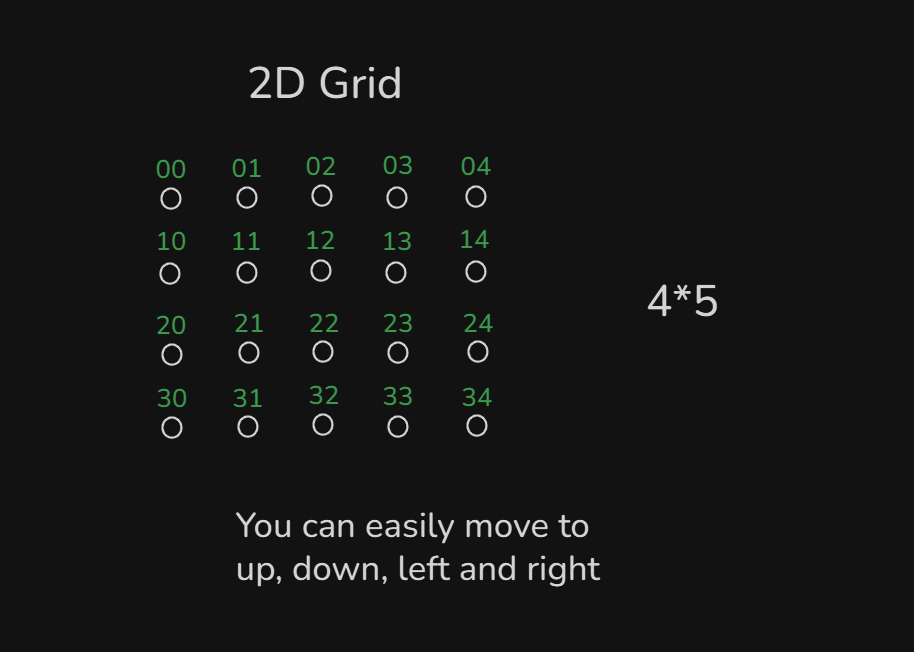
    - 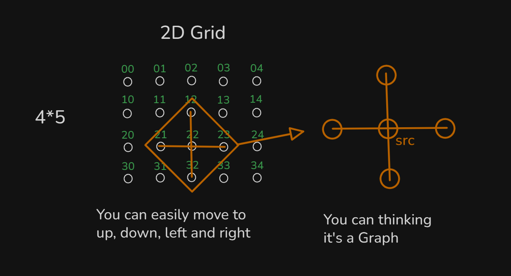
    - 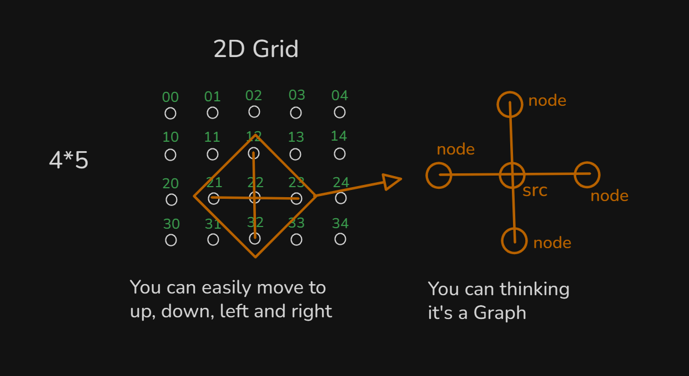

## 5. DFS on 2D grid
- 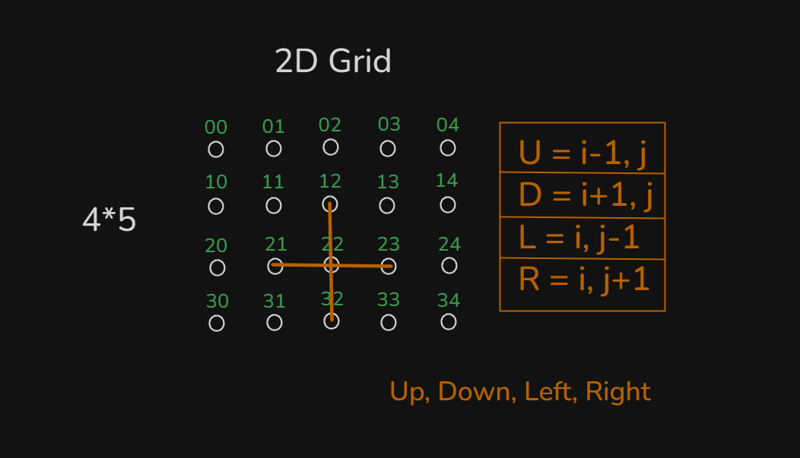
- 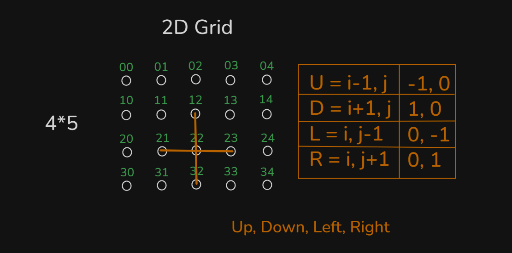
- 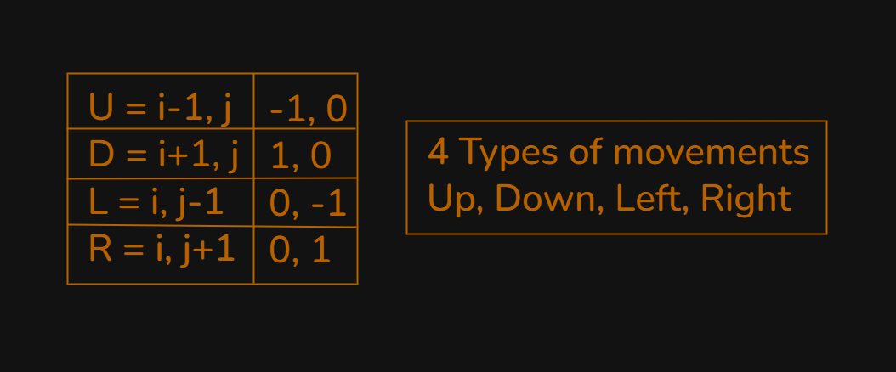
- 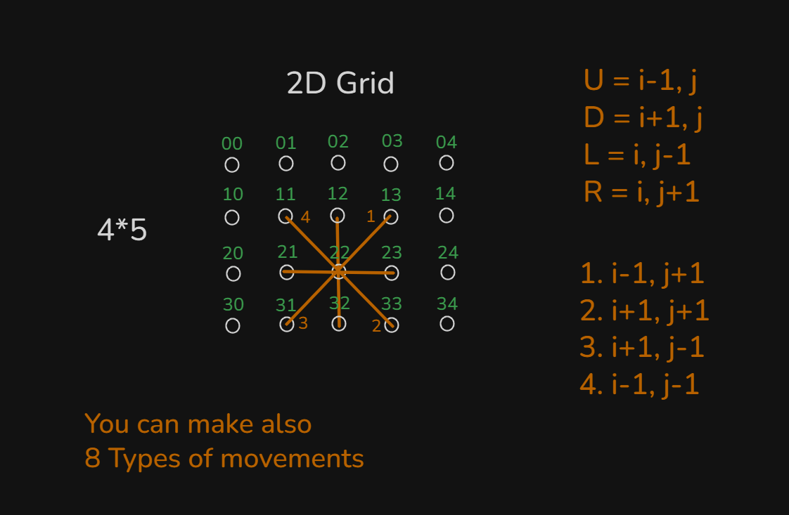
- Most of the time `4 types of movements` have to work.

## 6. DFS on 2D grid Implementation I
- Program: `dfs_2d_grid.cpp`

## 7. DFS on 2D grid Implementation II
- Program: `dfs_2d_grid2.cpp`
- This program `Time Complexity is`
    - `O(V+E)`
    - Then `v = n*m` and `E->edge` will ignored. `Time Complexity = O(n*m)`

## 8. DFS on 2D grid Animated
- Explanation this code in this video with animated way:
    ```
    void dfs(int si, int sj) {
        cout << si << " " << sj << endl;
        vis_arr[si][sj] = true;
        for(int i = 0; i < 4; i++) {
            int ci = si + d[i].first;
            int cj = sj + d[i].second;
            if(valid(ci, cj) == true && !vis_arr[ci][cj]) {
                dfs(ci, cj);
            }
        }
    }
    ```

## Quiz: Module 03
- `Total Questions: 10`
- `Total Marks: 10`

## Quiz Explanation Module 03
- [Quiz Explanation:](https://docs.google.com/document/d/1fMr8VybA5kQWQScUDWWlHxLcBIy2V1Cn/edit?usp=drive_link&ouid=112433310488936743525&rtpof=true&sd=true)
#### 1. What does DFS stand for?
**a)** Directed First Search  
**b)** Delay First Search  
**c)** Depth Full Search  
**d)** Depth First Search ✅
> **Explanation:** DFS means Depth First Search।
---
#### 2. How is DFS implemented?
**a)** By Queue  
**b)** By Recursion ✅  
**c)** Both A and B  
**d)** None of them
> **Explanation:** DFS সাধারণত Recursion বা Stack ব্যবহার করে ইমপ্লিমেন্ট করা হয়। যদিও Stack ব্যবহার করে DFS করা যায়, তবে Recursion ব্যবহার করাই বেশি প্রচলিত। (Recursion ব্যবহার করে DFS আপনাদের মডিউলে দেখানো হয়েছে)।
---
#### 3. For the graph, When source=0, What following sequences of DFS will be?
- 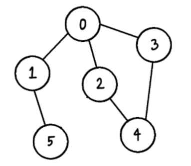
**a)** 0 -> 1-> 5 -> 2-> 4 -> 3  
**b)** 0 -> 1 -> 5 -> 3-> 4-> 2  
**c)** 0 -> 2 -> 4-> 3 -> 1-> 5  
**d)** All of a, b, and c. ✅
> **Explanation:** কুইজের a,b,c এই ৩ টা অপশনই সঠিক। (কিভাবে DFS ট্রাভার্স করতে হয় তা মডিউলে বিস্তারিত আলোচনা করা হয়েছে)।
---
#### 4. What will be the DFS traversal of the graph below if the source is 0?
- 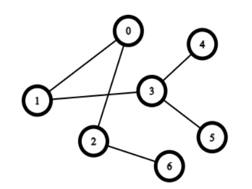
**a)** 0 -> 3 -> 4 -> 5 -> 6 -> 2 -> 1  
**b)** 0 -> 2-> 6 -> 1 ->  3 -> 4 -> 5 ✅  
**c)** 0 -> 1 -> 2 -> 3 -> 4 -> 5 -> 6  
**d)** 0 -> 1 -> 3 -> 2 -> 6 -> 4 -> 5
> **Explanation:** কুইজের b নং অপশন সঠিক। (কিভাবে DFS ট্রাভার্স করতে হয় তা মডিউলে বিস্তারিত আলোচনা করা হয়েছে)।
---
#### 5. In this 2D grid, we want to move from our source cell to the right. Our source cell i=1 and j=1. How can we do this?
- 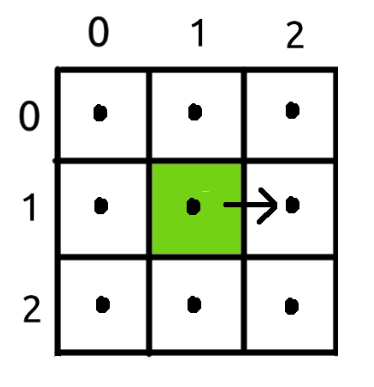
**a)** By adding -1 to i and 0 to j  
**b)** By adding 0 to i and  -1 to j  
**c)** By adding 0 to i and 1 to j ✅  
**d)** By adding 1 to i and 1 to j
> **Explanation:** 2D গ্রিডে (i, j) কোঅর্ডিনেট ব্যবহার করে move করা হয়, যেখানে i = সারি (row) সংখ্যা এবং j = কলাম (column) সংখ্যা। ডানে যেতে হলে row পরিবর্তন হবে না তাই i এর সাথে 0 যোগ হবে এবং column এক ধাপ বাড়বে তাই j এর সাথে 1 যোগ হবে। তাই, (i, j) → (i + 0, j + 1) আমাদের ডানে যাওয়ার সঠিক উপায়।
---
#### 6. In this 2D grid, we want to move from our source cell to the bottom left adjacent. Our source cell i=1 and j=2. How can we do this?
- 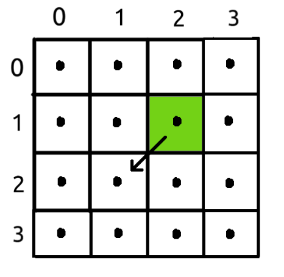
**a)** By adding -1 to i and -1 to j  
**b)** By adding 1 to i and  -1 to j ✅  
**c)** By adding -1 to i and 1 to j  
**d)** By adding 1 to i and 1 to j
> **Explanation:** 2D গ্রিডে (i, j) কোঅর্ডিনেট ব্যবহার করে চলাচল করা হয়, যেখানে i = সারি (row) সংখ্যা এবং j = কলাম (column) সংখ্যা। bottom-left যেতে হলে row এর সাথে 1 যোগ করলে নিচে নামবে এবং left যেতে  column এক ধাপ কমবে তাই j এর সাথে 1 বিয়োগ হবে। 
তাই, আমাদের bottom-left যাওয়ার সঠিক উপায় (i, j) → (i + 1 ,  j - 1)।
---
#### 7. What will be the DFS traversal of the graph below if the source is 3?
- 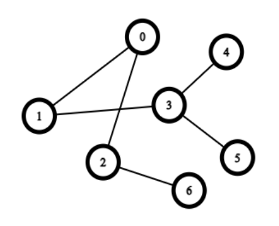
**a)** 3 -> 4 -> 5 -> 6 -> 2 -> 1 -> 0  
**b)** 3 -> 4 -> 5 -> 1 -> 0 -> 2 -> 6 ✅  
**c)** 3 -> 1 -> 2 -> 0 -> 4 -> 5 -> 6  
**d)** 3 -> 1 -> 0 -> 2 -> 4 -> 5 -> 6
> **Explanation:** কুইজের b নং অপশন সঠিক। (কিভাবে DFS ট্রাভার্স করতে হয় তা মডিউলে বিস্তারিত আলোচনা করা হয়েছে)।
---
#### 8. For the graph When source=5; What following sequences of DFS will be?
- 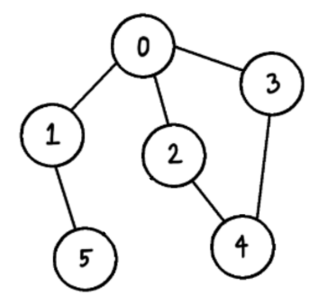
**a)** 5 -> 1 -> 0 -> 2 -> 4 -> 3  
**b)** 5 -> 1 -> 0 -> 3 -> 4 -> 2  
**c)** Both A and B ✅  
**d)** None of them
> **Explanation:** কুইজের A,B এই 2 টা অপশনই সঠিক। (কিভাবে DFS ট্রাভার্স করতে হয় তা মডিউলে বিস্তারিত আলোচনা করা হয়েছে )।
---
#### 9. What type of traversal method is there for the DFS graph?
**a)** Level-wise Traversal  
**b)** Breadth-wise Traversal  
**c)** Depth-wise Traversal ✅  
**d)** Random Traversal
> **Explanation:** DFS এ সাধারণত Depth-wise traversal পদ্ধতি অনুসরণ করে, যেখানে প্রথমে একটি নোড select করা হয়, তারপর যতদূর সম্ভব Depth এ যায়।
---
#### 10. When does DFS backtracking occur?
**a)** When all adjacent nodes are visited ✅  
**b)** When a new node is found  
**c)** When a new edge is discovered  
**d)** When there is only one node
> **Explanation:** DFS-এ যখন কোনো নোডের সকল Adjacent নোড ভিসিট করা শেষ হয় এবং নতুন কোনো নোডে যাওয়ার path থাকে না। তখন এটি পূর্বের নোডে ফিরে যায় বা backtracking ঘটে। <br><br>
ভুল Option গুলোর ব্যাখ্যা: <br>
❌ B) When a new node is found <br>
➡️ নতুন নোড পাওয়া গেলে ব্যাকট্র্যাকিং হয় না, বরং DFS সেই নোডে যায় এবং  নোড ভিসিট করে। backtracking তখনই ঘটে যখন কোনো নতুন নোড পাওয়া যায় না। <br> <br>
❌ C) When a new edge is discovered <br>
➡️ নতুন কোনো Edge discover হলে DFS সেই edge ধরে নতুন নোডে যায়, ব্যাকট্র্যাকিং তখন হয় না। ব্যাকট্র্যাক তখনই হয় যখন আর কোনো নতুন নোডে যাওয়ার edge or path থাকে না। <br> <br>
❌ D) When there is only one node <br>
➡️ যদি গ্রাফে শুধু একটি নোড থাকে, তাহলে ব্যাকট্র্যাক করার প্রয়োজনই নেই কারণ নতুন কোনো নোডে যাওয়ার সুযোগ নেই। DFS শুধুমাত্র একটি নোড ভিজিট করেই শেষ হয়ে যাবে। <br> <br>
---

## Feedback Form
- মডিউল রিলেটেড তোমার যে কোন ফিডব্যাক থাকলে এই ফর্মে লিখে দিতে পারো। আমরা তোমার ফিডব্যাক গুরুত্বসহকার দেখব।
- [Form Links](https://forms.gle/DH5mjuGD1x2EZ4z29)