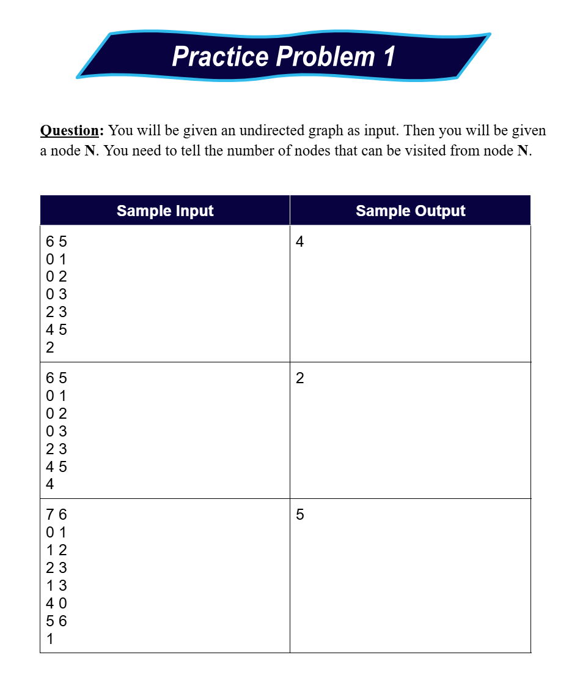
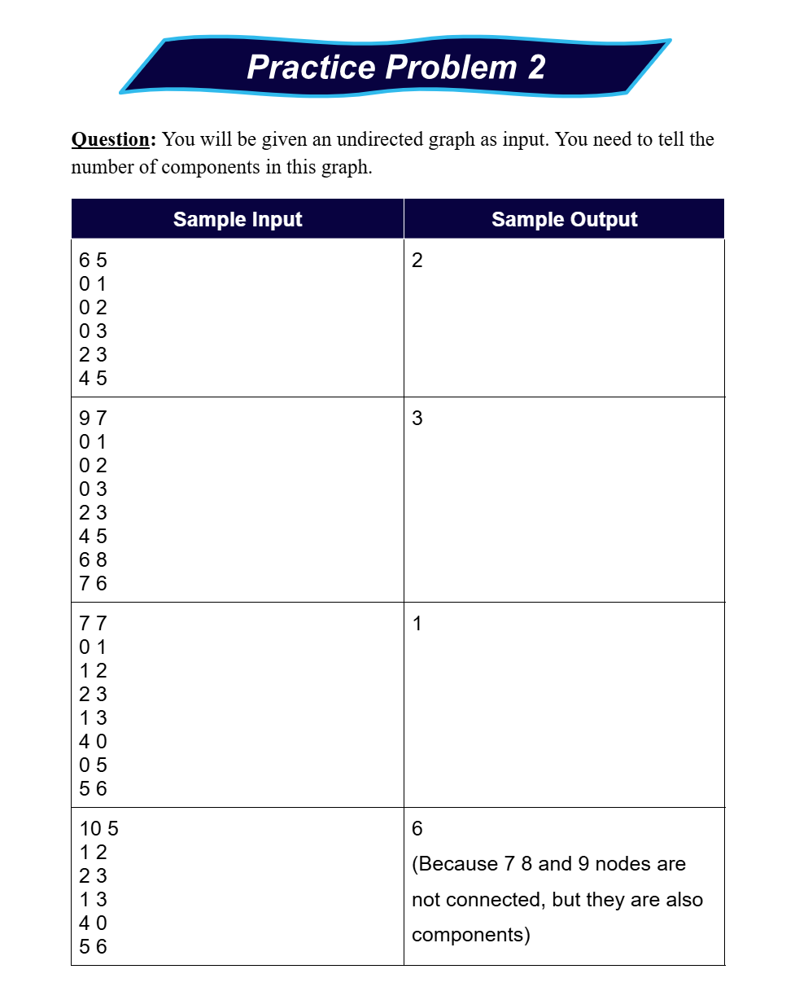
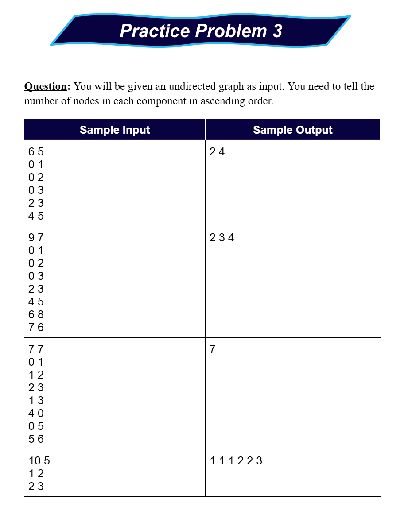
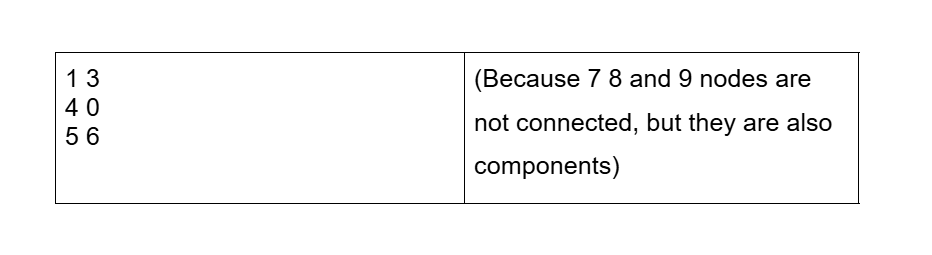

# Date: 20 August, 2025 - Wednesday

## Topics:
- Practice Problem Set: Module 3.5
0. BFS on 2D grid
1. Variations of 2D Grid
2. Number of Components
3. Practice Instructions

## Practice Problem Set: Module 3.5
- [Practice Problem Link](https://docs.google.com/document/d/1yoK3HsR21Tr4f1y9O_Fo-IMS19-4ho6q/edit?usp=sharing&ouid=110071013354717279052&rtpof=true&sd=true)
- 
- 
- 
- 
- 
- 
- [Problem 1](https://cses.fi/problemset/task/1192)
- [Problem 2](https://leetcode.com/problems/flood-fill/)
- [Problem 3](https://leetcode.com/problems/number-of-closed-islands/)

## 0. BFS on 2D grid
- Program: `bfs_2d_grid.cpp`
- Next program `bfs_2d_grid2.cpp` for finding shortest distance to each nodes.
- Program: `bfs_2d_grid2.cpp`

## 1. Variations of 2D Grid
- Program: `bfs_2d_grid3.cpp`