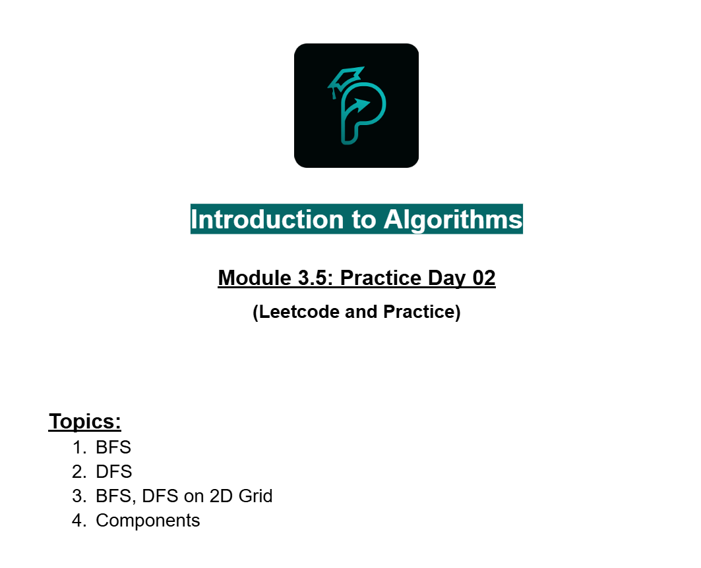

# Date: 20 August, 2025 - Wednesday

## Topics:
- Practice Problem Set: Module 3.5
0. BFS on 2D grid
1. Variations of 2D Grid
2. Number of Components
3. Practice Instructions

## Practice Problem Set: Module 3.5
- [Practice Problem Link](https://docs.google.com/document/d/1yoK3HsR21Tr4f1y9O_Fo-IMS19-4ho6q/edit?usp=sharing&ouid=110071013354717279052&rtpof=true&sd=true)
- 