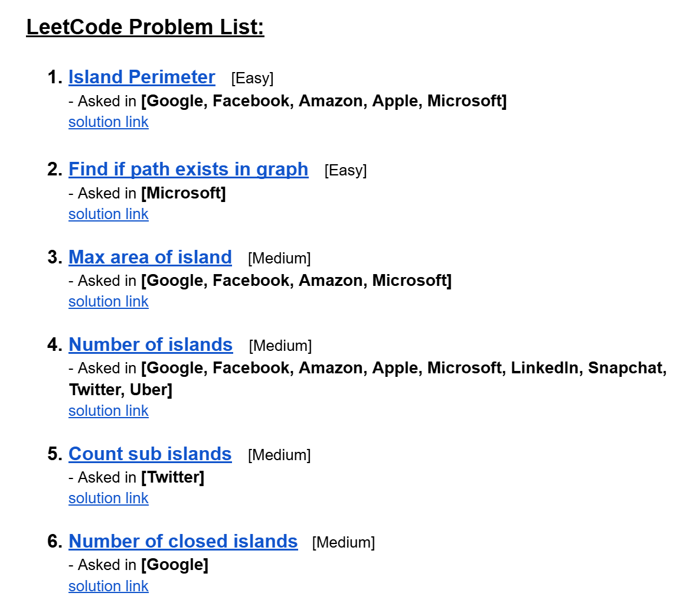
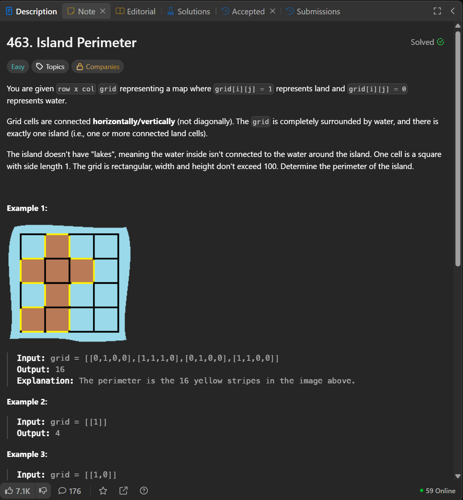
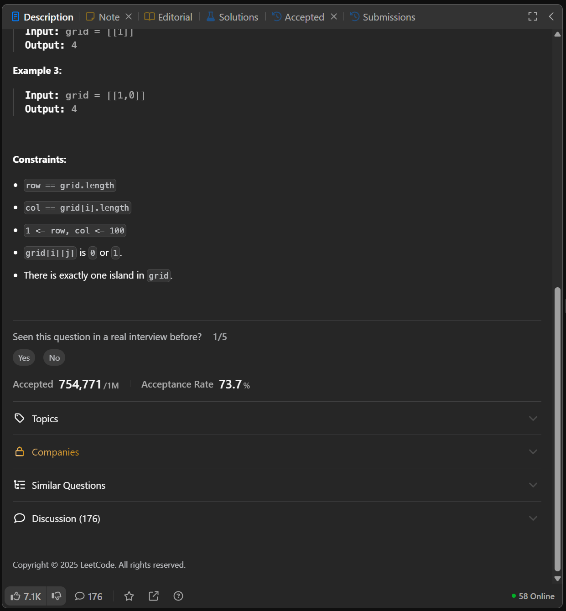

# Date: 23 August, 2025 - Saturday

## Topics:
- Module 05 Problem List
0. Introduction
1. Island Perimeter part I
2. Island Perimeter part II
3. Find if path exists in graph
4. Max area of Island
5. Number of Islands
6. Count sub islands
7. Number of closed islands
8. Summary
- Extra Practice Problem
- Feedback Form Module 05

## Module 05 Problem List
- [Here is Problem Link](https://docs.google.com/document/d/1QBllWHoRSyuKG7xZru_t0I4TSjWgPFoHfy2aZG3gbQI/edit?usp=sharing)
- 
- [Problem 1](https://leetcode.com/problems/island-perimeter/)
    - [Solution Link](https://leetcode.com/problems/island-perimeter/solutions/7105772/simple-beginner-friendly-dfs-well-explai-vtbh/)
- [Problem 2](https://leetcode.com/problems/find-if-path-exists-in-graph/)
    - [Solution Link](https://leetcode.com/problems/find-if-path-exists-in-graph/solutions/7105789/beginner-friendly-dfs-by-piaaaas-ufmk/)
- [Problem 3](https://leetcode.com/problems/max-area-of-island/)
    - [Solution Link](https://leetcode.com/problems/max-area-of-island/solutions/7105798/dfs-beats-100-by-piaaaas-rzev/)
- [Problem 4](https://leetcode.com/problems/number-of-islands/)
    - [Solution Link](https://leetcode.com/problems/number-of-islands/solutions/7105813/dfs-with-counter-by-piaaaas-da27/)
- [Problem 5](https://leetcode.com/problems/count-sub-islands/)
    - [Solution Link](https://leetcode.com/problems/count-sub-islands/solutions/7105821/simple-dfs-by-piaaaas-7m9o/)
- [Problem 6](https://leetcode.com/problems/number-of-closed-islands/)
    - [Solution Link](https://leetcode.com/problems/number-of-closed-islands/solutions/7105850/dfs-bfs-both-solution-beats-100-by-piaaa-bkiy/)

## 0. Introduction
- `Week 01` we was learned to `Graph`. `Graph` have 2 (two) traversal algorithms - `BFS and DFS`. Then how to `2D Grid` relationship with `Graph` that was understand.
- Today problems are this topics related, also `Week 01`. This six problem you solved then you can realize and understand `BFS and DFS` which time to apply which one.

## 1. Island Perimeter part I
- In this video we will discuss this problem
- Problem Image or Statement:
    - 
    - 
- `Graph` and `Algorithms` question are very hard or medium not a easy questions. `BFS` are using for short distance calculate and `DFS` is easy between `BFS`.

## 2. Island Perimeter part II
- Problem Image or Statement:
    - 
    - 
- Problem Solving Code:
    ```
    class Solution {
    public:
        int count;
        bool vis[101][101];
        vector<pair<int, int>> d = {{0,1}, {0,-1}, {1,0}, {-1,0}};
        int n,m;

        bool valid(int i,int j) {
            if(i<0 || i>=n || j<0 || j>=m)
                return false;
            return true;
        }

        void dfs(int si, int sj, vector<vector<int>>& grid) {
            vis[si][sj] = true;
            for(int i = 0; i < 4; i++) {
                int ci = si + d[i].first;
                int cj = sj + d[i].second;
                if(valid(ci, cj) == false)
                    count++;
                else if(valid(ci, cj) == true && grid[ci][cj] == 0)
                    count++;
                else if(valid(ci, cj) == true && !vis[ci][cj] && grid[ci][cj] == 1)
                    dfs(ci, cj, grid);
            }
        }

        int islandPerimeter(vector<vector<int>>& grid) {
            count = 0;
            n = grid.size();
            m = grid[0].size();
            memset(vis, false, sizeof(vis));
            for(int i = 0; i < n; i++)
                for(int j = 0; j < m; j++)
                    if(!vis[i][j] && grid[i][j] == 1)
                        dfs(i, j, grid);
            return count;
        }
    };
    ```