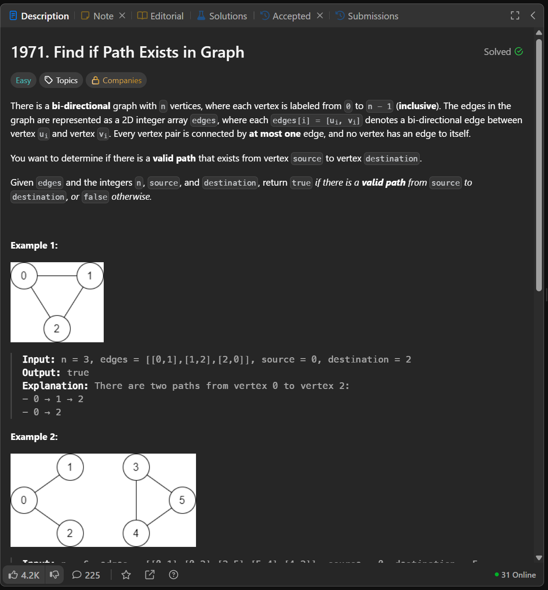
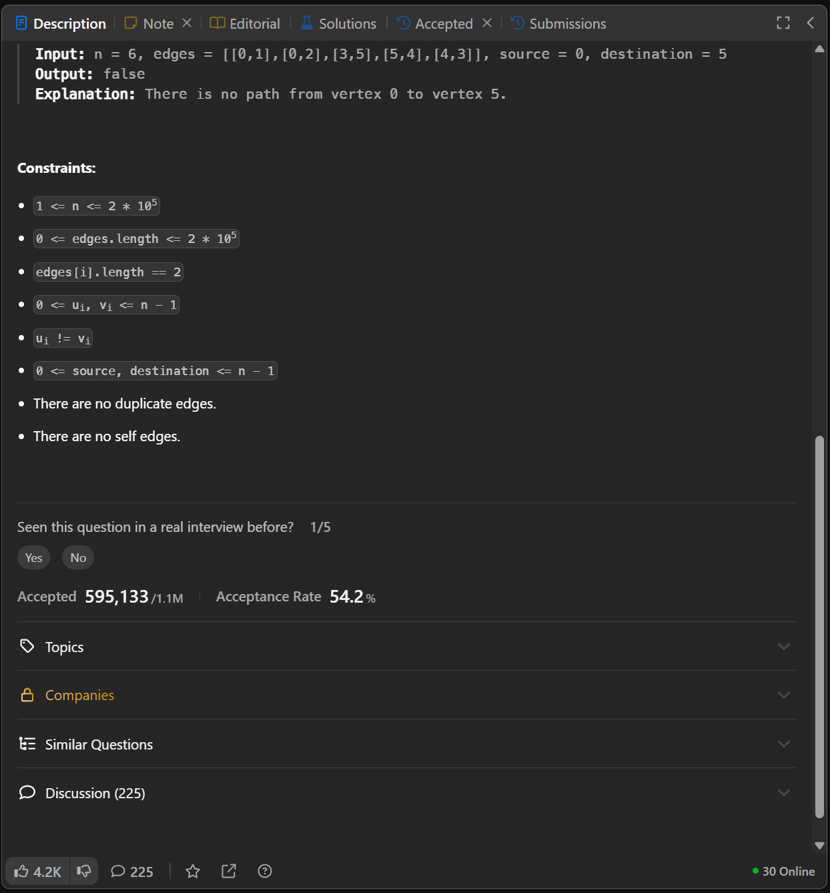
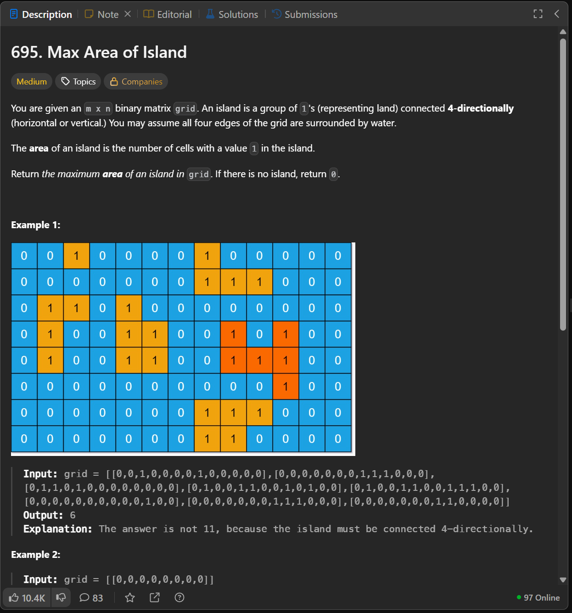
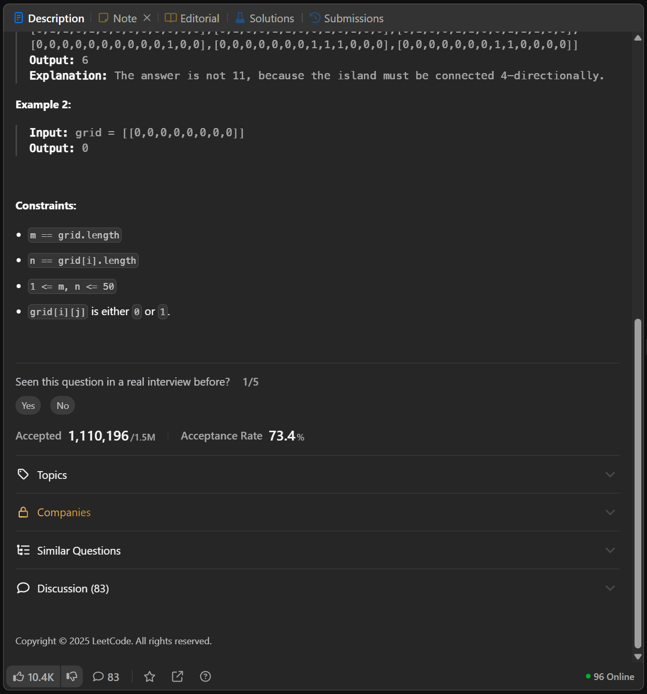
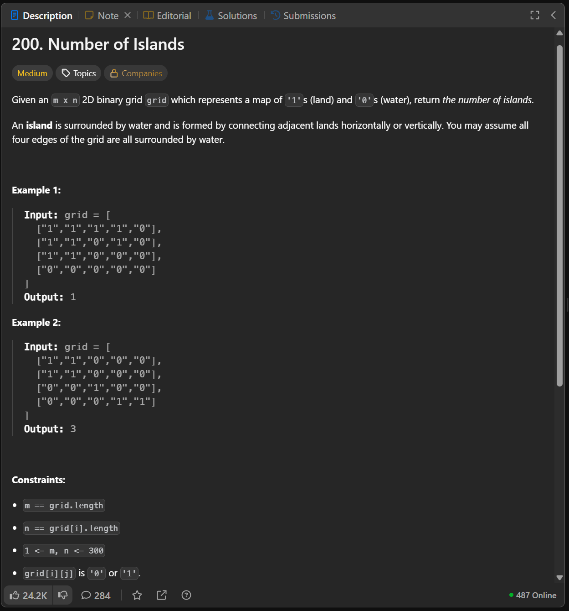
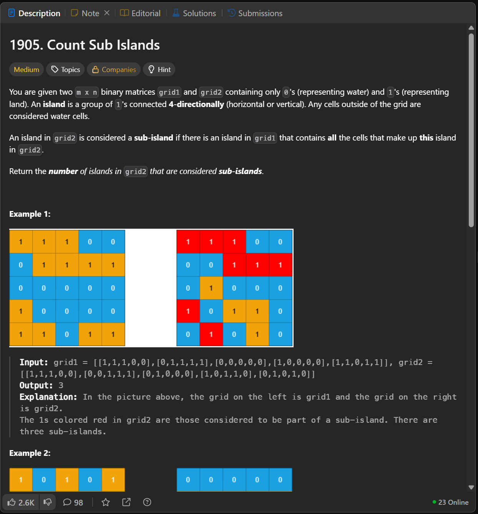
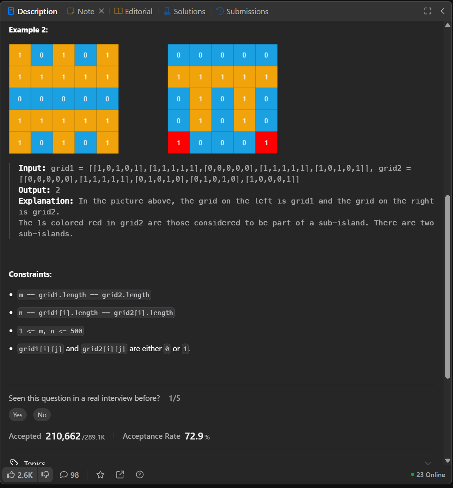
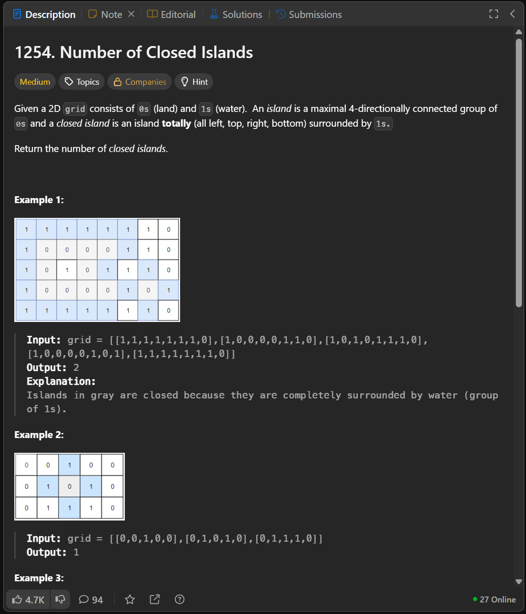
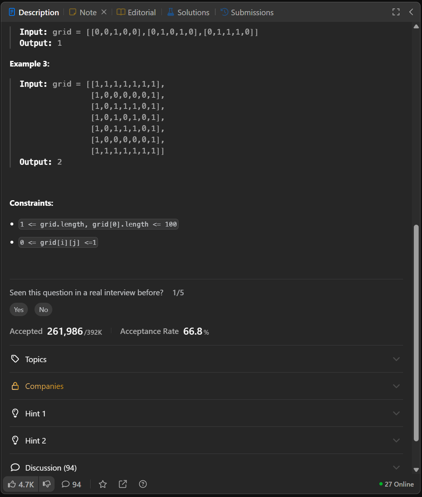
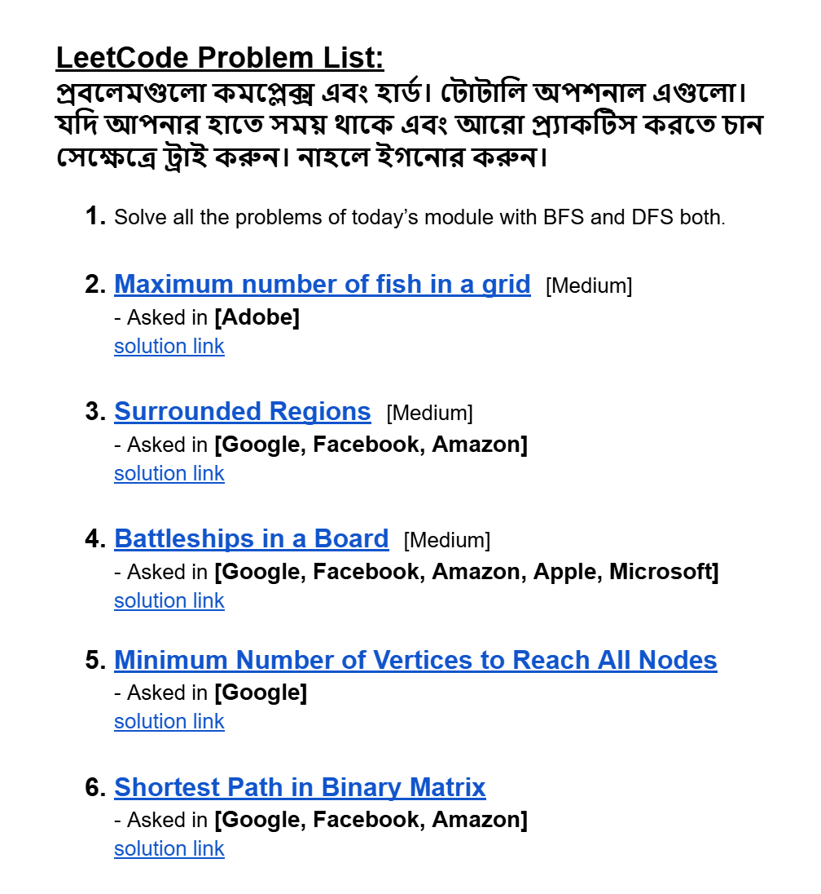

# Date: 23 August, 2025 - Saturday

## Topics:
- Module 05 Problem List
0. Introduction
1. Island Perimeter part I
2. Island Perimeter part II
3. Find if path exists in graph
4. Max area of Island
5. Number of Islands
6. Count sub islands
7. Number of closed islands
8. Summary
- Extra Practice Problem
- Feedback Form Module 05

## Module 05 Problem List
- [Here is Problem Link](https://docs.google.com/document/d/1QBllWHoRSyuKG7xZru_t0I4TSjWgPFoHfy2aZG3gbQI/edit?usp=sharing)
- 
- [Problem 1](https://leetcode.com/problems/island-perimeter/)
    - [Solution Link](https://leetcode.com/problems/island-perimeter/solutions/7105772/simple-beginner-friendly-dfs-well-explai-vtbh/)
- [Problem 2](https://leetcode.com/problems/find-if-path-exists-in-graph/)
    - [Solution Link](https://leetcode.com/problems/find-if-path-exists-in-graph/solutions/7105789/beginner-friendly-dfs-by-piaaaas-ufmk/)
- [Problem 3](https://leetcode.com/problems/max-area-of-island/)
    - [Solution Link](https://leetcode.com/problems/max-area-of-island/solutions/7105798/dfs-beats-100-by-piaaaas-rzev/)
- [Problem 4](https://leetcode.com/problems/number-of-islands/)
    - [Solution Link](https://leetcode.com/problems/number-of-islands/solutions/7105813/dfs-with-counter-by-piaaaas-da27/)
- [Problem 5](https://leetcode.com/problems/count-sub-islands/)
    - [Solution Link](https://leetcode.com/problems/count-sub-islands/solutions/7105821/simple-dfs-by-piaaaas-7m9o/)
- [Problem 6](https://leetcode.com/problems/number-of-closed-islands/)
    - [Solution Link](https://leetcode.com/problems/number-of-closed-islands/solutions/7105850/dfs-bfs-both-solution-beats-100-by-piaaa-bkiy/)

## 0. Introduction
- `Week 01` we was learned to `Graph`. `Graph` have 2 (two) traversal algorithms - `BFS and DFS`. Then how to `2D Grid` relationship with `Graph` that was understand.
- Today problems are this topics related, also `Week 01`. This six problem you solved then you can realize and understand `BFS and DFS` which time to apply which one.

## 1. Island Perimeter part I
- In this video we will discuss this problem
- Problem Image or Statement:
    - 
    - 
- `Graph` and `Algorithms` question are very hard or medium not a easy questions. `BFS` are using for short distance calculate and `DFS` is easy between `BFS`.

## 2. Island Perimeter part II
- Problem Image or Statement:
    - 
    - 
- Problem Solving Code:
    ```
    class Solution {
    public:
        int count;
        bool vis[101][101];
        vector<pair<int, int>> d = {{0,1}, {0,-1}, {1,0}, {-1,0}};
        int n,m;

        bool valid(int i,int j) {
            if(i<0 || i>=n || j<0 || j>=m)
                return false;
            return true;
        }

        void dfs(int si, int sj, vector<vector<int>>& grid) {
            vis[si][sj] = true;
            for(int i = 0; i < 4; i++) {
                int ci = si + d[i].first;
                int cj = sj + d[i].second;
                if(valid(ci, cj) == false)
                    count++;
                else if(valid(ci, cj) == true && grid[ci][cj] == 0)
                    count++;
                else if(valid(ci, cj) == true && !vis[ci][cj] && grid[ci][cj] == 1)
                    dfs(ci, cj, grid);
            }
        }

        int islandPerimeter(vector<vector<int>>& grid) {
            count = 0;
            n = grid.size();
            m = grid[0].size();
            memset(vis, false, sizeof(vis));
            for(int i = 0; i < n; i++)
                for(int j = 0; j < m; j++)
                    if(!vis[i][j] && grid[i][j] == 1)
                        dfs(i, j, grid);
            return count;
        }
    };
    ```

## 3. Find if path exists in graph
- Problem Image or Statement:
    - 
    - 
- Problem Solving Code:
    ```
    class Solution {
    public:
        vector<int> adj_list[200001];
        bool vis[200001];

        void dfs(int src) {
            vis[src] = true;
            for(int child : adj_list[src]) {
                if(!vis[child])
                    dfs(child);
            }
        }

        bool validPath(int n, vector<vector<int>>& edges, int source, int destination) {
            for(int i = 0; i < edges.size(); i++) {
                int a = edges[i][0];
                int b = edges[i][1];
                adj_list[a].push_back(b);
                adj_list[b].push_back(a);
            }
            memset(vis, false, sizeof(vis));
            dfs(source);
            return vis[destination];
        }
    };
    ```

## 4. Max area of Island
- Problem Image or Statement:
    - 
    - 
- Problem Solving Code:
    ```
    class Solution {
    public:
        bool vis[50][50];
        vector<pair<int, int>> d =  {{0,-1}, {0,1}, {-1,0}, {1,0}};
        int n, m, count, mx;

        bool valid(int i, int j) {
            if(i<0 || i>=n || j<0 || j>=m)
                return false;
            return true;
        }

        void dfs(int si, int sj, vector<vector<int>>& grid) {
            vis[si][sj] = true;
            count++;
            for(int i = 0; i < 4; i++) {
                int ci = si + d[i].first;
                int cj = sj + d[i].second;
                if(valid(ci, cj) && !vis[ci][cj] && grid[ci][cj] == 1)
                    dfs(ci, cj, grid);
            }
        }

        int maxAreaOfIsland(vector<vector<int>>& grid) {
            n = grid.size();
            m = grid[0].size();
            mx = 0;
            memset(vis, false, sizeof(vis));
            for(int i = 0; i < n; i++)
                for(int j = 0; j < m; j++)
                    if(!vis[i][j] && grid[i][j] == 1) {
                        count = 0;
                        dfs(i, j, grid);
                        mx = max(count,mx);
                    }
            return mx;
        }
    };
    ```

## 5. Number of Islands
- Problem Image or Statement:
    - 
- Problem Solving Code:
    ```
    class Solution {
    public:
        bool vis[300][300];
        vector<pair<int, int>> d =  {{0,-1}, {0,1}, {-1,0}, {1,0}};
        int n, m;

        bool valid(int i, int j) {
            if(i<0 || i>=n || j<0 || j>=m)
                return false;
            return true;
        }

        void dfs(int si, int sj, vector<vector<char>>& grid) {
            vis[si][sj] = true;
            for(int i = 0; i < 4; i++) {
                int ci = si + d[i].first;
                int cj = sj + d[i].second;
                if(valid(ci, cj) && !vis[ci][cj] && grid[ci][cj] == '1')
                    dfs(ci, cj, grid);
            }
        }

        int numIslands(vector<vector<char>>& grid) {
            n = grid.size();
            m = grid[0].size();
            int count = 0;
            memset(vis, false, sizeof(vis));
            for(int i = 0; i < n; i++)
                for(int j = 0; j < m; j++)
                    if(!vis[i][j] && grid[i][j] == '1') {
                        dfs(i, j, grid);
                        count++;
                    }
            return count;
        }
    };
    ```

## 6. Count sub islands
- Problem Image or Statement:
    - 
    - 
- Problem Solving Code:
    ```
    class Solution {
    public:
        bool vis[500][500];
        vector<pair<int, int>> d = {{-1,0}, {1,0}, {0,-1}, {0,1}};
        int n, m;
        bool flag;

        bool valid(int i, int j) {
            if(i<0 || i>=n || j<0 || j>=m)
                return false;
            return true;
        }

        void dfs(int si, int sj, vector<vector<int>>& grid1, vector<vector<int>>& grid2)
        {
            vis[si][sj] = true;
            if(grid1[si][sj] == 0)
                flag = false;
            for(int i = 0; i < 4; i++) {
                int ci = si + d[i].first;
                int cj = sj + d[i].second;
                if(valid(ci, cj) && !vis[ci][cj] && grid2[ci][cj] == 1)
                    dfs(ci, cj, grid1, grid2);
            }
        }

        int countSubIslands(vector<vector<int>>& grid1, vector<vector<int>>& grid2) {
            int count = 0;
            n = grid1.size();
            m = grid1[0].size();
            memset(vis, false, sizeof(vis));
            for(int i = 0; i < n; i++)
                for(int j = 0; j < m; j++)
                    if(!vis[i][j] && grid2[i][j] == 1) {
                        flag = true;
                        dfs(i, j, grid1, grid2);
                        if(flag == true)
                            count++;
                    }
            return count;
        }
    };
    ```

## 7. Number of closed islands
- Problem Image or Statement:
    - 
    - 
- Problem Solving Code:
    ```
    class Solution {
    public:
        bool vis[100][100];
        vector<pair<int, int>> d = {{-1,0}, {1,0}, {0,-1}, {0,1}};
        int n, m;
        bool flag;

        bool valid(int i, int j) {
            if(i<0 || i>=n || j<0 || j>=m)
                return false;
            return true;
        }

        void dfs(int si, int sj, vector<vector<int>>& grid) {
            vis[si][sj] = true;
            
            for(int i = 0; i < 4; i++) {
                int ci = si + d[i].first;
                int cj = sj + d[i].second;
                if(!valid(ci, cj))
                    flag = false;
                if(valid(ci, cj) && !vis[ci][cj] && grid[ci][cj] == 0)
                    dfs(ci, cj, grid);
            }
        }

        int closedIsland(vector<vector<int>>& grid) {
            int count = 0;
            n = grid.size();
            m = grid[0].size();
            memset(vis, false, sizeof(vis));
            for(int i = 0; i < n; i++)
                for(int j = 0; j < m; j++)
                    if(!vis[i][j] && grid[i][j] == 0) {
                        flag = true;
                        dfs(i, j, grid);
                        if(flag)
                            count++;
                    }
            return count; 
        }
    };
    ```

## 8. Summary
- Already we was learn `Algorithms Traversal` - `BFS` and `DFS`. Those 6 (Six) problem solve to this topics based `BFS` and `DFS`.

## Extra Practice Problem
- [Extra Practice Problem (Optional):](https://docs.google.com/document/d/1CAMxZMvqczNG1Yv4RGO4s-abD8ZEJiaOlBQtrhCxCYs/edit?usp=sharing)
- 
- `Problem 1` - `Solve all the problems of today’s module with BFS and DFS both`
- [Problem 2](https://leetcode.com/problems/maximum-number-of-fish-in-a-grid/description/)
    - [Solution Link](https://leetcode.com/problems/maximum-number-of-fish-in-a-grid/solutions/7106207/simple-dfs-by-piaaaas-v7v1/)
- [Problem 3](https://leetcode.com/problems/surrounded-regions/description/)
    - [Solution Link](https://leetcode.com/problems/surrounded-regions/solutions/7106369/dfs-mark-border-connected-os-first-beats-uydw/)
- [Problem 4](https://leetcode.com/problems/battleships-in-a-board/description/)
    - [Solution Link](https://leetcode.com/problems/battleships-in-a-board/solutions/7106386/dfs-simple-number-of-components-beats-10-784f/)
- [Problem 5](https://leetcode.com/problems/minimum-number-of-vertices-to-reach-all-nodes/)
    - [Solution Link](https://leetcode.com/problems/minimum-number-of-vertices-to-reach-all-nodes/solutions/7112574/simple-parent-check-approach-no-algorith-mka3/)
- [Problem 6](https://leetcode.com/problems/shortest-path-in-binary-matrix/)
    - [Solution Link](https://leetcode.com/problems/shortest-path-in-binary-matrix/solutions/7112836/simple-bfs-by-piaaaas-9ltf/)

## Feedback Form Module 05
- মডিউল রিলেটেড তোমার যে কোন ফিডব্যাক থাকলে এই ফর্মে লিখে দিতে পারো। আমরা তোমার ফিডব্যাক গুরুত্বসহকার দেখব।
- [Form Links](https://forms.gle/DH5mjuGD1x2EZ4z29)