# Date: 24 August, 2025 - Sunday

## Topics:
0. Introduction
1. Detect cycle in undirected graph
2. Detect cycle in undirected graph using BFS
3. Detect cycle in undirected graph using BFS Animated
4. Detect cycle in undirected graph using DFS
5. Detect cycle in directed graph
6. Detect cycle in directed graph using DFS
7. Detect cycle in directed graph using DFS Animated
- Quiz: Module 06
- Extra Practice Problem and Quiz Explanation
- Feedback Form Module 06

## 0. Introduction
- We will learn to `Cycle Detection`
- `Cycle Detection`:
    - `Undirected`:
        - `BFS`
        - `DFS`
    - `Directed`:
        - `DFS`
- 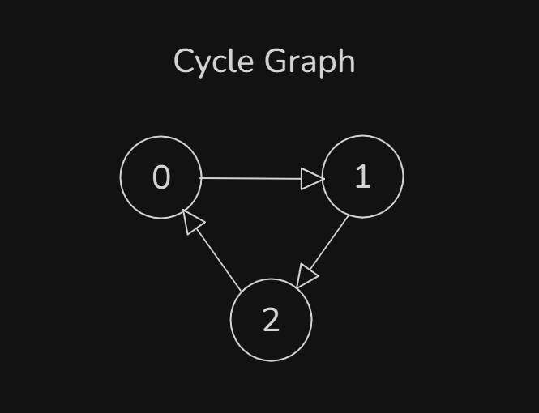
- This `Cycle Graph` also a loop system. This cycle will going around or rotates as a loops.
- `Undirected Graph have minimum 3(three) nodes`
    - 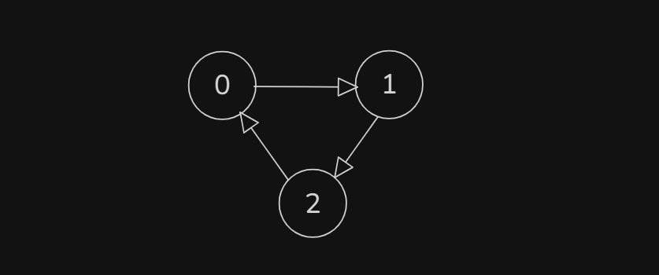
- `Directed Graph make with 2(two) nodes`
    - 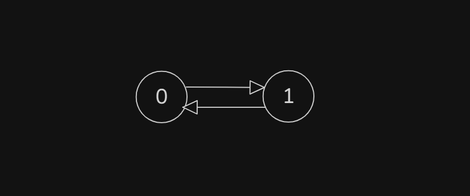

## 1. Detect cycle in undirected graph
- `Undirected Graph have minimum 3(three) nodes must or 3 nodes can above`
- Build logic for `Detect cycle in undirected graph` with drawing:
    - 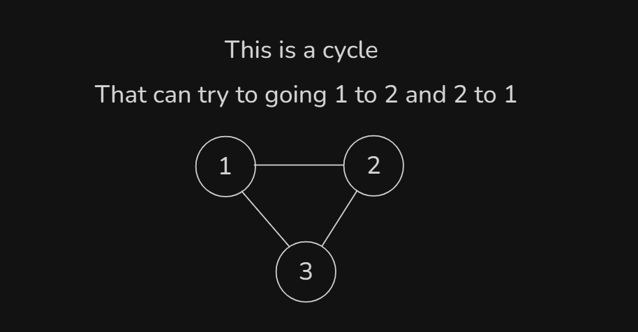
    - 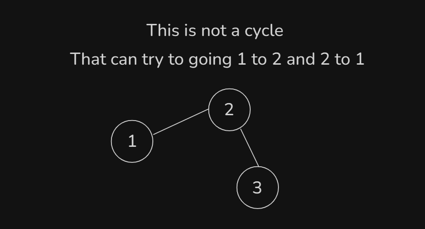
    - 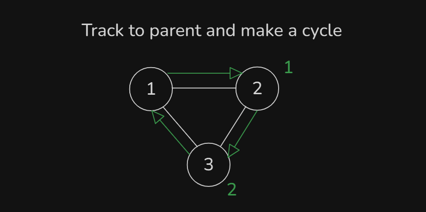
- `Undirected Graph` simple logics:
    - `If there a node visited then check to this node also a parent, then this is not a cycle`.
    - `If this node is not a parent but already this visited and going to there, then this a cycle`.

## 2. Detect cycle in undirected graph using BFS
- Program: `main.cpp`

## 3. Detect cycle in undirected graph using BFS Animated
- Explanation this code in this video:
    ```
    void bfs(int src) {
        queue<int> q;
        q.push(src);
        vis[src] = true;
        while(!q.empty()) {
            int par = q.front(); // Make a parent value
            q.pop();
            for(int child : adj_list[par]) {
                if(vis[child] && parent[par] != child)
                    cycle = true;
                if(!vis[child]) {
                    q.push(child);
                    vis[child] = true;
                    parent[child] = par;
                }
            }
        }
    }
    ```

## 4. Detect cycle in undirected graph using DFS
- Program: `main2.cpp`

## 5. Detect cycle in directed graph
- Those concept and logic understand in this video.
    - This is not a `Cycle`:
        - 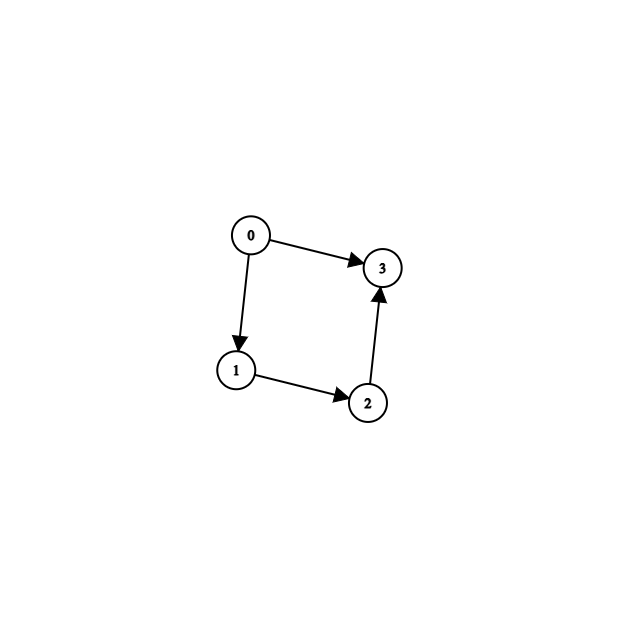
    - This is a `Cycle`:
        - 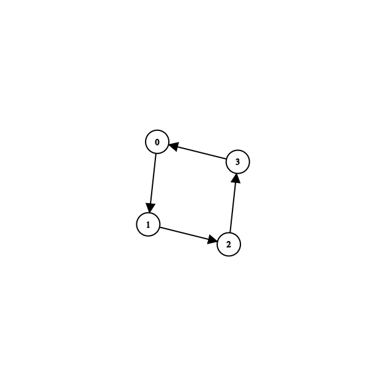

## 6. Detect cycle in directed graph using DFS
- Program: `main3.cpp`

## 7. Detect cycle in directed graph using DFS Animated
- Explanation this code in this video:
    ```
    void dfs(int src) {
        vis[src] = true;
        pathVis[src] = true;
        for(int child : adj_list[src]) {
            if(vis[child] && pathVis[child])
                cycle = true;
            if(!vis[child]) {
                dfs(child);
            }
        }
        pathVis[src] = false;
    }
    ```

## Quiz: Module 06
- `Total Questions: 10`
- `Total Marks: 10`

## Extra Practice Problem and Quiz Explanation
- [Quiz Explanation Link:](https://docs.google.com/document/d/1YBY4n8oYlmbWCooU9SwNQhMHhL8Kcwl69dK8A_m3nBg/edit?usp=drivesdk)
#### 1. What is a cycle in a graph?
**a)** A set of nodes connected by edges  
**b)** The longest path in the graph  
**c)** A path that starts and ends at the same node ✅  
**d)** None of the above
> **Explanation:** গ্রাফে কোনো একটি নোড থেকে ট্রাভারস শুরু করে সেই একই নোডে ফিরে আসা হলে তাকে একটি সাইক্লিক (Cyclic)  গ্রাফ বলা হয়ে থাকে।
---
#### 2. What is the time complexity of cycle detection using Depth-First Search in an undirected graph with V vertices and E edges?
**a)** O(V)  
**b)** O(E)  
**c)** O(V * E)  
**d)** O(V + E) ✅
> **Explanation:** আমরা জানি , Depth First Search(DFS) এর টাইম কমপ্লেক্সিটি O(Vertices + Edges) = O(V+E)।
---
#### 3. Does this directed graph have a cycle?
- 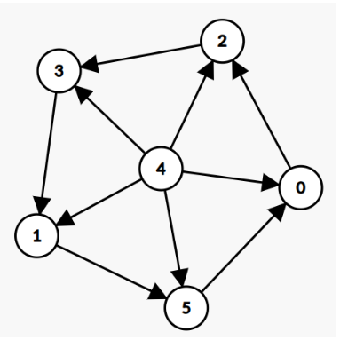
**a)** Yes ✅  
**b)** No
> **Explanation:** 1-> 5 -> 0 -> 2 -> 3 -> 1 এই পাথ টি একটি cycle নির্দেশ করে।
---
#### 4. What do we use to detect cycles in directed graphs?
**a)** visitedArray, parentArray.  
**b)** visitedArray only.  
**c)** visitedArray, pathVisitedArray. ✅  
**d)** pathVisitedArray only.
> **Explanation:** মডিউল ৬ এর ৬ নাম্বার সেকশনে এর বিস্তারিত এক্সপ্লেনেশন রয়েছে।
---
#### 5. In an undirected graph, what is the minimum number of edges required to form a cycle in a connected component with V vertices?
**a)** V - 1  
**b)** V ✅  
**c)** V + 1  
**d)** 2V
> **Explanation:** V সংখ্যক নোড পরস্পরের সাথে যুক্ত করার জন্য V-1 টি edge এর প্রয়োজন। এর চেয়ে একটি edge বেশি হলে graph টিতে একটি cycle ক্রিয়েট হবে. অর্থাৎ মিনিমাম V টি edge হলে একটি cyclic গ্রাফ তৈরি হবে।
---
#### 6. What is the minimum number of nodes needed to create a cycle in an undirected graph?
**a)** 2  
**b)** 3 ✅  
**c)** 4  
**d)** 1
> **Explanation:** একটি undirected গ্রাফে দুটি Node পরস্পরের সাথে একটি edge এর মধ্যে যুক্ত থাকলে , তাকে সাধারণত cyclic গ্রাফ বলা হয় না। এক্ষেত্রে minimum ৩ টি Node এর প্রয়োজন।
---
#### 7. What do we use to detect cycles in undirected graphs?
**a)** visitedArray, parentArray. ✅  
**b)** visitedArray only.  
**c)** visitedArray, pathVisitedArray.  
**d)** pathVisitedArray only.
> **Explanation:** একটি visited array এবং parent array এর মাধ্যমে undirected গ্রাফে cycle detect করা সম্ভব যা ৬-২ - ৬-৪ নাম্বার মডিউলে বিস্তারিত ব্যাখা করা হয়েছে।
---
#### 8. How many cycles in this directed graph?
- 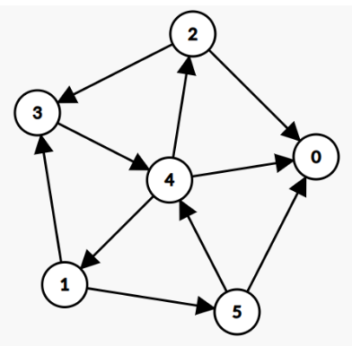
**a)** 2  
**b)** 4 ✅  
**c)** 3  
**d)** 1
> **Explanation:** Cycle সমুহ হলোঃ <br> ১। 1 -> 3 -> 4 -> 1 <br> ২। 3-> 4 -> 2 -> 3 <br> ৩। 1->5 -> 4 -> 1 <br> ৪ । 1->5->4->2->3->4->1।
---
#### 9. Which traversal algorithm did we use to detect cycles in directed graphs according to the module?
**a)** BFS  
**b)** DFS ✅
> **Explanation:** মডিউল ৬-৬ এ DFS এর সাহায্যে directed গ্রাফে কীভাবে cycle detect করতে হয় তা দেখানো হয়েছে।
---
#### 10. What is the minimum number of nodes needed to create a cycle in a directed graph?
**a)** 2 ✅  
**b)** 3  
**c)** 4  
**d)** 1
> **Explanation:** মিনিমাম দুটি Node এর মাধ্যমে directed graph এ cycle ক্রিয়েট হয়। যেমনঃ 1←→2।
---
### Extra Practice Problem (Optional):
- [Extra Practice Problem Link:](https://docs.google.com/document/d/1psUz9BHS2knojsMRJoFGPECRHJVPHz3tHKbmqUtScJY/edit?usp=drivesdk)
- 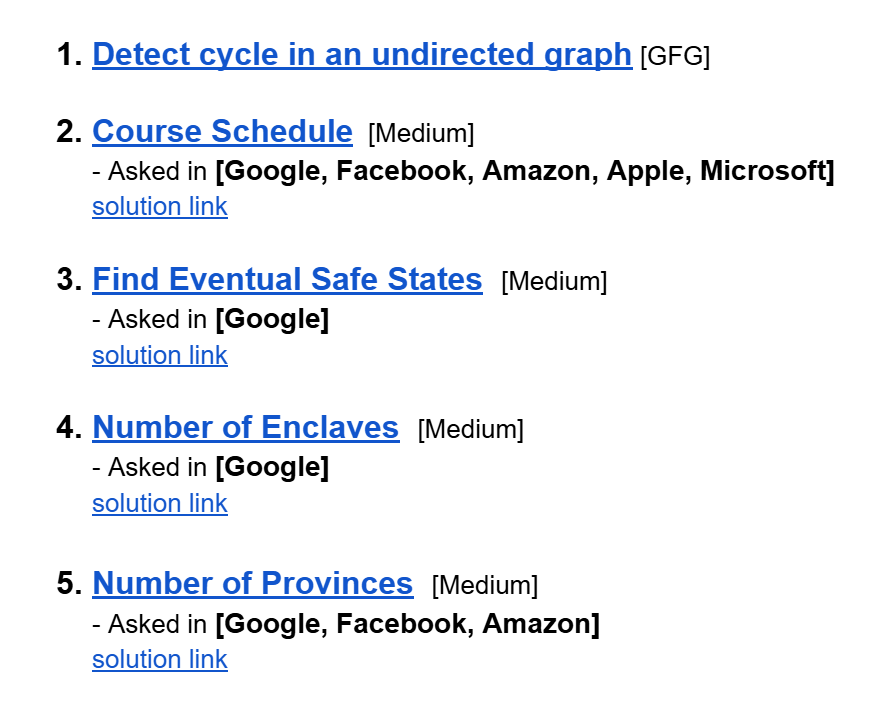
- [Problem 1](https://www.geeksforgeeks.org/problems/detect-cycle-in-an-undirected-graph/1?utm_source=geeksforgeeks&utm_medium=article_practice_tab&utm_campaign=article_practice_tab)
- [Problem 2](https://leetcode.com/problems/course-schedule/)
    - [Solution Link](https://leetcode.com/problems/course-schedule/solutions/7117305/no-topo-sort-just-dfs-with-pathvis-by-pi-chdo/)
- [Problem 3](https://leetcode.com/problems/find-eventual-safe-states/)
    - [Solution Link](https://leetcode.com/problems/find-eventual-safe-states/solutions/7117313/dfs-cycle-detection-solution-by-piaaaas-vt0f/)
- [Problem 4](https://leetcode.com/problems/number-of-enclaves/)
    - [Solution Link](https://leetcode.com/problems/number-of-enclaves/solutions/7114305/just-dfs-by-piaaaas-5ifu/)
- [Problem 5](https://leetcode.com/problems/number-of-provinces/)
    - [Solution Link](https://leetcode.com/problems/number-of-provinces/solutions/7114353/simple-dfs-beats-100-by-piaaaas-o81t/)

## Feedback Form Module 06
- মডিউল রিলেটেড তোমার যে কোন ফিডব্যাক থাকলে এই ফর্মে লিখে দিতে পারো। আমরা তোমার ফিডব্যাক গুরুত্বসহকার দেখব।
- [Form Links](https://forms.gle/DH5mjuGD1x2EZ4z29)