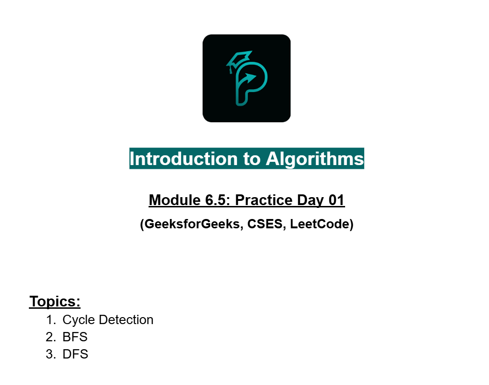
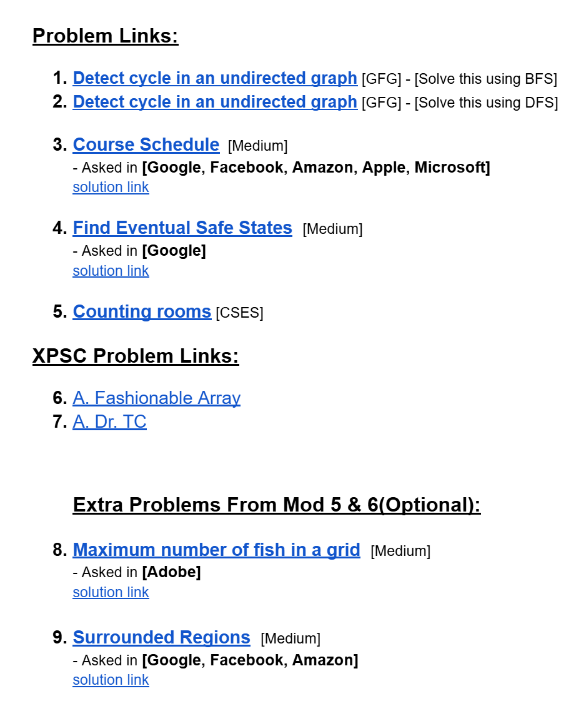
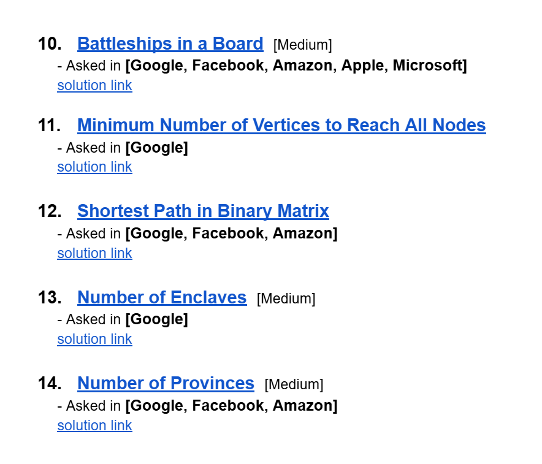
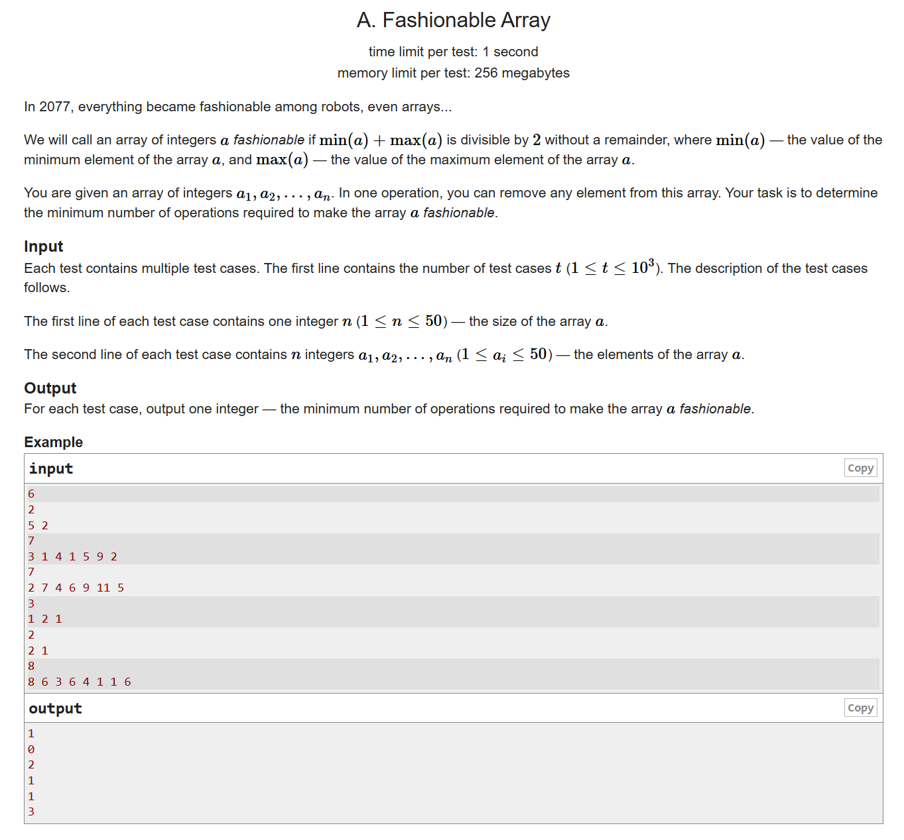
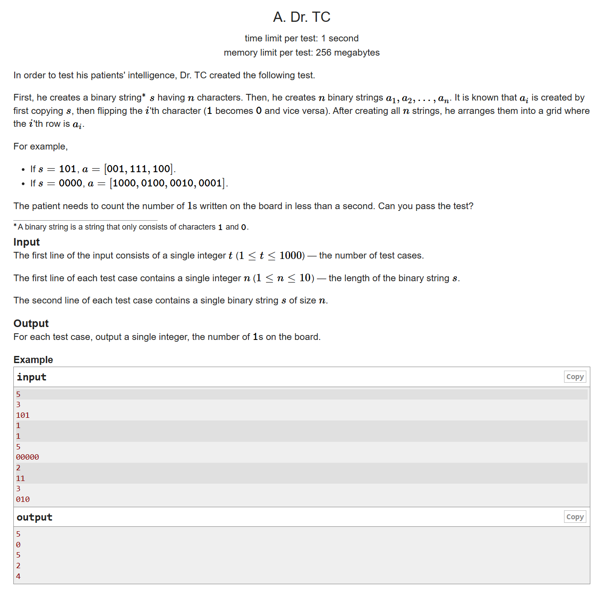

# Date: 25 August, 2025 - Monday

## Topics:
- Practice Problem Set: Module 6.5
- Fashionable Array
- Dr. TC
- Feedback about Road to XPSC
- Practice Instructions

## Practice Problem Set: Module 6.5
- [Practice Problem Set Link](https://docs.google.com/document/d/1tJhelqibvLQYJjak9tZ5Hxl1EhEuZD0D/edit?usp=drive_link&ouid=112433310488936743525&rtpof=true&sd=true)
- 
- 
- 
- `Problems Links`:
    - [Problem 1](https://www.geeksforgeeks.org/problems/detect-cycle-in-an-undirected-graph/1?utm_source=geeksforgeeks&utm_medium=article_practice_tab&utm_campaign=article_practice_tab)
    - [Problem 2](https://www.geeksforgeeks.org/problems/detect-cycle-in-an-undirected-graph/1?utm_source=geeksforgeeks&utm_medium=article_practice_tab&utm_campaign=article_practice_tab)
    - [Problem 3](https://leetcode.com/problems/course-schedule/)
        - [Solution Link](https://leetcode.com/problems/course-schedule/solutions/7117305/no-topo-sort-just-dfs-with-pathvis-by-pi-chdo/)
    - [Problem 4](https://leetcode.com/problems/find-eventual-safe-states/)
        - [Solution Link](https://leetcode.com/problems/find-eventual-safe-states/solutions/7117313/dfs-cycle-detection-solution-by-piaaaas-vt0f/)
    - [Problem 5](https://cses.fi/problemset/task/1192)
- `XPSC Problem Links`:
    - [Problem 6](https://codeforces.com/problemset/problem/2110/A)
    - [Problem 7](https://codeforces.com/problemset/problem/2106/A)
- `Extra Problems From Mod 5 & 6(Optional)`:
    - [Problem 8](https://leetcode.com/problems/maximum-number-of-fish-in-a-grid/description/)
        - [Solution Link](https://leetcode.com/problems/maximum-number-of-fish-in-a-grid/solutions/7106207/simple-dfs-by-piaaaas-v7v1/)
    - [Problem 9](https://leetcode.com/problems/maximum-number-of-fish-in-a-grid/description/)
        - [Solution Link](https://leetcode.com/problems/surrounded-regions/solutions/7106369/dfs-mark-border-connected-os-first-beats-uydw/)
    - [Problem 10](https://leetcode.com/problems/battleships-in-a-board/description/)
        - [Solution Link](https://leetcode.com/problems/battleships-in-a-board/solutions/7106386/dfs-simple-number-of-components-beats-10-784f/)
    - [Problem 11](https://leetcode.com/problems/minimum-number-of-vertices-to-reach-all-nodes/)
        - [Solution Link](https://leetcode.com/problems/minimum-number-of-vertices-to-reach-all-nodes/solutions/7112574/simple-parent-check-approach-no-algorith-mka3/)
    - [Problem 12](https://leetcode.com/problems/shortest-path-in-binary-matrix/)
        - [Solution Link](https://leetcode.com/problems/shortest-path-in-binary-matrix/solutions/7112836/simple-bfs-by-piaaaas-9ltf/)
    - [Problem 13](https://leetcode.com/problems/number-of-enclaves/)
        - [Solution Link](https://leetcode.com/problems/number-of-enclaves/solutions/7114305/just-dfs-by-piaaaas-5ifu/)
    - [Problem 14](https://leetcode.com/problems/number-of-provinces/)
        - [Solution Link](https://leetcode.com/problems/number-of-provinces/solutions/7114353/simple-dfs-beats-100-by-piaaaas-o81t/)

## Fashionable Array
- `Problem Image`:
    - 
- [Problem Link](https://codeforces.com/problemset/problem/2110/A)
- `Problem Solving Code`:
    ```
    #include <bits/stdc++.h>
    using namespace std;

    int main() {
        int t;
        cin >> t;
        while(t--) {
            int n;
            cin >> n;
            int a[n];
            for(int i = 0; i < n; i++)
                cin >> a[i];

            sort(a, a+n);
            int mn = a[0];
            int mx = a[n-1];
            if(mn%2 == mx%2) cout << 0 << endl;
            else {
                int i = 0, count1 = 0;
                while(a[i]%2 != mx%2) {
                    i++;
                    count1++;
                }
                
                int j = n-1, count2 = 0;
                while(a[j]%2 != mn%2) {
                    j--;
                    count2++;
                }
                
                cout << min(count1, count2) << endl;
            }
        }

        return 0;
    }
    ```

## Dr. TC
- `Problem Image`:
    - 
- [Problem Link](https://codeforces.com/problemset/problem/2106/A)
- `Problem Solving Code`:
    ```
    #include <bits/stdc++.h>
    using namespace std;

    int main() {
        int t;
        cin >> t;
        while(t--) {
            int n;
            cin >> n;
            string s;
            cin >> s;
            int count = 0;
            for(char c : s)
                if(c == '1')
                    count++;
                    
            int ans = 0;
            for(char c : s) {
                if(c == '1')
                    ans += count - 1;
                else
                    ans += count + 1;
            }
            cout << ans << endl;
        }

        return 0;
    }
    ```