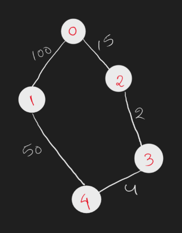
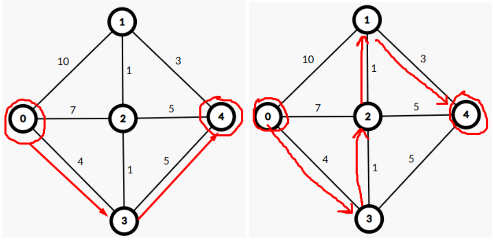
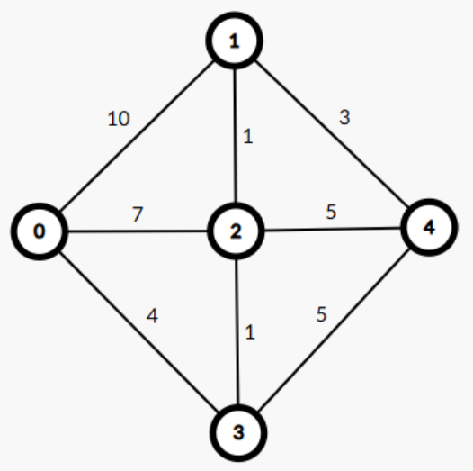
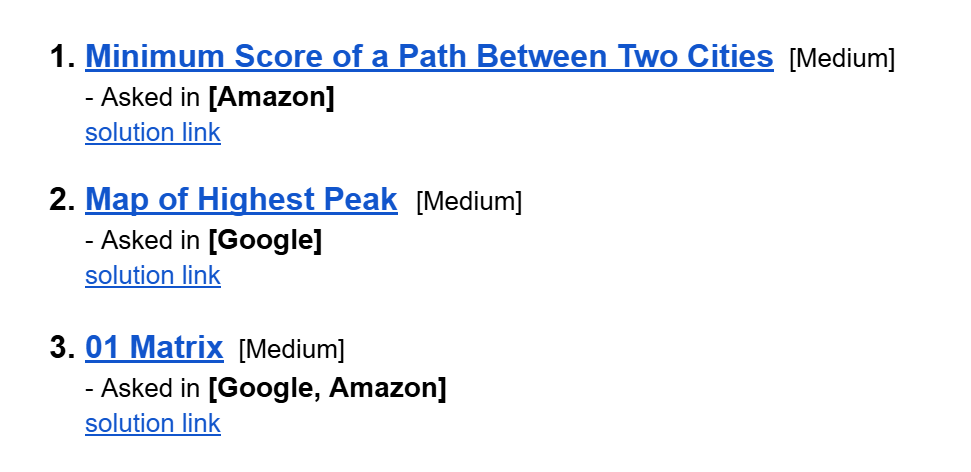

# Date: 26 August, 2025 - Tuesday

## Topics:
0. Introduction
1. Why we need to learn Dijkstra
2. Path relaxation
3. Dijkstra Concept
4. Dijkstra Naive Approach
5. Adjacency list for weighted graph
6. Dijkstra Naive Implementation
7. Dijkstra Naive Animated
8. Complexity of Dijkstra Naive
- Quiz: Module 07
- Extra Practice Problem and Quiz Explanation
- Feedback Form Module 07

## 0. Introduction
- Dijkstra Algorithm:
    - `Single sources shortest distance`
- Dijkstra Algorithm learn with two approach:
    - `Naive` - Time complexity have bad
    - `Optimized` - Time complexity have good rather than `Naive`

## 1. Why we need to learn Dijkstra
- 
- 
- 
- `Weighted Graph` have do not work `BFS`. When there was `Unweighted Graph` then `BFS` have work.
- `Unweighted` - `BFS`
- `Weighted` - `Dijkstra`

## 2. Path relaxation
- `Path relaxation` is a short concept of `Dijkstra Algorithm`
- 

## 3. Dijkstra Concept
- 
- 

## 4. Dijkstra Naive Approach
- 
- After path relaxation:
    - 

## 5. Adjacency list for weighted graph
- Program: `adj_list_wg.cpp`

## 6. Dijkstra Naive Implementation
- Program: `dijkstra_naive.cpp`

## 7. Dijkstra Naive Animated
- Explanation this code in this video:
    ```
    void dijkstra(int src) {
        queue<pair<int, int>> q;
        q.push({src, 0});
        dis[src] = 0;
        while(!q.empty()) {
            pair<int, int> par = q.front();
            q.pop();
            int par_node = par.first;
            int par_dis = par.second;
            for(auto child : adj_list[par_node]) {
                int child_node = child.first;
                int child_dis = child.second;
                if(par_dis + child_dis < dis[child_node]) {
                    dis[child_node] = par_dis + child_dis;
                    q.push({child_node, dis[child_node]});
                }
            }
        }
    }
    ```

## 8. Complexity of Dijkstra Naive
- Complexity analysis of this code:
    ```
    void dijkstra(int src) {
        queue<pair<int, int>> q;
        q.push({src, 0});
        dis[src] = 0;
        while(!q.empty()) { // O(V)
            pair<int, int> par = q.front();
            q.pop();
            int par_node = par.first;
            int par_dis = par.second;
            for(auto child : adj_list[par_node]) { // O(E)
                int child_node = child.first;
                int child_dis = child.second;
                if(par_dis + child_dis < dis[child_node]) {
                    dis[child_node] = par_dis + child_dis;
                    q.push({child_node, dis[child_node]});
                }
            }
        }
    }
    ```
- `E * V`
- `O(VE)`
- `O(VE)` - This too bad complexity.

## Quiz: Module 07
- `Total Questions: 8`
- `Total Marks: 8`

## Extra Practice Problem and Quiz Explanation
- [Quiz Explanation:](https://docs.google.com/document/d/17G7WGD_LvmiJcX_4QueE8lFh67F0taZV/edit?usp=sharing&ouid=110071013354717279052&rtpof=true&sd=true)
#### 1. Dijkstra's algorithm is used to find the shortest path in a __________ .
**a)** Weighted graph ✅  
**b)** Unweighted graph
> **Explanation:** Dijkstra অ্যালগরিদম Weighted গ্রাফে কাজ করে, যেখানে প্রতিটি Edge বা সংযোগের একটি নির্দিষ্ট Weight থাকে। এটি Directed ও Undirected উভয় প্রকার গ্রাফেই কাজ করতে পারে। <br> 📌 Unweighted গ্রাফের জন্য সাধারণত BFS (Breadth-First Search) ব্যবহার করা হয়, কারণ সেখানে প্রতিটি এজের weight সমান ধরা হয় (weight = ১)।
---
#### 2. In Dijkstra's algorithm, what does the term "weight" refer to?
**a)** Number of edges  
**b)** Distance between nodes ✅  
**c)** Color of nodes  
**d)** Connectivity of nodes
> **Explanation:** গ্রাফের প্রতিটি এজের Weight, দুটি নোডের মধ্যকার distance বা cost নির্দেশ করে, যা Dijkstra অ্যালগরিদমের shortest path নির্ণয়ে ব্যবহার করে।
---
#### 3. Dijkstra’s algorithm is used to solve _____________ problems.
**a)** All pair shortest path  
**b)** Single source shortest path ✅  
**c)** Network flow  
**d)** Sorting
> **Explanation:** Dijkstra's অ্যালগরিদম Single Source Shortest Path (SSSP) সমস্যা সমাধান করে, যেখানে একটি নির্দিষ্ট Source নোড থেকে অন্যান্য নোডের সর্বনিম্ন path নির্ণয় করা হয়।
---
#### 4. What will be the shortest path of this graph? If source is 0 and destination is 4.
- 
**a)** 0->2->3->4 ✅  
**b)** 0->1->4  
**c)** 0->2->1->4  
**d)** 0->1->3->4
> **Explanation:** a) 0->2->3->4, path cost = 21, যা এই গ্রাফ এর জন্য shortest path. <br> b) 0->1->4, path cost = 150, যা এই গ্রাফ এর জন্য shortest path না। <br> c) 0->2->1->4, এই গ্রাফ এর জন্য ভ্যালিড path না। <br> d) 0->1->3->4, এই গ্রাফ এর জন্য ভ্যালিড path না।
---
#### 5. Consider the following graph. If 0 is the source vertex, what is the minimum cost to reach 4 vertex?
- 
**a)** 8  
**b)** 9 ✅  
**c)** 4  
**d)** 6
> **Explanation:** source 0 থেকে 4 নোডে যেতে 0->3->4 এবং 0->3->2->1->4 path এ কস্ট 9, যা সবচেয়ে কম। <br> 
---
#### 6. Consider the following graph. If 0 is the source vertex, what is the minimum cost to reach 1 vertex?
- 
**a)** 8  
**b)** 9  
**c)** 4  
**d)** 6 ✅
> **Explanation:** source 0 থেকে 1 নোডে যেতে 0->3->2->1 path এ কস্ট 6, যা সবচেয়ে কম।
---
#### 7. What is the time complexity of Dijkstra's naive algorithm? (V = number of vertices, E = number of edges)
- 
**a)** O(V + E)  
**b)** O(V log V + E log V)  
**c)** O(V²)  
**d)** O(E * V) ✅
> **Explanation:** Dijkstra naive অ্যালগরিদমের Time Complexity: O(E * V) (মডিউলে ভালোভাবে দেখানো হয়েছে)।
---
#### 8. Consider the following graph. If 0 is the source vertex, what is the minimum cost to reach 0 vertex?
- 
**a)** 8  
**b)** 9  
**c)** 4  
**d)** 0 ✅
> **Explanation:** source 0 থেকে 0 নোডে যেতে কস্ট 0।
---
- [Extra Practice Problem (Optional):](https://docs.google.com/document/d/1TSwbv-jcI3pNKGDNyMybRA6ibIKS4RgBEHJCnxhsKfQ/edit?usp=sharing)
- 

## Feedback Form Module 06
- মডিউল রিলেটেড তোমার যে কোন ফিডব্যাক থাকলে এই ফর্মে লিখে দিতে পারো। আমরা তোমার ফিডব্যাক গুরুত্বসহকার দেখব।
- [Form Links](https://forms.gle/DH5mjuGD1x2EZ4z29)