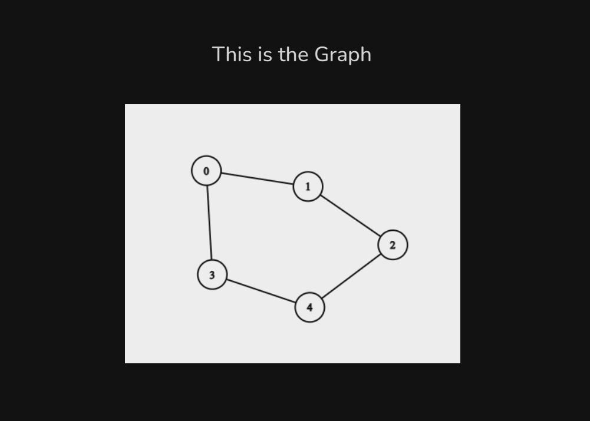
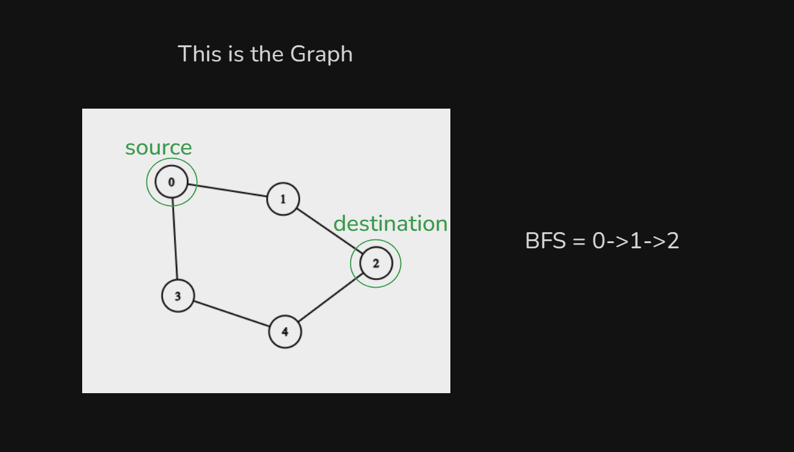
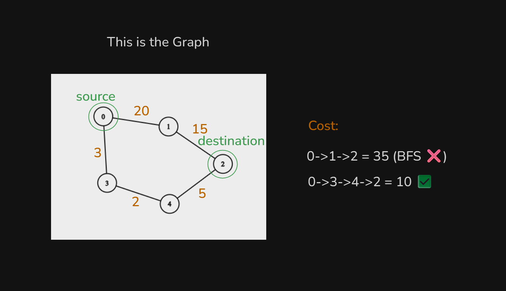
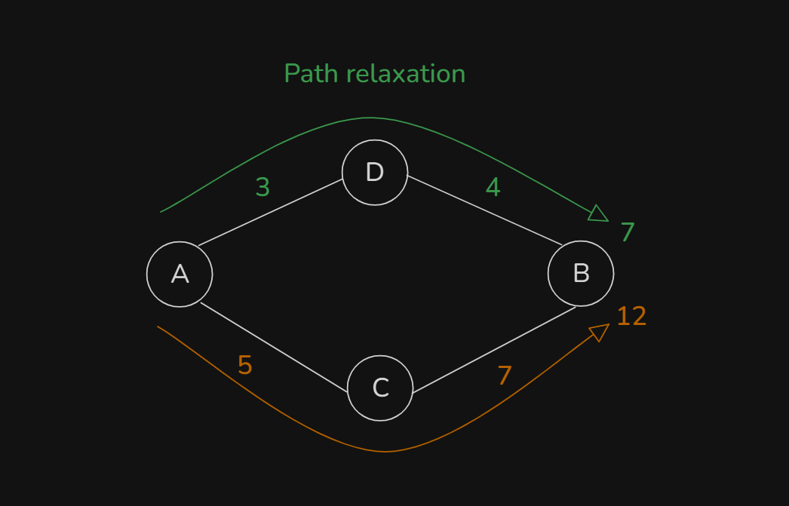
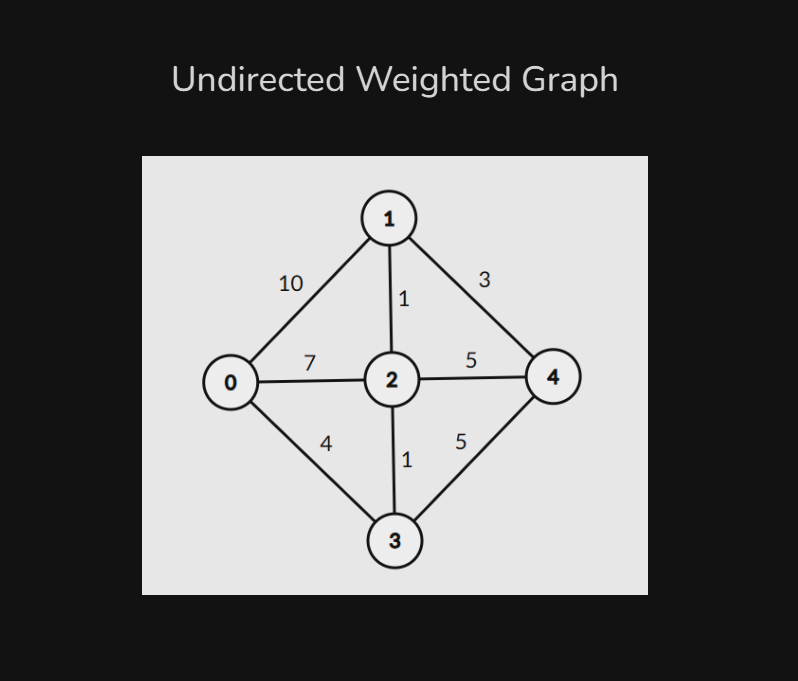
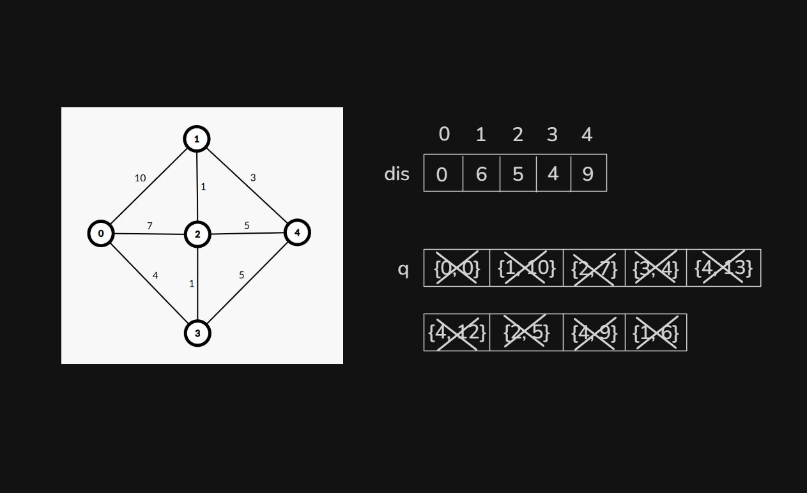
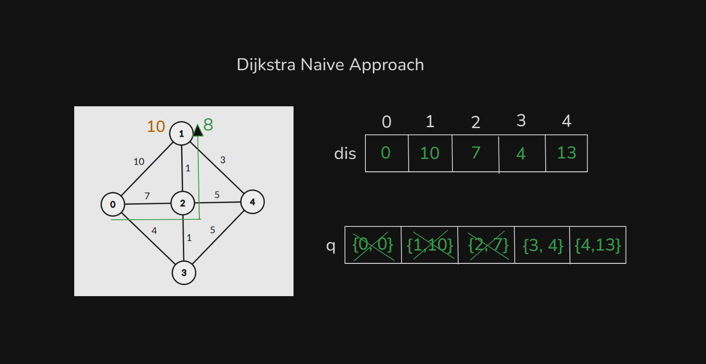

# Date: 26 August, 2025 - Tuesday

## Topics:
0. Introduction
1. Why we need to learn Dijkstra
2. Path relaxation
3. Dijkstra Concept
4. Dijkstra Naive Approach
5. Adjacency list for weighted graph
6. Dijkstra Naive Implementation
7. Dijkstra Naive Animated
8. Complexity of Dijkstra Naive
- Quiz: Module 07
- Extra Practice Problem and Quiz Explanation
- Feedback Form Module 07

## 0. Introduction
- Dijkstra Algorithm:
    - `Single sources shortest distance`
- Dijkstra Algorithm learn with two approach:
    - `Naive` - Time complexity have bad
    - `Optimized` - Time complexity have good rather than `Naive`

## 1. Why we need to learn Dijkstra
- 
- 
- 
- `Weighted Graph` have do not work `BFS`. When there was `Unweighted Graph` then `BFS` have work.
- `Unweighted` - `BFS`
- `Weighted` - `Dijkstra`

## 2. Path relaxation
- `Path relaxation` is a short concept of `Dijkstra Algorithm`
- 

## 3. Dijkstra Concept
- 
- 

## 4. Dijkstra Naive Approach
- 
- 
- 
- This method or logic are same to other nodes.