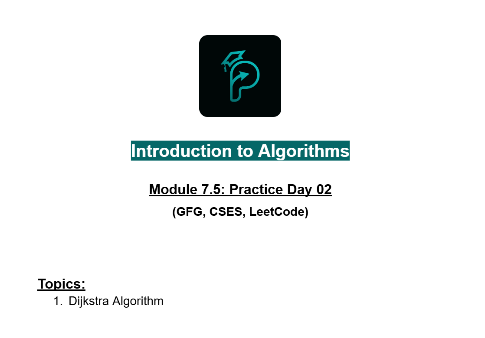
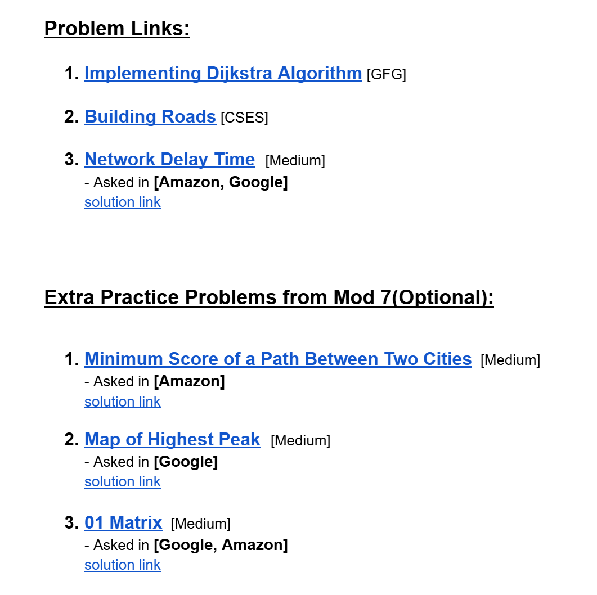
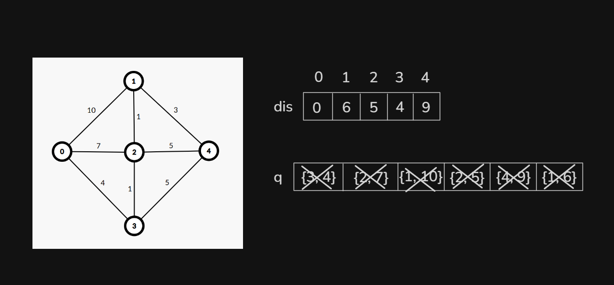

# Date: 27 August, 2025 - Wednesday

## Topics:
0. Practice Problem Set: Module 7.5
1. Dijkstra Optimized
2. Dijkstra Optimized Animated
3. Priority queue of pairs
4. Dijkstra Optimized Implementation
5. Complexity of Dijkstra optimized
6. Practice Instructions

## Practice Problem Set: Module 7.5
- [Link:](https://docs.google.com/document/d/1UJim3BvM7uyeVBX-tq3DMRgFt_IYcq_P/edit?usp=sharing&ouid=110071013354717279052&rtpof=true&sd=true)
- 
- 

## 1. Dijkstra Optimized
- Before Optimized:
    - 
- After Optimized:
    - 

## 2. Dijkstra Optimized Animated
- Explanation this optimized version of Dijkstra in this video.

## 3. Priority queue of pairs
- Program: `priority_queue.cpp`

## 4. Dijkstra Optimized Implementation
- Program: `dijkstra_optimized.cpp`

## 5. Complexity of Dijkstra optimized
- Complexity analysis of this code:
    ```
    void dijkstra(int src) {
        priority_queue<pair<int, int>, vector<pair<int, int>>, greater<pair<int, int>>> pq;
        pq.push({0, src});
        dis[src] = 0;
        while(!pq.empty()) { // O(V)
            pair<int, int> par = pq.top();
            pq.pop(); // O(VlogV)
            int par_node = par.second;
            int par_dis = par.first;
            for(auto child : adj_list[par_node]) { // O(E)
                int child_node = child.first;
                int child_dis = child.second;
                if(par_dis + child_dis < dis[child_node]) {
                    dis[child_node] = par_dis + child_dis;
                    pq.push({dis[child_node], child_node}); // O(ElogV)
                }
            }
        }
    }
    ```
- `O(VlogV + ElogV)`
- ` = logV(V + E)`
- `Complexity of Dijkstra Algorithm O((V + E) log V)`

## 6. Practice Instructions
- In this video, explain those whole practice problem one by one:
    - 
    - 