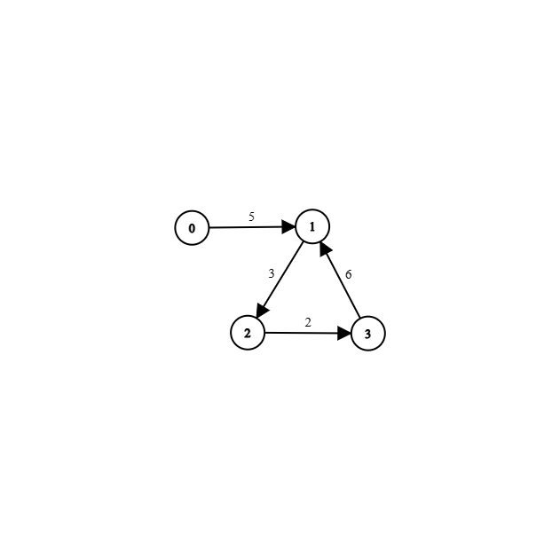
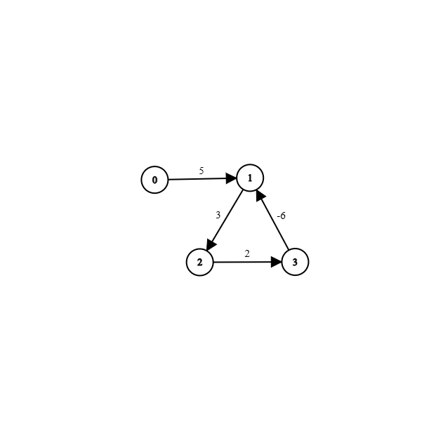
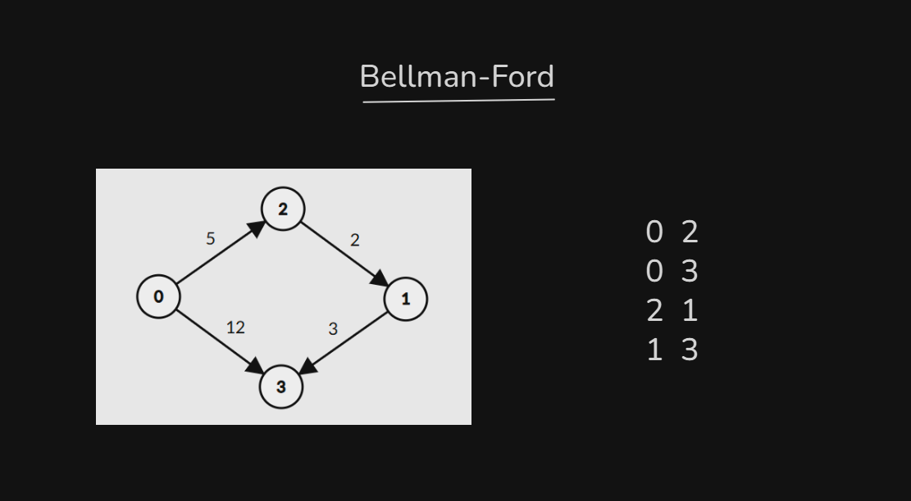
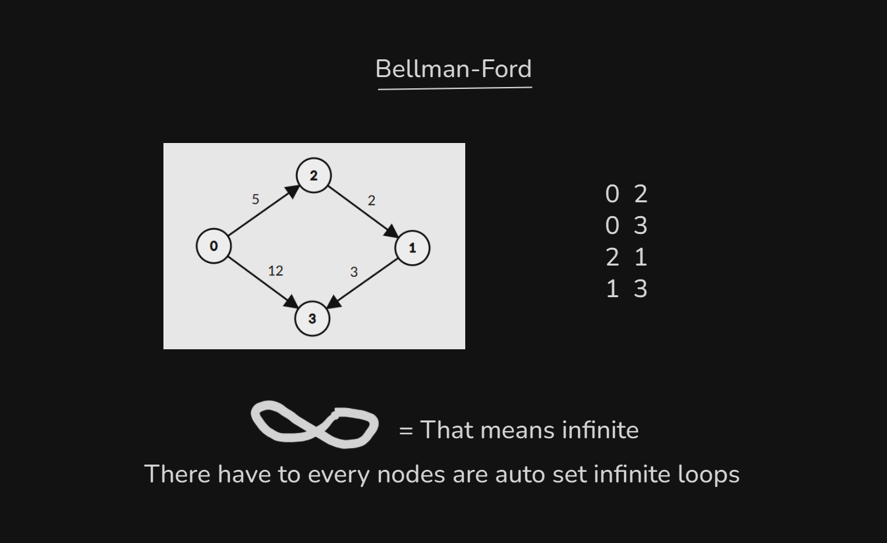
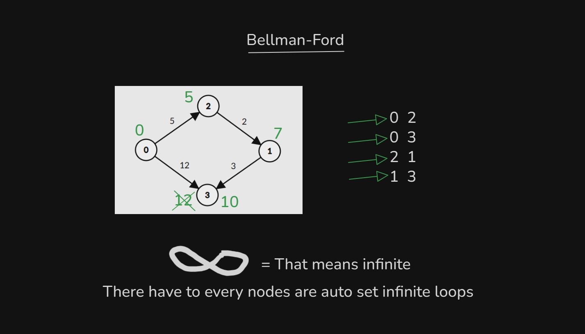
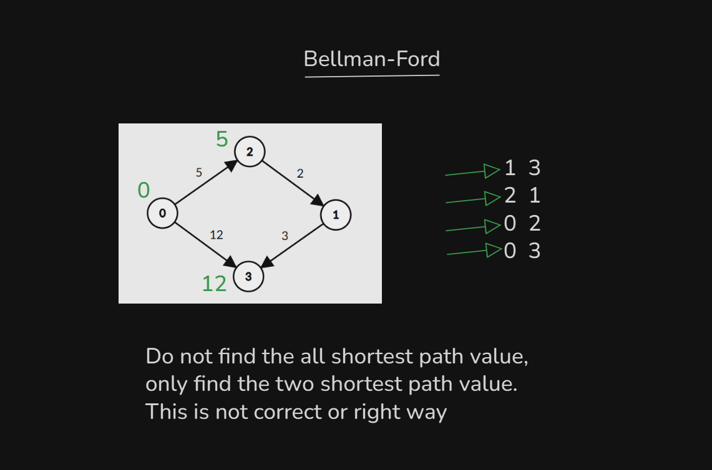
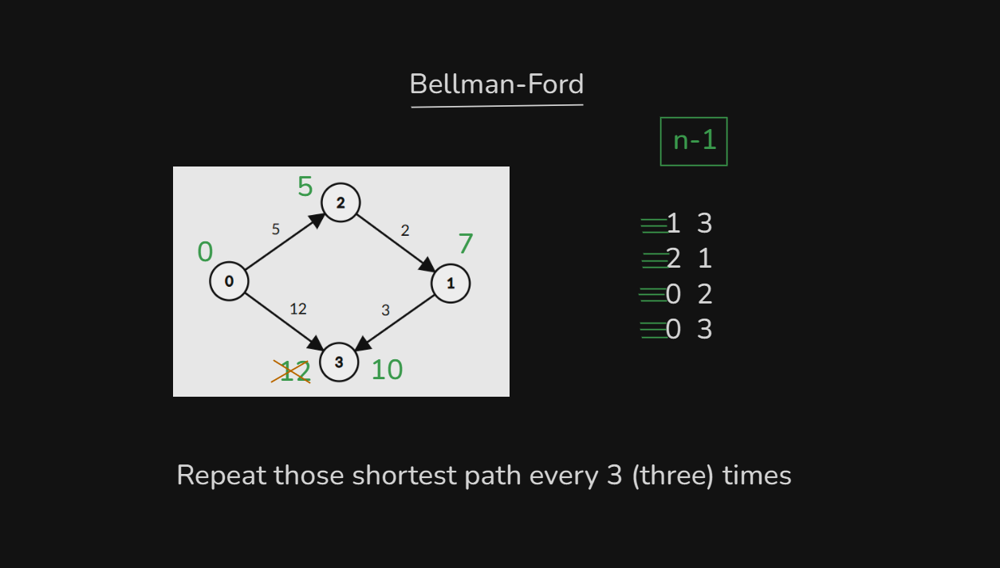
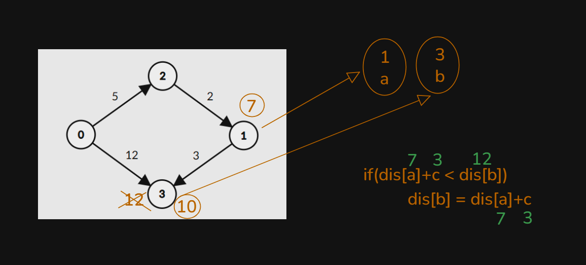

# Date: 30 August, 2025 - Saturday

## Topics:
0. Introduction
1. Limitations of Dijkstra and Why we need Bellman-Ford
2. Bellman-Ford concept
3. Bellman-Ford theory
4. Bellman-Ford Animated
5. Bellman-Ford Implementation
6. Bellman-Ford Animated
7. Bellman-Ford complexity analysis
8. Detect negative weighted cycle using Bellman-Ford
9. Summary
- Quiz: Module 09
- Extra Practice Problem and Quiz Explanation Module 09
- Feedback Form Module 09

## 0. Introduction
- Today will learn a new algorithm called to `Bellman-Ford`.
- Single Source Shortest Distance:
    - `BFS`
    - `Dijkstra`
    - `Bellman-Ford`

## 1. Limitations of Dijkstra and Why we need Bellman-Ford
- `Dijkstra Problems`:
    - When have to two `Cycle` and `Negative Weight` or called to in one sentence `Negative Weighted Cycle` then `Dijkstra` can't done the work. This code fall in to `Infinite Loops`. This problem solve with `Bellman-Ford` algorithm.
- This work able in `Dijkstra`. Because of, this is not a `Negative Weighted Cycle`:
    - 
- This work able in `Bellman-Ford`. Because of, this is a `Negative Weighted Cycle`:
    - 
- `Negative Weighted Cycle` means total weight summation are `-value`. For example: `-6+2+3 = -1`.

## 2. Bellman-Ford concept
- `Bellman-Ford` Algorithm invented are two person. Name are `Bellman` and `Ford`.
- 
- 
- 
- 
- `Bellman-Ford` have source node find with `n-1`. Because of, 0 sources nodes distance 0 and others source node have infinite.
- 

## 3. Bellman-Ford theory
- Right now, you are fucking student don't understand don't know when use to `Adjacency Matrix`, `Adjacency List` and `Edge List`.
- Two node connected checking then use to `Adjacency Matrix`.
- Build checking logic with drawing:
    - 
    - 