# Date: 30 August, 2025 - Saturday

## Topics:
0. Introduction
1. Limitations of Dijkstra and Why we need Bellman-Ford
2. Bellman-Ford concept
3. Bellman-Ford theory
4. Bellman-Ford Animated
5. Bellman-Ford Implementation
6. Bellman-Ford Animated
7. Bellman-Ford complexity analysis
8. Detect negative weighted cycle using Bellman-Ford
9. Summary
- Quiz: Module 09
- Extra Practice Problem and Quiz Explanation Module 09
- Feedback Form Module 09

## 0. Introduction
- Today will learn a new algorithm called to `Bellman-Ford`.
- Single Source Shortest Distance:
    - `BFS`
    - `Dijkstra`
    - `Bellman-Ford`

## 1. Limitations of Dijkstra and Why we need Bellman-Ford
- `Dijkstra Problems`:
    - When have to two `Cycle` and `Negative Weight` or called to in one sentence `Negative Weighted Cycle` then `Dijkstra` can't done the work. This code fall in to `Infinite Loops`. This problem solve with `Bellman-Ford` algorithm.
- This work able in `Dijkstra`. Because of, this is not a `Negative Weighted Cycle`:
    - 
- This work able in `Bellman-Ford`. Because of, this is a `Negative Weighted Cycle`:
    - 
- `Negative Weighted Cycle` means total weight summation are `-value`. For example: `-6+2+3 = -1`.
- When total `edge` are `- value (-1, -2 or -3)` then `Dijkstra` are not working, `Dijkstra` then fall in `infinite loops`. This time use to `Bellman-Ford`.

## 2. Bellman-Ford concept
- `Bellman-Ford` Algorithm invented are two person. Name are `Bellman` and `Ford`.
- 
- 
- 
- 
- `Bellman-Ford` have source node find with `n-1`. Because of, 0 sources nodes distance 0 and others source node have infinite.
- 

## 3. Bellman-Ford theory
- Right now, you don't understand don't know when use to `Adjacency Matrix`, `Adjacency List` and `Edge List`.
- Two node connected checking then use to `Adjacency Matrix`.
- When two node connected not to need then we'll use to `Edge List`.
- Build checking logic with drawing:
    - 
- `Infinite value` are define with `INT_MAX`. The value of `INT_MAX` in C++ is typically `2,147,483,647` on most modern systems.
- Main concept of this module to `Need or make to path relaxation conditions`
    ```
        dis[a]+c < dis[b] {
            dis[b] = dis[a]+c;
        }
    ```

## 4. Bellman-Ford Animated
- 
- 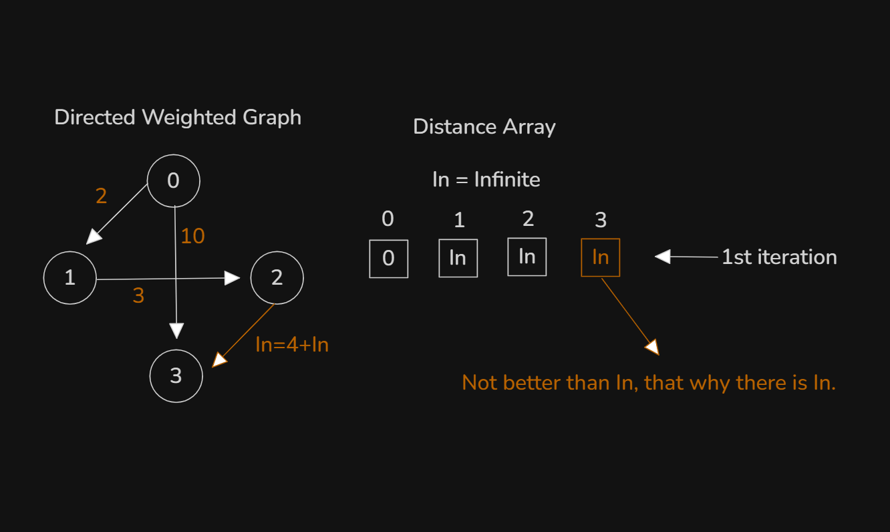
- 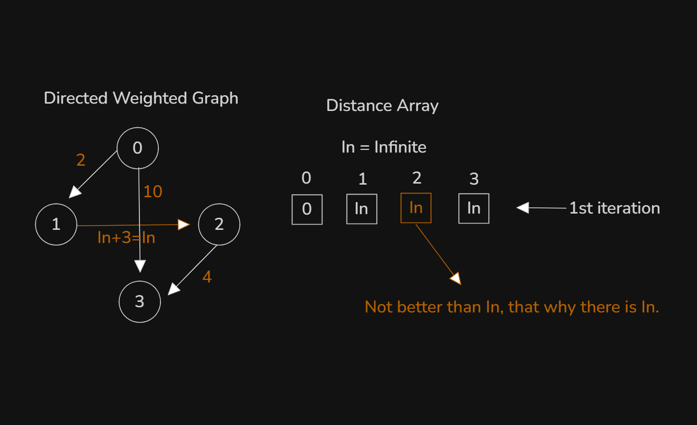
- 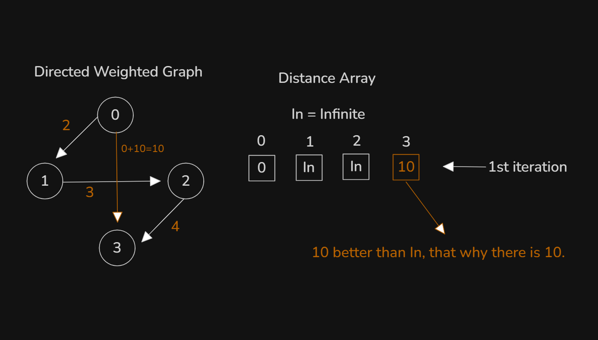
- 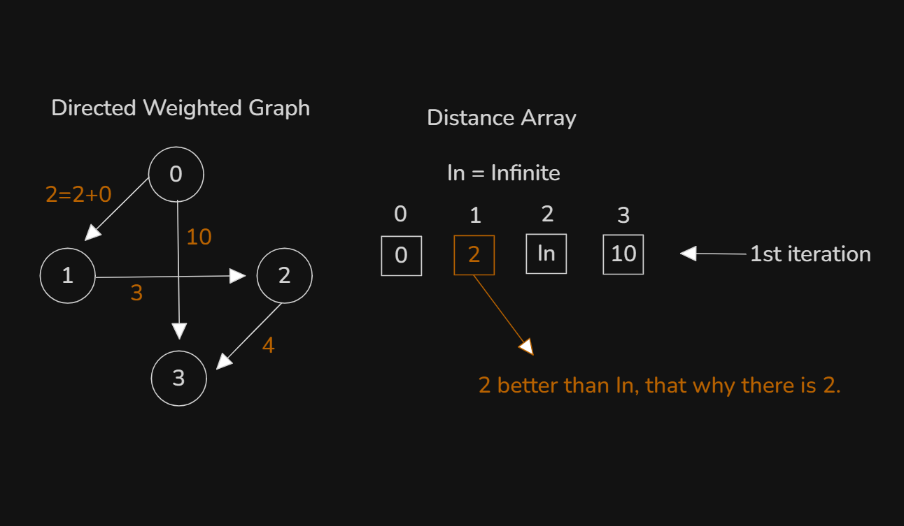
- `1st Iteration` done with `4 Edge`
- 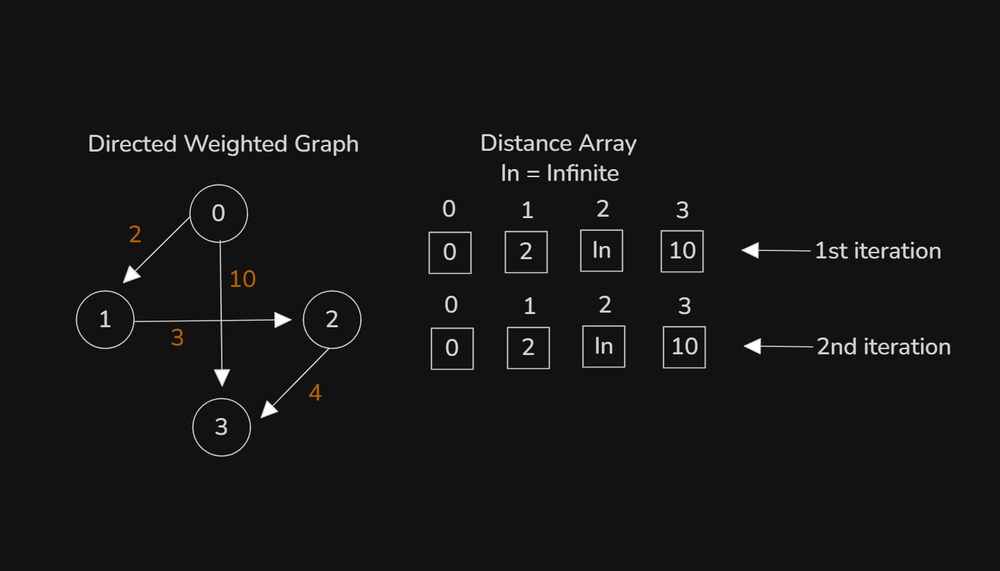
- 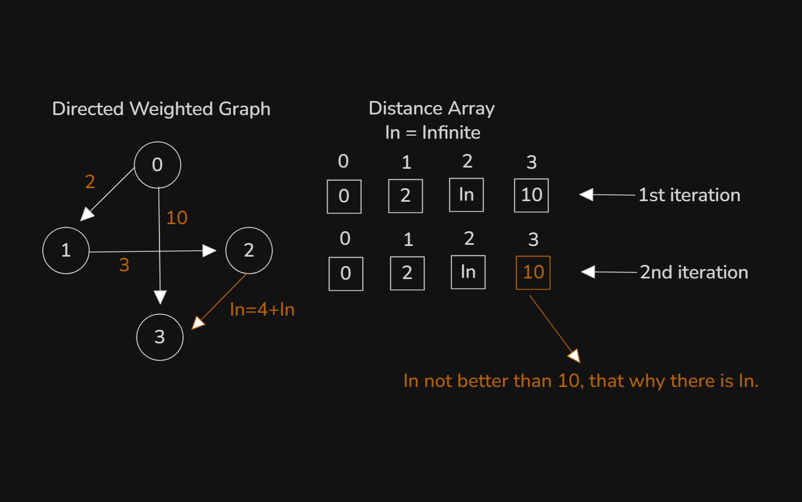
- 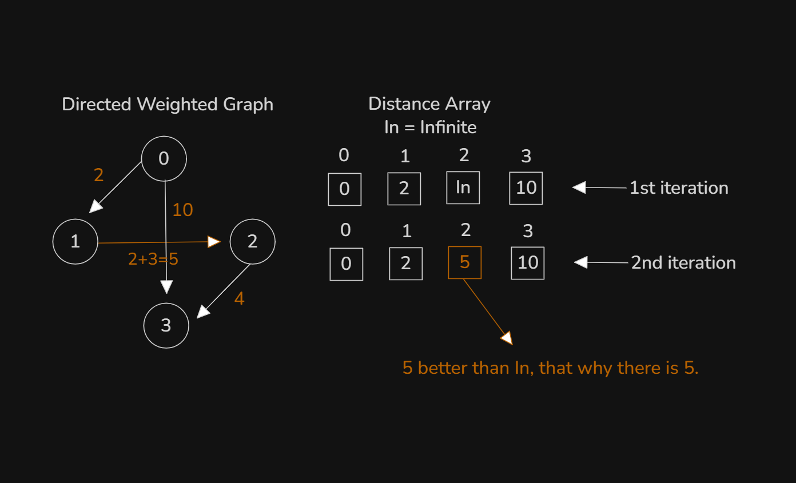
- 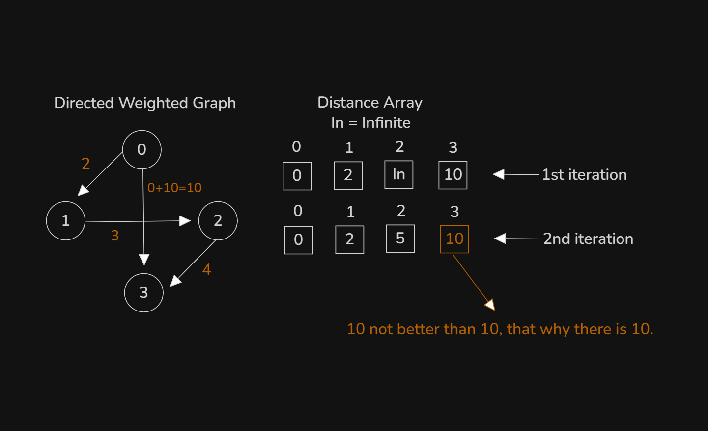
- 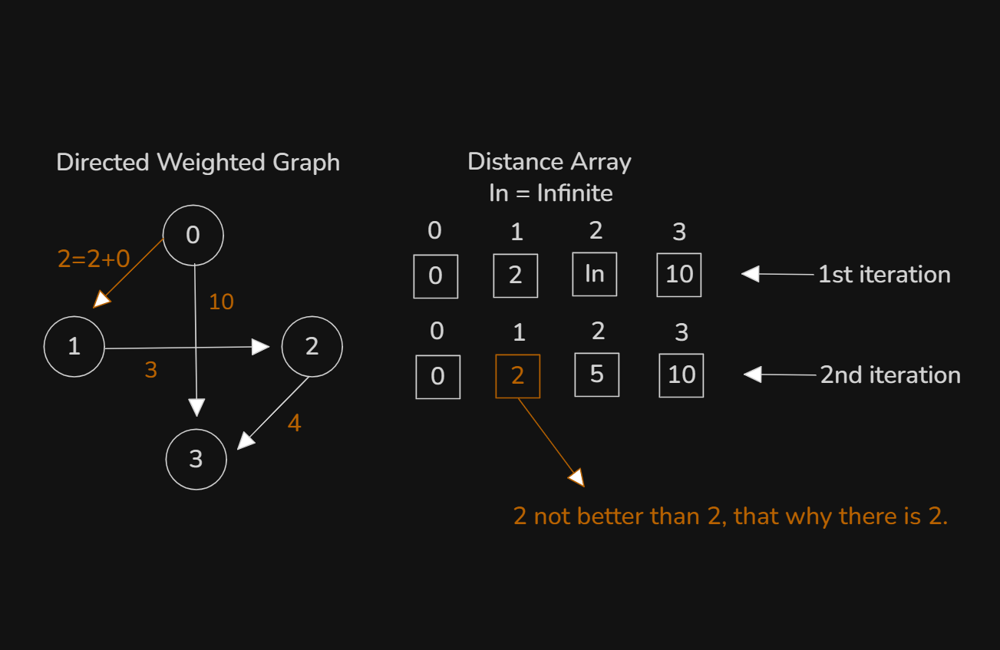
- `2nd Iteration` done with `4 Edge`
- 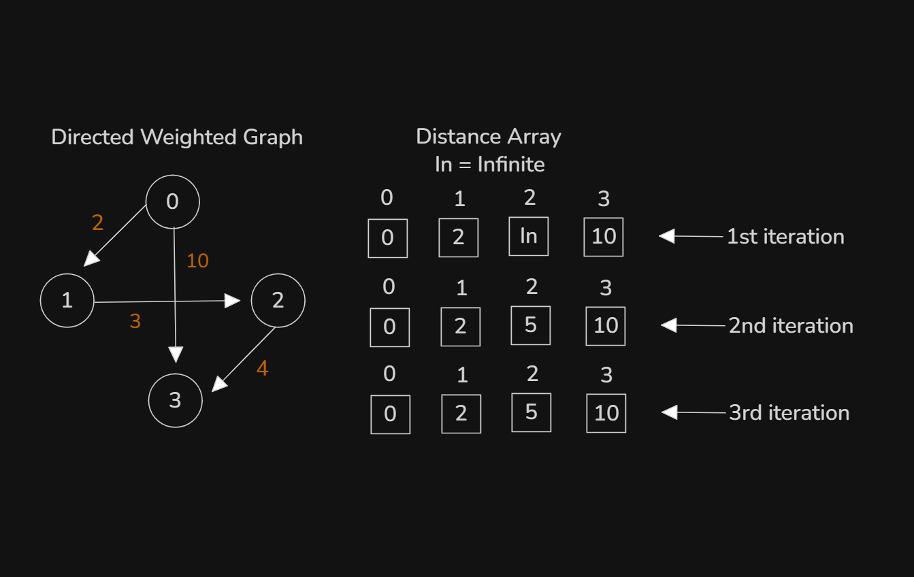
- 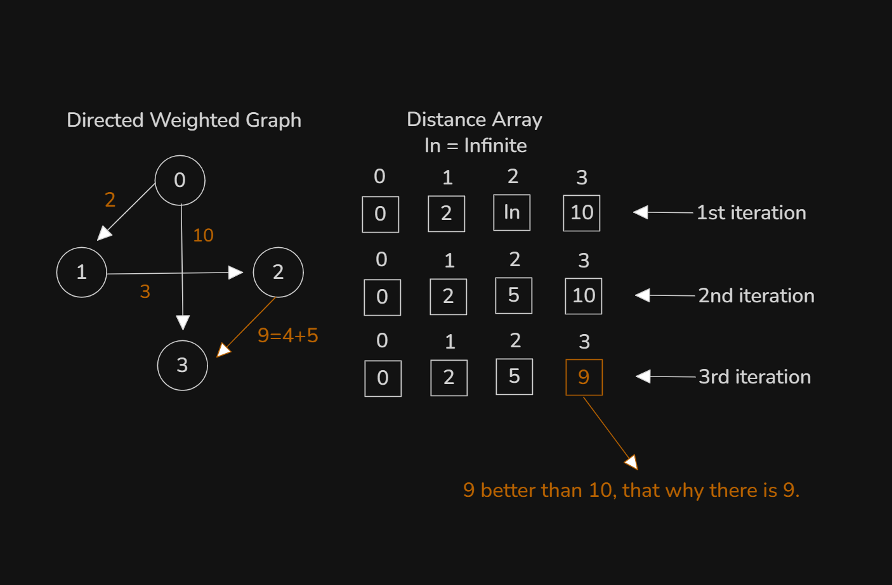
- 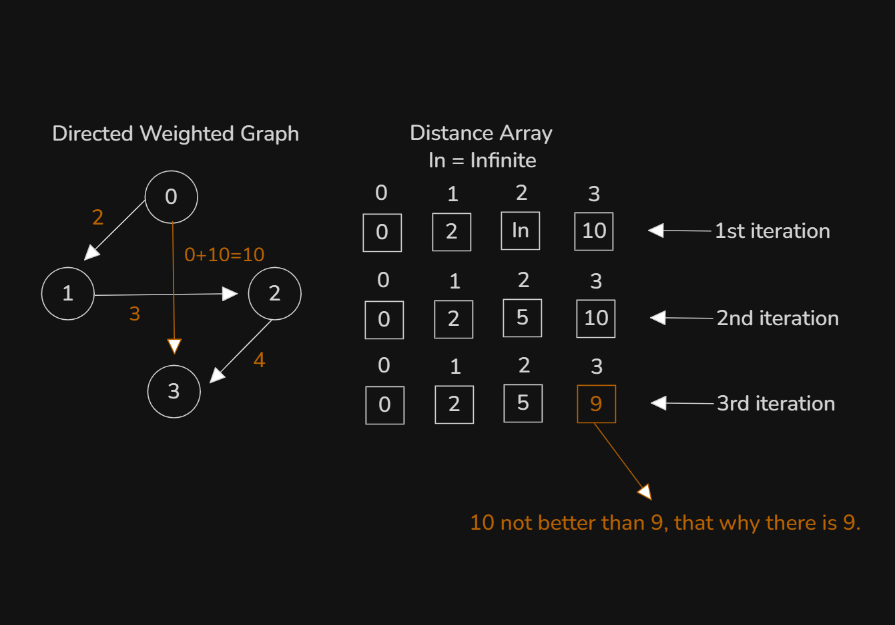
- 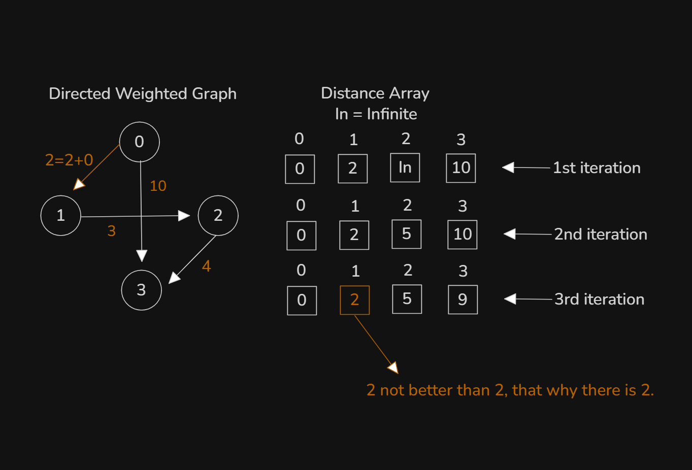
- `3rd Iteration` done with `4 Edge`
- The Final Iteration Result:
    - 

## 5. Bellman-Ford Implementation
- Program: `main.cpp` - Doing Main Function
- Program: `main2.cpp` - Doing Other Function

## 6. Bellman-Ford Animated
- Explanation this code in this video:
    ```
    void bellman_ford(int n) {
        // Find out edge and doing relaxation
        for(int i = 0; i < n-1; i++) {
            for(auto ed : edge_list) {
                int a = ed.a;
                int b = ed.b;
                int c = ed.c;
                if(dis[a] != INT_MAX && dis[a]+c < dis[b]) {
                    dis[b] = dis[a]+c;
                }
            }
        }
    }
    ```

## 7. Bellman-Ford complexity analysis
- Update main2 file to main3 file:
    - Program: `main3.cpp` - Directed Graph
- Program: `main4.cpp` - Undirected Graph
- Time complexity of this code:
    ```
    void bellman_ford(int n) {
        for(int i = 0; i < n-1; i++) { // O(V)
            for(auto ed : edge_list) { // O(E)
                int a = ed.a;
                int b = ed.b;
                int c = ed.c;
                if(dis[a] != INT_MAX && dis[a]+c < dis[b]) {
                    dis[b] = dis[a]+c;
                }
            }
        }
    }
    // Total time complexity: O(VE)
    ```

## 8. Detect negative weighted cycle using Bellman-Ford
- 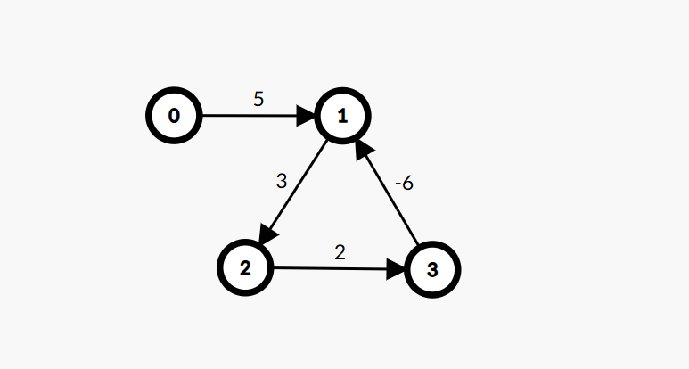
- Directed Graph Cost are `- value` then Dijkstra are infinite loops, others side Bellman-Ford this case are easily handle. Bellman-Ford not fall into loops, Bellman-Ford get to final output.
- Program: `main5.cpp`

## 9. Summary
- Learned Bellman-Ford algorithm.
- Dijkstra limitation solve with Bellman-Ford.
- Bellman-Ford not fall into infinite loops with negative cost.
- Bellman-Ford complexity analysis.
- Detect negative weighted cycle with one more loops (n times not n-1 times) into Bellman-Ford.
- Bellman-Ford detected with negative weighted graph.