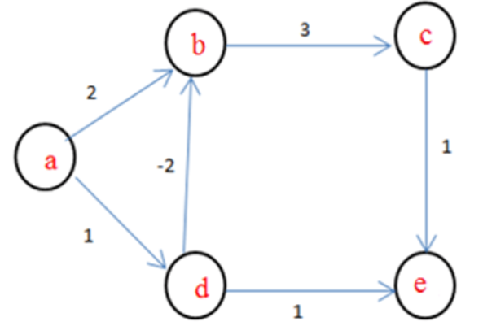
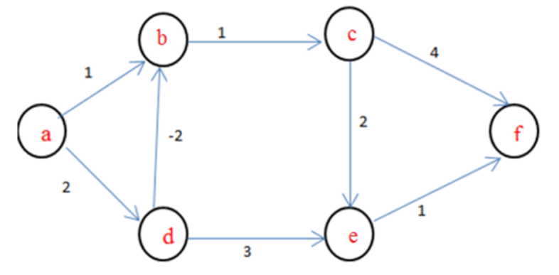
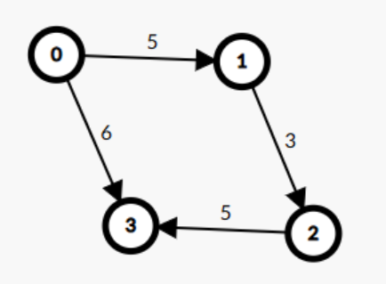

# Date: 30 August, 2025 - Saturday

## Topics:
0. Introduction
1. Limitations of Dijkstra and Why we need Bellman-Ford
2. Bellman-Ford concept
3. Bellman-Ford theory
4. Bellman-Ford Animated
5. Bellman-Ford Implementation
6. Bellman-Ford Animated
7. Bellman-Ford complexity analysis
8. Detect negative weighted cycle using Bellman-Ford
9. Summary
- Quiz: Module 09
- Extra Practice Problem and Quiz Explanation Module 09
- Feedback Form Module 09

## 0. Introduction
- Today will learn a new algorithm called to `Bellman-Ford`.
- Single Source Shortest Distance:
    - `BFS`
    - `Dijkstra`
    - `Bellman-Ford`

## 1. Limitations of Dijkstra and Why we need Bellman-Ford
- `Dijkstra Problems`:
    - When have to two `Cycle` and `Negative Weight` or called to in one sentence `Negative Weighted Cycle` then `Dijkstra` can't done the work. This code fall in to `Infinite Loops`. This problem solve with `Bellman-Ford` algorithm.
- This work able in `Dijkstra`. Because of, this is not a `Negative Weighted Cycle`:
    - 
- This work able in `Bellman-Ford`. Because of, this is a `Negative Weighted Cycle`:
    - 
- `Negative Weighted Cycle` means total weight summation are `-value`. For example: `-6+2+3 = -1`.
- When total `edge` are `- value (-1, -2 or -3)` then `Dijkstra` are not working, `Dijkstra` then fall in `infinite loops`. This time use to `Bellman-Ford`.

## 2. Bellman-Ford concept
- `Bellman-Ford` Algorithm invented are two person. Name are `Bellman` and `Ford`.
- 
- 
- 
- 
- `Bellman-Ford` have source node find with `n-1`. Because of, 0 sources nodes distance 0 and others source node have infinite.
- 

## 3. Bellman-Ford theory
- Right now, you don't understand don't know when use to `Adjacency Matrix`, `Adjacency List` and `Edge List`.
- Two node connected checking then use to `Adjacency Matrix`.
- When two node connected not to need then we'll use to `Edge List`.
- Build checking logic with drawing:
    - 
- `Infinite value` are define with `INT_MAX`. The value of `INT_MAX` in C++ is typically `2,147,483,647` on most modern systems.
- Main concept of this module to `Need or make to path relaxation conditions`
    ```
        dis[a]+c < dis[b] {
            dis[b] = dis[a]+c;
        }
    ```

## 4. Bellman-Ford Animated
- 
- 
- 
- 
- 
- `1st Iteration` done with `4 Edge`
- 
- 
- 
- 
- 
- `2nd Iteration` done with `4 Edge`
- 
- 
- 
- 
- `3rd Iteration` done with `4 Edge`
- The Final Iteration Result:
    - 

## 5. Bellman-Ford Implementation
- Program: `main.cpp` - Doing Main Function
- Program: `main2.cpp` - Doing Other Function

## 6. Bellman-Ford Animated
- Explanation this code in this video:
    ```
    void bellman_ford(int n) {
        // Find out edge and doing relaxation
        for(int i = 0; i < n-1; i++) {
            for(auto ed : edge_list) {
                int a = ed.a;
                int b = ed.b;
                int c = ed.c;
                if(dis[a] != INT_MAX && dis[a]+c < dis[b]) {
                    dis[b] = dis[a]+c;
                }
            }
        }
    }
    ```

## 7. Bellman-Ford complexity analysis
- Update main2 file to main3 file:
    - Program: `main3.cpp` - Directed Graph
- Program: `main4.cpp` - Undirected Graph
- Time complexity of this code:
    ```
    void bellman_ford(int n) {
        for(int i = 0; i < n-1; i++) { // O(V)
            for(auto ed : edge_list) { // O(E)
                int a = ed.a;
                int b = ed.b;
                int c = ed.c;
                if(dis[a] != INT_MAX && dis[a]+c < dis[b]) {
                    dis[b] = dis[a]+c;
                }
            }
        }
    }
    // Total time complexity: O(VE)
    ```

## 8. Detect negative weighted cycle using Bellman-Ford
- 
- Directed Graph Cost are `- value` then Dijkstra are infinite loops, others side Bellman-Ford this case are easily handle. Bellman-Ford not fall into loops, Bellman-Ford get to final output.
- Program: `main5.cpp`

## 9. Summary
- Learned Bellman-Ford algorithm.
- Dijkstra limitation solve with Bellman-Ford.
- Bellman-Ford not fall into infinite loops with negative cost.
- Bellman-Ford complexity analysis.
- Detect negative weighted cycle with one more loops (n times not n-1 times) into Bellman-Ford.
- Bellman-Ford detected with negative weighted graph.

## Quiz: Module 09
- `Total Questions: 10`
- `Total Marks: 10`

## Extra Practice Problem and Quiz Explanation Module 09
- [Quiz Explanation:](https://docs.google.com/document/d/13TiEKEyJmDqmPzHg7jW27Dhtvf5R3tw_9aSRaoM-nzg/edit?usp=sharing)
- [Extra Practice Problem (Optional):](https://docs.google.com/document/d/133PI7IeqTGlajsBJqnp3XLuGjTG1wSMj2R8I2aP3XuA/edit?usp=sharing)
#### 1. Bellman Ford algorithm provides solutions for __________ problems.
**a)** All pair shortest path  
**b)** Sorting  
**c)** Network flow  
**d)** Single source shortest path ✅
> **Explanation:** Bellman-Ford অ্যালগরিদমটি একটি নির্দিষ্ট source নোড থেকে গ্রাফের সকল নোডের মধ্যে shortest path নির্ণয়ের জন্য ব্যবহৃত হয়। এটি single source shortest path সমস্যার সমাধান করে এবং negative weight cycle থাকলেও কাজ করতে পারে।
---
#### 2. What is the running time of Bellman Ford Algorithm?
**a)** O(V)  
**b)** O(V2)  
**c)** O(ElogV)  
**d)** O(VE) ✅
> **Explanation:** Bellman-Ford অ্যালগরিদমটি V-1 বার লুপ চালিয়ে সব এজ (E) আপডেট করে। প্রতিটি iteration-এ সকল এজকে আপডেট করতে O(E) সময় লাগে। ফলে, মোট O(VE) সময় প্রয়োজন, যেখানে V হলো নোডের সংখ্যা এবং E হলো এজের সংখ্যা।
---
#### 3. How many times the for loop in the Bellman Ford Algorithm gets executed?
**a)** V times  
**b)** V-1 ✅  
**c)** E  
**d)** E-1
> **Explanation:** Bellman-Ford অ্যালগরিদমটি V-1 বার সব এজ (E) আপডেট করে, যেখানে V হলো গ্রাফের মোট নোড সংখ্যা। কারণ, একটি গ্রাফে V-1 সংখ্যক এজ আপডেট করলেই shortest path নিশ্চিত করা যায়। যদি আরও একটি iteration চালিয়ে পরিবর্তন পাওয়া যায়, তাহলে গ্রাফে negative weight cycle রয়েছে।
---
#### 4. How many times does the for loop execute in the Bellman-Ford Algorithm for detecting a negative weight cycle?
**a)** V times ✅  
**b)** V-1 times  
**c)** E times  
**d)** E-1 times
> **Explanation:** Bellman-Ford অ্যালগরিদমের প্রথম (V-1) বার লুপ চালিয়ে shortest path আপডেট করা হয়। এরপর Vth iteration-এ আবার সব এজ রিল্যাক্স (relax) করে চেক করা হয় যে, কোনো ওজন কমছে কিনা। যদি Vth iteration-এও কোনো পরিবর্তন ঘটে, তাহলে গ্রাফে negative weight cycle রয়েছে। তাই cycle detection-এর জন্য লুপ V বার চলবে।
---
#### 5. Dijikstra’s algorithm is more efficient than Bellman Ford Algorithm.
**a)** True ✅  
**b)** False
> **Explanation:** Dijkstra’s অ্যালগরিদম সাধারণত Bellman-Ford অ্যালগরিদমের তুলনায় বেশি কার্যকরী, কারণ এটি priority queue (heap) ব্যবহার করে যা  O((V+E) log V) সময়ে কাজ করতে পারে। অন্যদিকে, Bellman-Ford অ্যালগরিদমের টাইম কমপ্লেক্সিটি O(VE), যা বেশি ধীরগতির।
---
#### 6. What is the basic principle behind the Bellman Ford Algorithm?
**a)** Interpolation  
**b)** Extrapolation  
**c)** Regression  
**d)** Relaxation ✅
> **Explanation:** Bellman-Ford অ্যালগরিদম Relaxation পদ্ধতির উপর ভিত্তি করে কাজ করে। যদি কোনো ছোট পথ পাওয়া যায় তাহলে Bellman-Ford অ্যালগরিদম প্রতিটি নোডের দূরত্ব ক্রমান্বয়ে আপডেট করে।
---
#### 7. Which algorithm is more efficient in finding the shortest path in a graph with non-negative weights?
**a)** Dijkstra’s Algorithm ✅  
**b)** Bellman-Ford Algorithm  
**c)** Both are equally efficient  
**d)** None of the above
> **Explanation:** যদি গ্রাফের সব এজের ওজন ধনাত্মক (non-negative) হয়, তাহলে Dijkstra’s Algorithm বেশি কার্যকরী। কারণ এটি priority queue (heap) ব্যবহার করে O((V+E) log V) সময়ে কাজ করতে পারে, যা Bellman-Ford অ্যালগরিদমের O(VE) time complexity এর তুলনায় অনেক দ্রুত। তবে, যদি গ্রাফে negative weight cycle থাকে, তাহলে Dijkstra’s Algorithm কাজ করবে না, এবং Bellman-Ford Algorithm ব্যবহার করতে হবে।
---
#### 8. Consider the following graph. What is the minimum cost to travel from node A to node C?
- 
**a)** 5  
**b)** 2 ✅  
**c)** 1  
**d)** 3
> **Explanation:** The minimum cost to travel from node A to node C is 2. <br>
A-D, cost= 1 <br>
D-B, cost= -2 <br>
B-C, cost= 3 <br>
Hence the total cost is 2.
---
#### 9. In the given graph, identify the path that has minimum cost to travel from node ‘a’ to node ‘f’?
- 
**a)** a->b->c->f  
**b)** a->d->e->f  
**c)** a->d->b->c->f  
**d)** a->d->b->c->e->f ✅
> **Explanation:** The minimum cost taken by the path a-d-b-c-e-f is 4. <br>
a-d, cost= 2 <br>
d-b, cost= -2 <br>
b-c, cost= 1 <br>
c-e, cost=  2 <br>
e-f, cost= 1 <br>
Hence the total cost is 4.
---
#### 10. Given the directed weighted graph in the image, apply the Bellman-Ford Algorithm with node "0" as the source and determine the shortest distances to all other nodes. What are the correct shortest distances from node 0 to all other nodes? <br><br> 1 → 5 means, source 0 to node 1 distance is 5.
- 
**a)** 0 → 0, 1 → 5, 2 → 8, 3 → 6 ✅  
**b)** 0 → 0, 1 → 5, 2 → 10, 3 → 6  
**c)** 0 → 0, 1 → 5, 2 → 8, 3 → 11  
**d)** 0 → 0, 1 → 6, 2 → 9, 3 → 11
> **Explanation:** মডিউলের এনিমেশন ভিডিওতে ভালোভাবে বোঝানো হয়েছে।
---