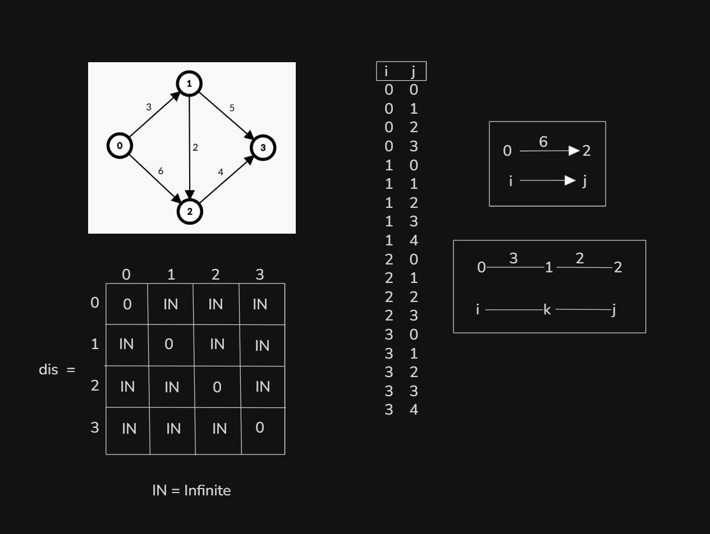

# Date: 31 August, 2025 - Sunday

## Topics:
- Module 10 Problem List
0. Introduction
1. Why we need to learn Floyd-Warshall
2. Floyd-Warshall Theory I
3. Floyd-Warshall Theory II
4. Floyd-Warshall Implementation
5. Floyd-Warshall Animated
6. Detect negative weighted cycle using Floyd-Warshall
7. DFS vs BFS vs Dijkstra vs Bellman-Ford vs Floyd-warshall
8. Shortest Routes II
9. Summary
- Quiz: Module 10
- Quiz Explanation Module 10
- Feedback Form Module 10

## Module 10 Problem List
- [Problem List Link:](https://docs.google.com/document/d/1uGHvBVITHY8DknLY7KIZ-ey5emDxlJyty4RG35EGcPI/edit?usp=sharing)
- 

## 0. Introduction
- Single source shortest distance:
    - BFS
    - Dijkstra
    - Bellman-Ford
- All pair shortest distance:
    - Floyd-Warshall

## 1. Why we need to learn Floyd-Warshall
- First we see this problem and why need to Floyd-Warshall algorithm
    - [Problem List Link:](https://docs.google.com/document/d/1uGHvBVITHY8DknLY7KIZ-ey5emDxlJyty4RG35EGcPI/edit?usp=sharing)
    - 
- Single source shortest distance:
    - BFS - `O(V+E)`
    - Dijkstra - `O(ElogV)`
    - Bellman-Ford - `O(VE)`
- All pair shortest distance:
    - Floyd-Warshall - `O(V^3)`
- This problem doesn't solve with `BFS`, `Dijkstra` or `Bellman-Ford`. This problem solve with `Floyd-Warshall` algorithm. `Floyd-Warshall` is a powerful algorithm.

## 2. Floyd-Warshall Theory I
- 