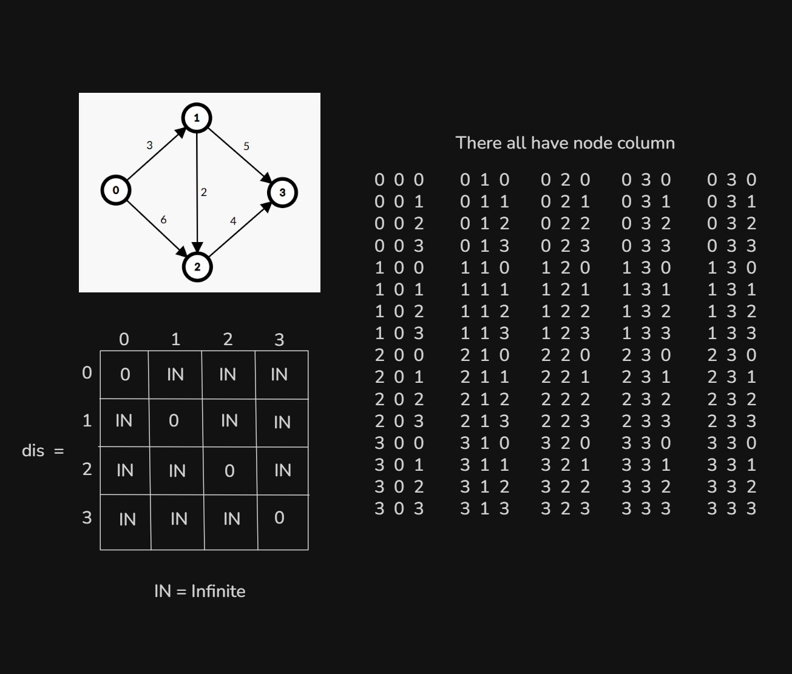
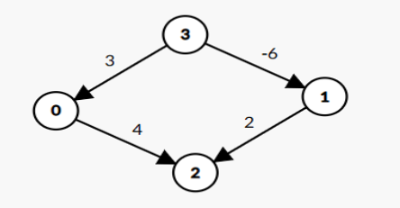
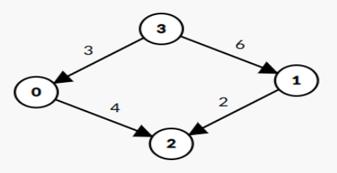

# Date: 31 August, 2025 - Sunday

## Topics:
- Module 10 Problem List
0. Introduction
1. Why we need to learn Floyd-Warshall
2. Floyd-Warshall Theory I
3. Floyd-Warshall Theory II
4. Floyd-Warshall Implementation
5. Floyd-Warshall Animated
6. Detect negative weighted cycle using Floyd-Warshall
7. DFS vs BFS vs Dijkstra vs Bellman-Ford vs Floyd-warshall
8. Shortest Routes II
9. Summary
- Quiz: Module 10
- Quiz Explanation Module 10
- Feedback Form Module 10

## Module 10 Problem List
- [Problem List Link:](https://docs.google.com/document/d/1uGHvBVITHY8DknLY7KIZ-ey5emDxlJyty4RG35EGcPI/edit?usp=sharing)
- 

## 0. Introduction
- Single source shortest distance:
    - BFS
    - Dijkstra
    - Bellman-Ford
- All pair shortest distance:
    - Floyd-Warshall

## 1. Why we need to learn Floyd-Warshall
- First we see this problem and why need to Floyd-Warshall algorithm
    - [Problem List Link:](https://docs.google.com/document/d/1uGHvBVITHY8DknLY7KIZ-ey5emDxlJyty4RG35EGcPI/edit?usp=sharing)
    - 
- Single source shortest distance:
    - BFS - `O(V+E)`
    - Dijkstra - `O(ElogV)`
    - Bellman-Ford - `O(VE)`
- All pair shortest distance:
    - Floyd-Warshall - `O(V^3)`
- This problem doesn't solve with `BFS`, `Dijkstra` or `Bellman-Ford`. This problem solve with `Floyd-Warshall` algorithm. `Floyd-Warshall` is a powerful algorithm.

## 2. Floyd-Warshall Theory I
- 

## 3. Floyd-Warshall Theory II
- 

## 4. Floyd-Warshall Implementation
- Program: `floyd_warshall.cpp`

## 5. Floyd-Warshall Animated
- Explanation this code in this video:
    ```
    for(int k = 0; k < n; k++) {
        for(int i = 0; i < n; i++) {
            for(int j = 0; j < n; j++) {
                if(adj_mat[i][k] != INT_MAX && adj_mat[k][j] != INT_MAX && adj_mat[i][k] + adj_mat[k][j] < adj_mat[i][j]) {
                    adj_mat[i][j] = adj_mat[i][k] + adj_mat[k][j];
                }
            }
        }
    }
    ```

## 6. Detect negative weighted cycle using Floyd-Warshall
- Program: `detect_nwc.cpp`

## 7. DFS vs BFS vs Dijkstra vs Bellman-Ford vs Floyd-warshall
- `Algorithms - Time Complexity -> Uses of cases`
- `DFS - O(V+E) -> For Traverse`
- `BFS - O(V+E) -> For Fixed Source`
- `Dijkstra - O(ElogV) -> Weighted Fixed Source`
- `Bellman-Ford - O(VE) -> Negative Weighted + Cycle`
- `Floyd-Warshall - O(V^3) -> For Multiple Sources`
- Think and work with better time complexity.

## 8. Shortest Routes II
- 
- [Shortest Routes II - Problem Link](https://cses.fi/problemset/task/1672/)
- Solved Program: `shortest_routes_2.cpp`

## 9. Summary
- Learn and explore to Floyd-Warshall Algorithm.
- Find the Shortest Routes with Floyd-Warshall Algorithm.
- We learn when to use which algorithms.

## Quiz: Module 10
- `Total Questions: 10`
- `Total Marks: 10`

## Quiz Explanation Module 10
- [Quiz Explanation:](https://docs.google.com/document/d/1PiE_uTmduby_M67wPiDiHGXOdWTpQ_cPES1pppkqOOU/edit?usp=sharing)
#### 1. Which graph algorithm is suitable for calculating the All pair shortest path of a graph?
**a)** BFS  
**b)** Dijkstra  
**c)** Bellman Ford  
**d)** Floyd Warshall ✅
> **Explanation:** Floyd Warshall O(N^3) টাইম কমপ্লেক্সিটি তে প্রত্যেকটি Node থেকে প্রত্যেকটি Node এ যাওয়ার shortest distance বের করতে পারে।
---
#### 2. What is the initial value assigned to the cells in a matrix for the Floyd-Warshall algorithm when there is no direct connection between the corresponding nodes?
**a)** 0  
**b)** 1  
**c)** ∞ (Infinity) ✅  
**d)** -1
> **Explanation:** Floyd Warshall Algorithm এর ক্ষেত্রে Edge ইনপুট নেয়ার আগে Matrix এর সব cell গুলোতে infinity রাখা হয় , এবং edge অর্থাৎ direct connection থাকলে সেক্ষেত্রে সেই স্পেসিফিক cell এর ভ্যালু টি চেঞ্জ হয়ে weight বসে , edge না থাকলে সেক্ষেত্রে ঐসব  cell গুলোতে initial value infinity(INF) থেকে যায়।
---
#### 3. In the Floyd-Warshall algorithm, a cell in the distance matrix is updated when a shorter path between two nodes is found through an intermediate node.
**a)** True ✅  
**b)** False
> **Explanation:** Floyd Warshall এর ক্ষেত্রে আমরা প্রত্যেকটি node থেকে প্রত্যেকটি Node এ যাওয়ার জন্য মাঝখানে একটি Node বসিয়ে দেখি , সেই Node এর মাধ্যমে অপর Node টিতে গেলে cost কমে কিনা, যদি cost কমে সেক্ষেত্রে আমরা সেই স্পেসিফিক distance matrix এর cell এর ভ্যালুটি কম cost এর ভ্যালু দ্বারা update করি।
---
#### 4. Which graph representation is suitable for implementing Floyd-Warshall algorithm?
**a)** Adjacency list  
**b)** Edge List  
**c)** Adjacency Matrix ✅  
**d)** All the above
> **Explanation:** যেহেতু আমাদের Floyd Warshall algorithm চলাকালে প্রত্যেক ক্ষেত্রে একটি Node হতে অপর একটি Node এ যাওয়ার distance দেখা লাগে তাই এক্ষেত্রে সবচেয়ে বেস্ট চয়েস Adjacency matrix. মডিউলে আরো বিস্তারিত ব্যাখা আছে।
---
#### 5. What is the time complexity of the Floyd Warshall algorithm if there’s  V nodes and E edges?
**a)** O(V*E)  
**b)** O(V+ElogV)  
**c)** O(V^3) ✅  
**d)** O(V+E)
> **Explanation:** Floyd Warshall Algorithm এর টাইম কমপ্লেক্সিটি O(V^3). মডিউলে এর বিস্তারিত ব্যাখা রয়েছে।
---
#### 6. Determine if this graph has a negative weighted cycle.
- 
**a)** Yes  
**b)** No ✅
> **Explanation:** উক্ত গ্রাফে negative weight এর edge আছে কিন্তু negative weighted কোনো cycle নেই।
---
#### 7. How can you determine if a graph contains a negative-weight cycle after running the Floyd-Warshall algorithm?
**a)** If any value in the distance matrix is negative.  
**b)** If any diagonal element dist[i][i] of the matrix is negative. ✅  
**c)** If the sum of all edge weights in the graph is negative.  
**d)** If the shortest path between any two nodes is zero.
> **Explanation:** Floyd-Warshall এলগরিদম রান করার পর আমরা যদি দেখি self node গুলো অর্থাৎ 0 থেকে 0 বা ১ থেকে ১ বা n থেকে n  এ যাওয়ার দূরত্ব 0 থেকে কমে নেগেটিভ হয়েছে , সেক্ষেত্রে আমরা বলতে পারি গ্রাফটি তে negative weighted cycle আছে। মডিউল ১০-৬ এর বিস্তারিত ব্যাখা রয়েছে।
---
#### 8. When should the Bellman-Ford algorithm be used instead of Dijkstra’s algorithm?
**a)** When the graph has a negative weighted cycle. ✅  
**b)** When the shortest path from a single source in a graph with only positive edge weights needs to be found.  
**c)** When the shortest paths between all pairs of nodes need to be calculated efficiently.
> **Explanation:** Dijkstra এলগরিদম negative weighted cycle এর ক্ষেত্রে কাজ করে না , সেক্ষেত্রে আমরা Bellman Ford এর সাহায্যে উক্ত সমস্যাটি সমাধান করতে পারি।
---
#### 9. Which algorithm is considered to be the best approach when dealing with the Shortest path in an unweighted graph with a single source?
**a)** Dijkstra  
**b)** Floyd Warshall  
**c)** BFS ✅  
**d)** Bellman Ford
> **Explanation:** Unweighted Graph এর ক্ষেত্রে single source হতে shortest path distance বের করার  BFS এর টাইম কমপ্লেক্সিটি O(V+E) , Dijkstra এর টাইম কমপ্লেক্সিটি O(ElogV) এবং Bellman Ford এর হলো O(VE) . এর মধ্যে সবচেয়ে efficient হলো BFS Algorithm।
---
#### 10. Which algorithm should be used to get the shortest path from the above graph if the source is 0 considering the best time complexity?
- 
**a)** BFS  
**b)** Floyd Warshall  
**c)** Bellman Ford  
**d)** Dijkstra ✅
> **Explanation:** উক্ত গ্রাফটি Weighted গ্রাফ এবং এই গ্রাফে কোনো negative weighted cycle নেই , সেক্ষেত্রে Dijkstra হলো best efficient এলগরিদম।

## Feedback Form Module 10
- মডিউল রিলেটেড তোমার যে কোন ফিডব্যাক থাকলে এই ফর্মে লিখে দিতে পারো। আমরা তোমার ফিডব্যাক গুরুত্বসহকার দেখব।
- [Form Links](https://forms.gle/DH5mjuGD1x2EZ4z29)