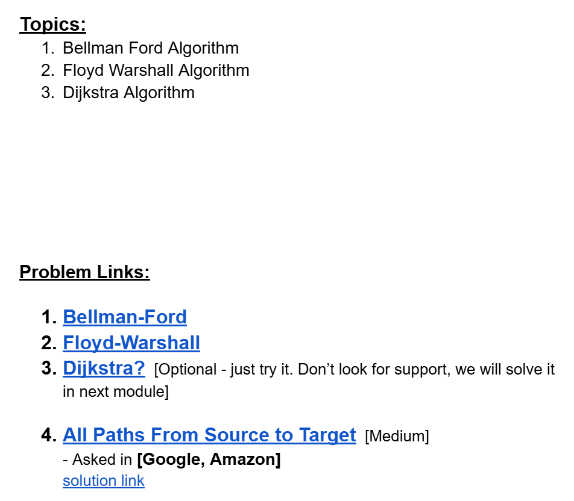
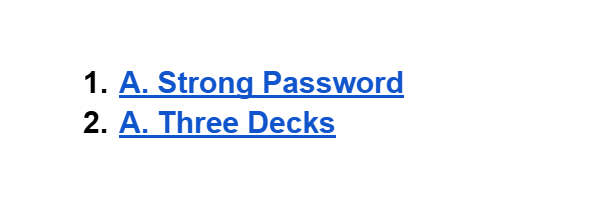

# Date: 01 September, 2025 - Monday

## Topics:
- Problem Set: Module 10.5
- Practice Instructions
- Three Decks

## Problem Set: Module 10.5
- [Practice Problem Set:](https://docs.google.com/document/d/17VKHcRQlT46ktvtmh6Rjnr5ou4FYODBHASIqXrOVPpc/edit?usp=sharing)
- 
- [Road to XPSC: Week 3](https://docs.google.com/document/d/1nRYfsV6vOqOySiqLn8IxxH7hIVxYfYcWUEyy8aydCPk/edit?usp=sharing)
- 

## Practice Instructions
- In this video explain those whole practice problem set.

## Three Decks
- Solved Program: `three_decks.cpp`