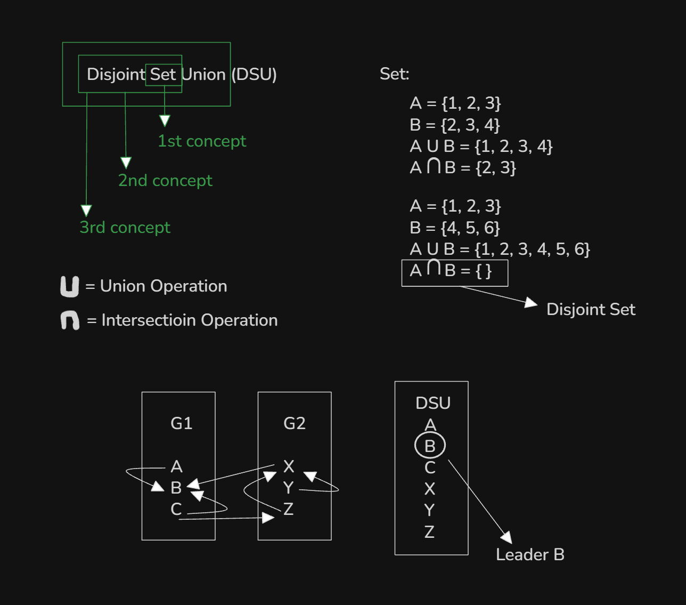

# Date: 02 September, 2025 - Tuesday

## Topics:
0. Introduction
1. What is DSU
2. How find operation works
3. Find operation implementation
4. Find operation optimized
5. Find operation Animated
6. How union operation works
7. Union operation implementation
8. Union operation Animated
9. Detect cycle in undirected graph using DSU
10. Detect cycle in undirected graph using DSU implementation
11. Summary
- Quiz: Module 11
- Quiz Explanation Module 11
- Feedback Form Module 11

## 0. Introduction
- This module will learn about `Union-Find` Algorithm.
- This algorithm basically `Graph Connected Component`, `Graph Cycle` and `Minimum Spanning Tree (MST)` problem will solve.

## 1. What is DSU
- 