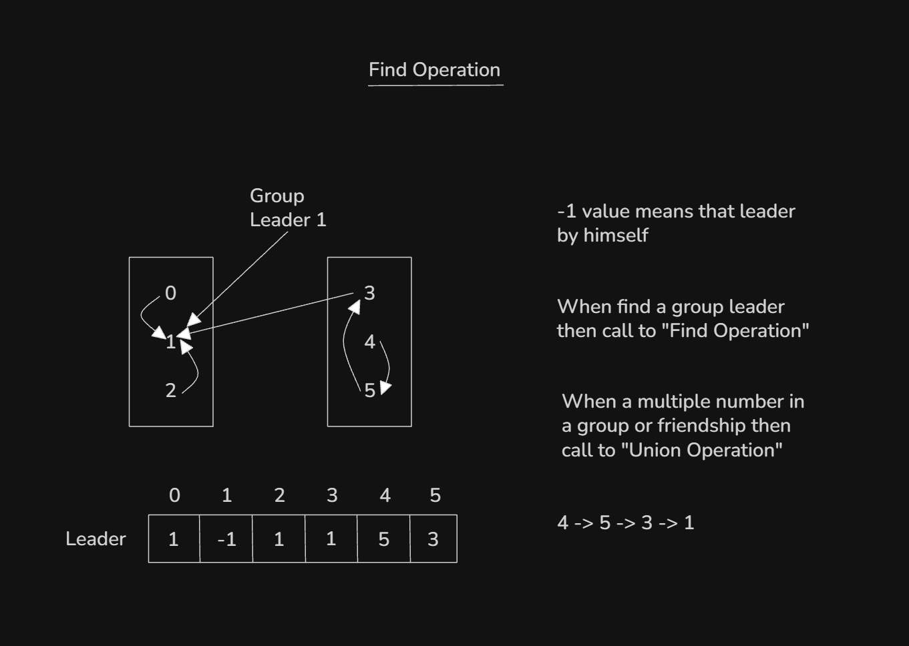
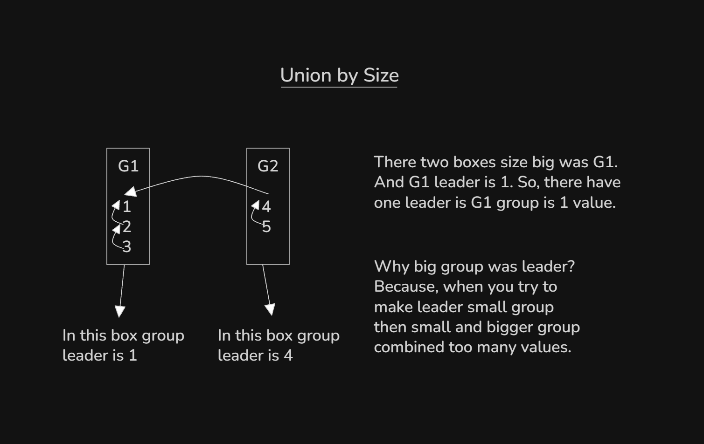

# Date: 02 September, 2025 - Tuesday

## Topics:
0. Introduction
1. What is DSU
2. How find operation works
3. Find operation implementation
4. Find operation optimized
5. Find operation Animated
6. How union operation works
7. Union operation implementation
8. Union operation Animated
9. Detect cycle in undirected graph using DSU
10. Detect cycle in undirected graph using DSU implementation
11. Summary
- Quiz: Module 11
- Quiz Explanation Module 11
- Feedback Form Module 11

## 0. Introduction
- This module will learn about `Union-Find` Algorithm.
- This algorithm basically `Graph Connected Component`, `Graph Cycle` and `Minimum Spanning Tree (MST)` problem will solve.

## 1. What is DSU
- 

## 2. How find operation works
- DSU define make a algorithm `Union-Find Algorithm`.
- 

## 3. Find operation implementation
- Program: `find_using_loop.cpp`
- Program: `find_using_recursion.cpp`

## 4. Find operation optimized
- Program: `find_optimized.cpp`

## 5. Find operation Animated
- Explanation this code in this video:
    ```
    int find(int node) { // O(logN)
        if(par[node] == -1)
            return node;
        int leader = find(par[node]);
        par[node] = leader; // Optimized code
        return leader;
    }
    ```

## 6. How union operation works
- 

## 7. Union operation implementation
- Program: `union.cpp`

## 8. Union operation Animated
- Explanation this code in this video:
    ```
    void dsu_union(int node1, int node2) {
        int leader1 = find(node1);
        int leader2 = find(node2);
        if(group_size[leader1] >= group_size[leader2]) {
            par[leader2] = leader1;
            group_size[leader1] += group_size[leader2];
        }
        else {
            par[leader1] = leader2;
            group_size[leader2] += group_size[leader1];
        }
    }
    ```

## 9. Detect cycle in undirected graph using DSU
- 

## 10. Detect cycle in undirected graph using DSU implementation
- Program: `dcug_using_dsu.cpp`

## 11. Summary
- Learn and explore to Disjoint Set Union (DSU). DSU have two operations:
    - `Find Operation`
    - `Union Operation`
- Explore `Find Operation`
- Explore `Union Operation`

## Quiz: Module 11
- `Total Questions: 08`
- `Total Marks: 08`

## Quiz Explanation Module 11
- [Quiz Explanation:](https://docs.google.com/document/d/1ujbl0vw6_HmHYbYnV6_NJ4ACiHNuJ9RRptJkdNoNgco/edit?usp=sharing)