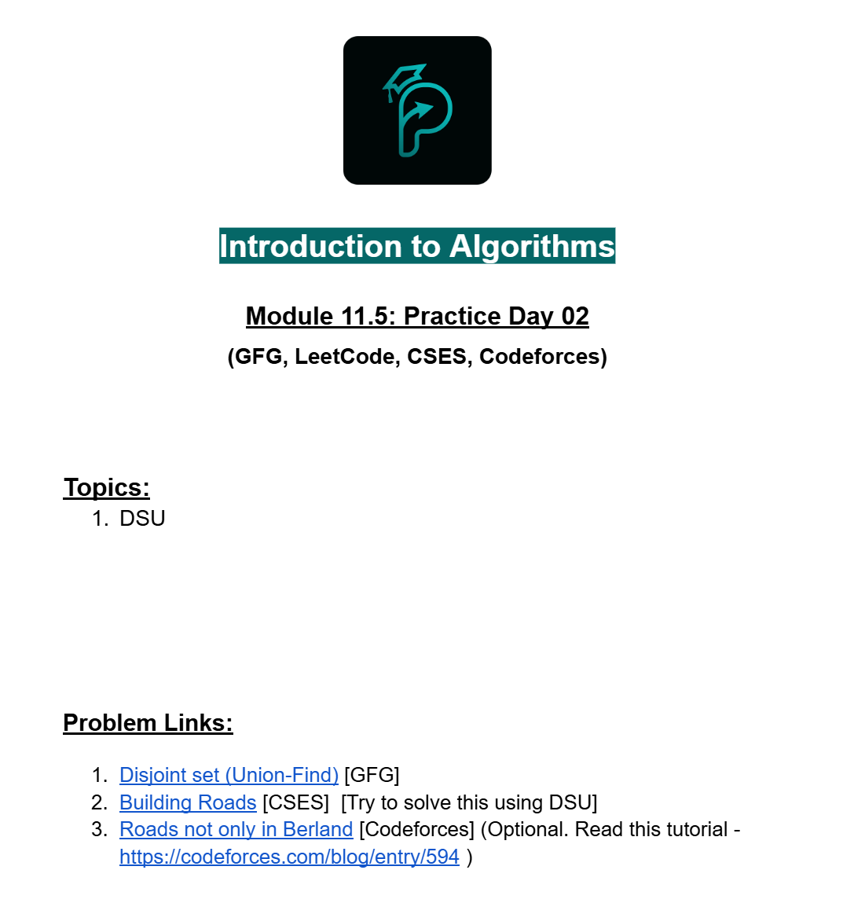

# Date: 03 September, 2025 - Wednesday

## Topics:
- Practice Problem Set: Module 11.5
- Practice Instructions
- Strong Password

## Practice Problem Set: Module 11.5
- [Practice Problem Set:](https://docs.google.com/document/d/170kbXCyIsGK7yLYcq14w8BhnYi_SNZDwUftv4Ym5b_M/edit?usp=sharing)
- 
- [Road to XPSC: Week 3](https://docs.google.com/document/d/1RsnOE2cWdZwqM_qwiJEA2DyoI4S3l7h8IGivAiCnsSU/edit?usp=sharing)
- 

## Practice Instructions
- Explain whole practice problems in this video.

## Strong Password
- [Problem Link:](https://codeforces.com/problemset/problem/1997/A)
- Solved Program: `strong_password.cpp`