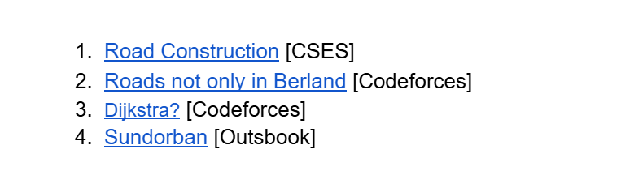
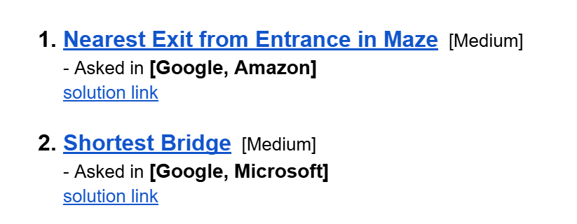

# Date: 06 September, 2025 - Saturday

## Topics:
- Problem List Module 13
0. Introduction
1. Roads Construction
2. Roads not only in berland theory
3. Roads not only in berland implementation
4. Dijkstra Path Printing
5. Sundorban
6. Summary
- Extra Practice Problem Module 13
- Feedback Form Module 13

## Problem List Module 13
- [Problem Link:](https://docs.google.com/document/d/1HM9iYXSivsLWDgeb0l4pVm0ycr9T8gIPV-5scKjV3oc/edit?usp=sharing)
- 

## 0. Introduction
- Basic intro or short into for problems

## 1. Roads Construction
- [Problem Link:](https://cses.fi/problemset/task/1676/)
- Solved Program: `roads_construction.cpp`

## 2. Roads not only in berland theory
- [Problem Link:](https://codeforces.com/problemset/problem/25/D)
- Make theory or logic how to build or solve this code.

## 3. Roads not only in berland implementation
- Solved Program: `roads_berland.cpp`

## 4. Dijkstra Path Printing
- [Problem Link:](https://codeforces.com/problemset/problem/20/C)
- Solved Program: `dijkstra.cpp`

## 5. Sundorban
- [Problem Link:](https://school.outsbook.com/problems/problemdetails/10106)
- Solved Program: `sundorban.cpp`

## 6. Summary
- Solved was those four problems.

## Extra Practice Problem Module 13
- [Extra Practice Problem (Optional):](https://docs.google.com/document/d/1KqITHsZ2zf-5jqt-02vABz5LRjWWF6qxBkErzhLnDB0/edit?usp=sharing)
- 