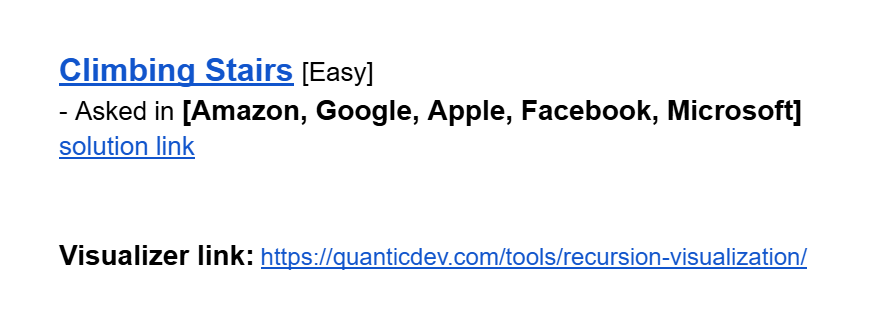
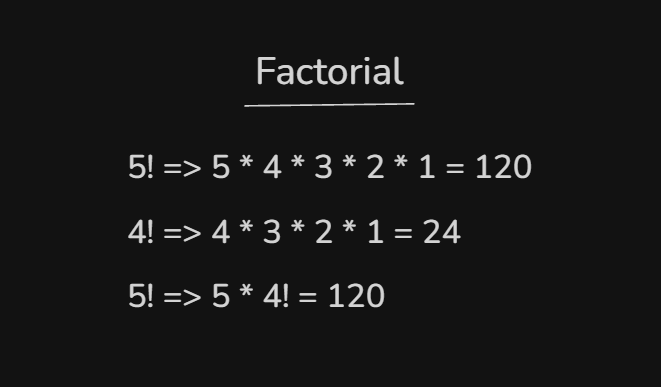
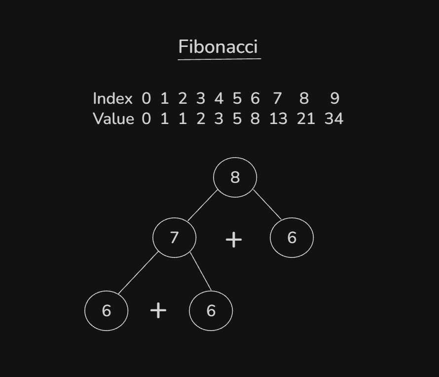
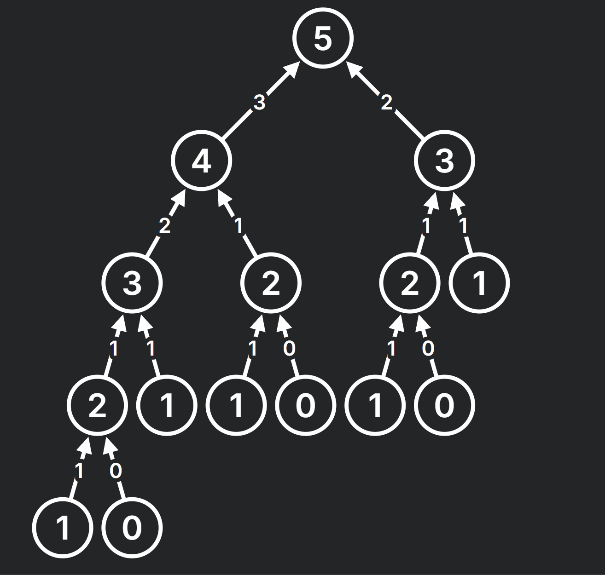
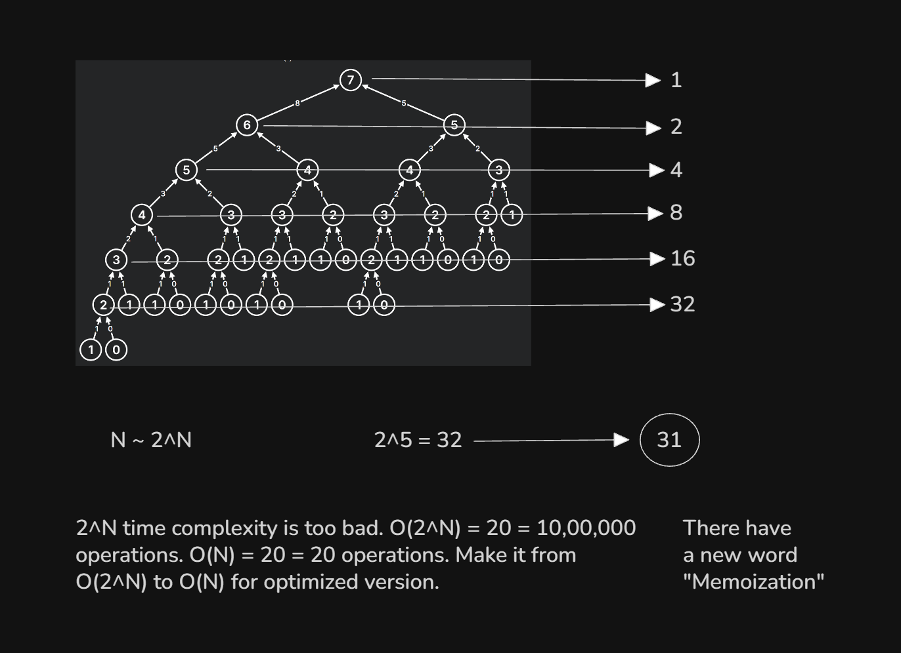
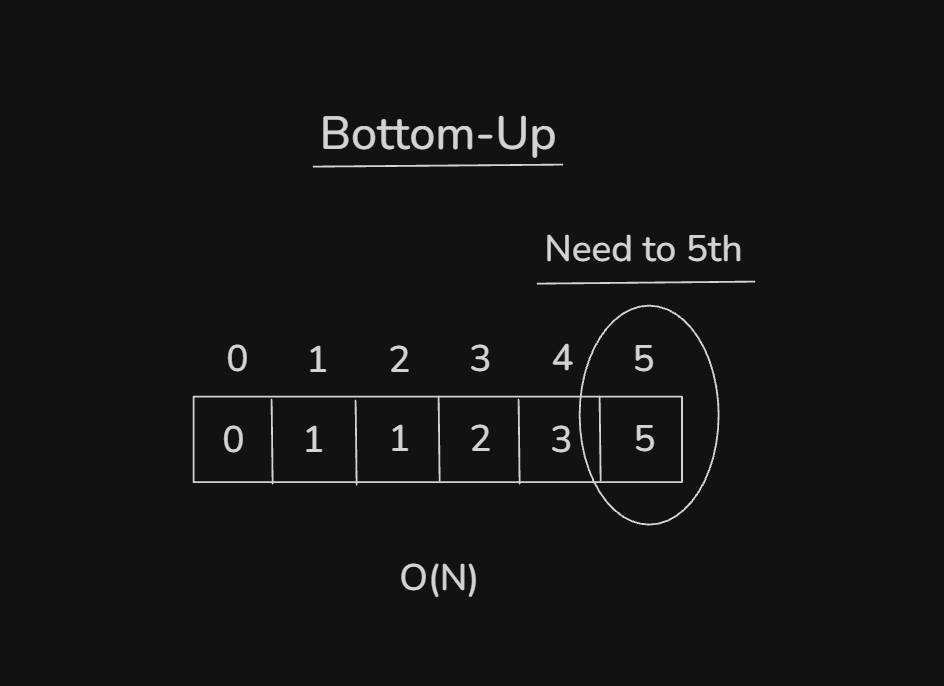

# Date: 07 September, 2025 - Sunday

## Topics:
- Problem and Visualizer Link
0. Introduction
1. What is Dynamic Programming
2. Recursion recap
3. Factorial with recursion
4. Fibonacci with recursion
5. Recursive call visualizer
6. Optimizing Fibonacci
7. Fibonacci with DP
8. Fibonacci bottom up
9. LeetCode Climbing Stairs
10. Summary
- Quiz: Module 14
- Quiz Explanation Module 14

## Problem and Visualizer Link
- [Problem Link:](https://docs.google.com/document/d/1KqvXBvKMWG1IDIWjDoRsWU2t7pjjAxysRM37H4dfrGI/edit?usp=sharing)
- 

## 0. Introduction
- Learn and explore to `Dynamic Programming`.
- `Dynamic Programming` have two types of approach:
    - `Top Down`
    - `Bottom Up`
- `Dynamic Programming` mainly work on recursion optimization.
- `Recursion` must be exert for in `Dynamic Programming`.

## 1. What is Dynamic Programming
- `Dynamic Programming` means `recursion + optimization`.
- When recursive solution have to duplicate or repeat to call then make to optimized recursion, that also call to `Dynamic Programming`.
- `Dynamic Programming` have two types of approach:
    - `Top Down -> Using with Recursion`
    - `Bottom Up -> Using with Loop`

## 2. Recursion recap
- Program: `recursion.cpp`

## 3. Factorial with recursion
- 
- Program: `factorial.cpp`

## 4. Fibonacci with recursion
- 
- Program: `fibonacci.cpp`
- This program will optimized in `7. Fibonacci with DP`.

## 5. Recursive call visualizer
- [Recursion Tree Visualizer Link:](https://quanticdev.com/tools/recursion-visualization/)
- 

## 6. Optimizing Fibonacci
- 

## 7. Fibonacci with DP
- Program: `fibonacci_memoization.cpp`

## 8. Fibonacci bottom up
- 
- Program: `fibonacci_bottom_up.cpp`