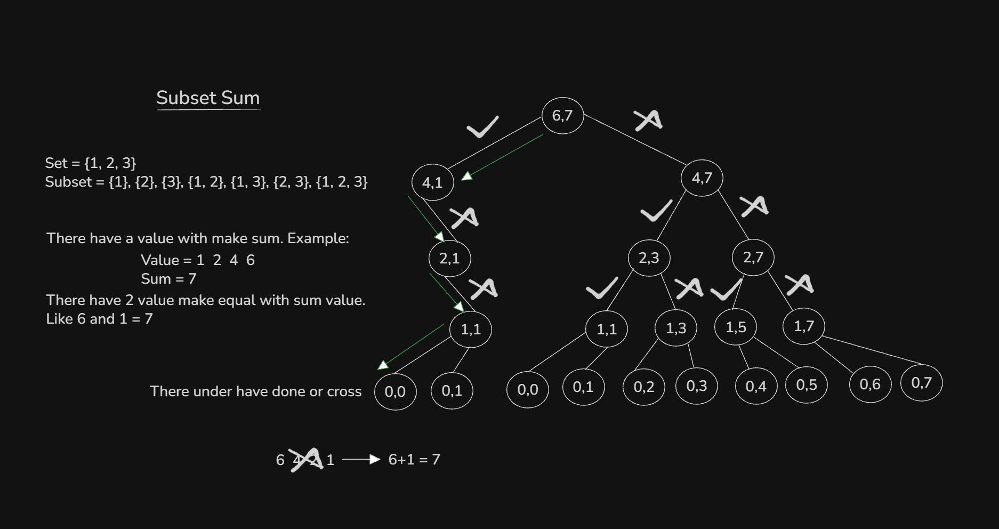
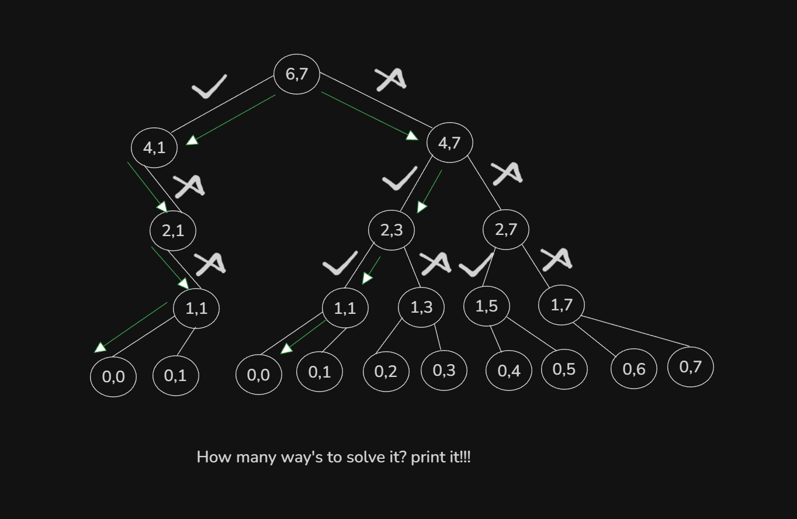
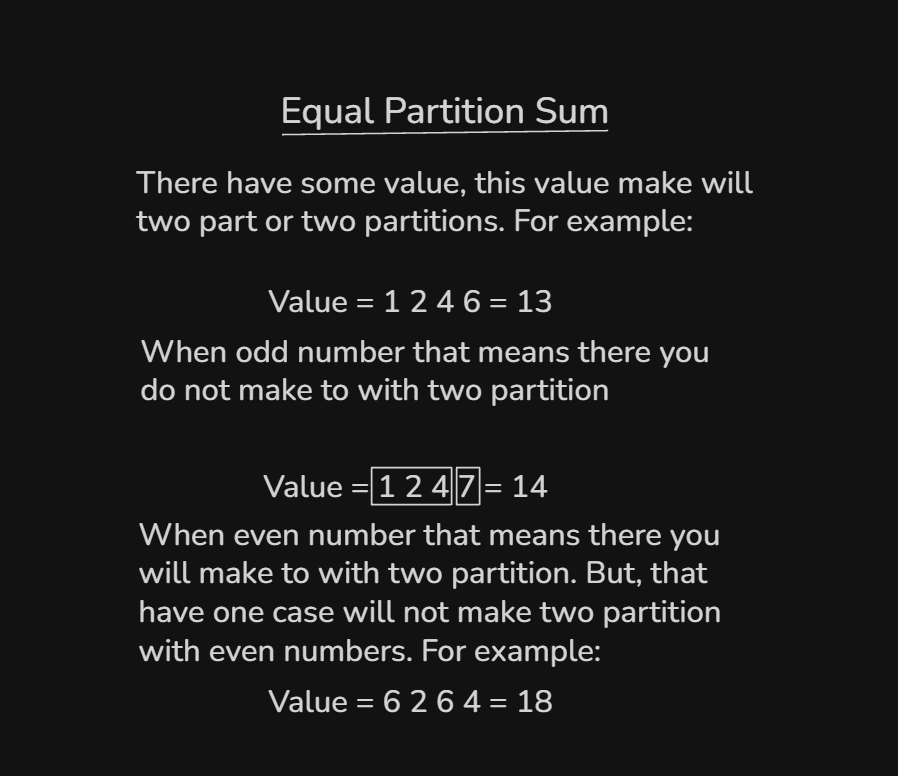

## Topics:
- Problem Link
0. Introduction
1. Subset sum Idea
2. Subset sum implementation
3. Subset sum using dp
4. Count of subset sum
5. Equal sum
6. Unbounded knapsack
7. Unbounded knapsack implementation
8. LeetCode coin change
9. Summary

## Problem Link
- [Problem Link:](https://docs.google.com/document/d/1D4Agn4-1AQI8UpiUUCjLiytCbnLET4HlLEKr8oDElaE/edit?usp=sharing)

## 0. Introduction
- KnapSack Variations:
    - Subset Sum
    - Subset Sum Variation
    - Unbounded KnapSack

## 1. Subset sum Idea
- 

## 2. Subset sum implementation
- Program: `subset_sum.cpp`
- This program time complexity was `O(2^N)`

## 3. Subset sum using dp
- Time complexity was `O(2^N)` that why we will use to `Dynamic Programming (DP)`.
- Program: `subset_sum_dp.cpp`

## 4. Count of subset sum
- 
- Program: `count_subset_sum.cpp`

## 5. Equal sum
- 
- Program: `equal_sum.cpp`

## 6. Unbounded knapsack
- 