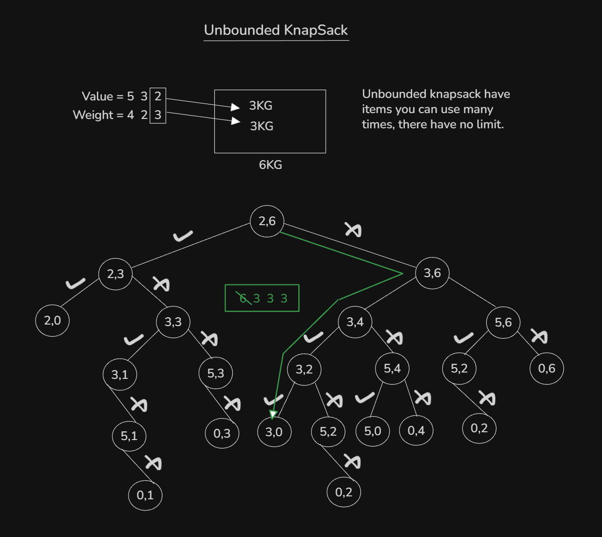

## Topics:
- Problem Link
0. Introduction
1. Subset sum Idea
2. Subset sum implementation
3. Subset sum using dp
4. Count of subset sum
5. Equal sum
6. Unbounded knapsack
7. Unbounded knapsack implementation
8. LeetCode coin change
9. Summary

## Problem Link
- [Problem Link:](https://docs.google.com/document/d/1D4Agn4-1AQI8UpiUUCjLiytCbnLET4HlLEKr8oDElaE/edit?usp=sharing)

## 0. Introduction
- KnapSack Variations:
    - Subset Sum
    - Subset Sum Variation
    - Unbounded KnapSack

## 1. Subset sum Idea
- 

## 2. Subset sum implementation
- Program: `subset_sum.cpp`
- This program time complexity was `O(2^N)`

## 3. Subset sum using dp
- Time complexity was `O(2^N)` that why we will use to `Dynamic Programming (DP)`.
- Program: `subset_sum_dp.cpp`

## 4. Count of subset sum
- 
- Program: `count_subset_sum.cpp`

## 5. Equal sum
- 
- Program: `equal_sum.cpp`

## 6. Unbounded knapsack
- 

## 7. Unbounded knapsack implementation
- Program: `unbounded_knapsack.cpp`

## 8. LeetCode coin change
- Solved Leetcode Coin Change. Here is solution code:
    ```
    class Solution {
    public:
        int dp[305][5005];
        int subset_sum(int i, int sum, vector<int>& coins) {
            if(i < 0) {
                if(sum == 0) return 1;
                else return 0;
            }
            if(dp[i][sum] != -1)
                return dp[i][sum];
            if(coins[i] <= sum) {
                int op1 = subset_sum(i, sum-coins[i], coins);
                int op2 = subset_sum(i-1, sum, coins);
                dp[i][sum] = op1 + op2;
                return dp[i][sum];
            }
            else
                dp[i][sum] = subset_sum(i-1, sum, coins);
                return dp[i][sum];
        }

        int change(int amount, vector<int>& coins) {
            int n = coins.size();
            for(int i = 0; i <= n; i++)
                for(int j = 0; j <= amount; j++)
                    dp[i][j] = -1;
            return subset_sum(n-1, amount, coins);
        }
    }
    ```

## 9. Summary
- Abc