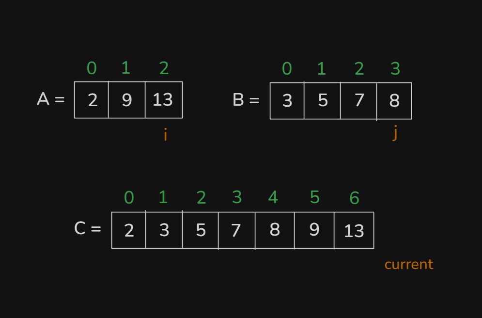
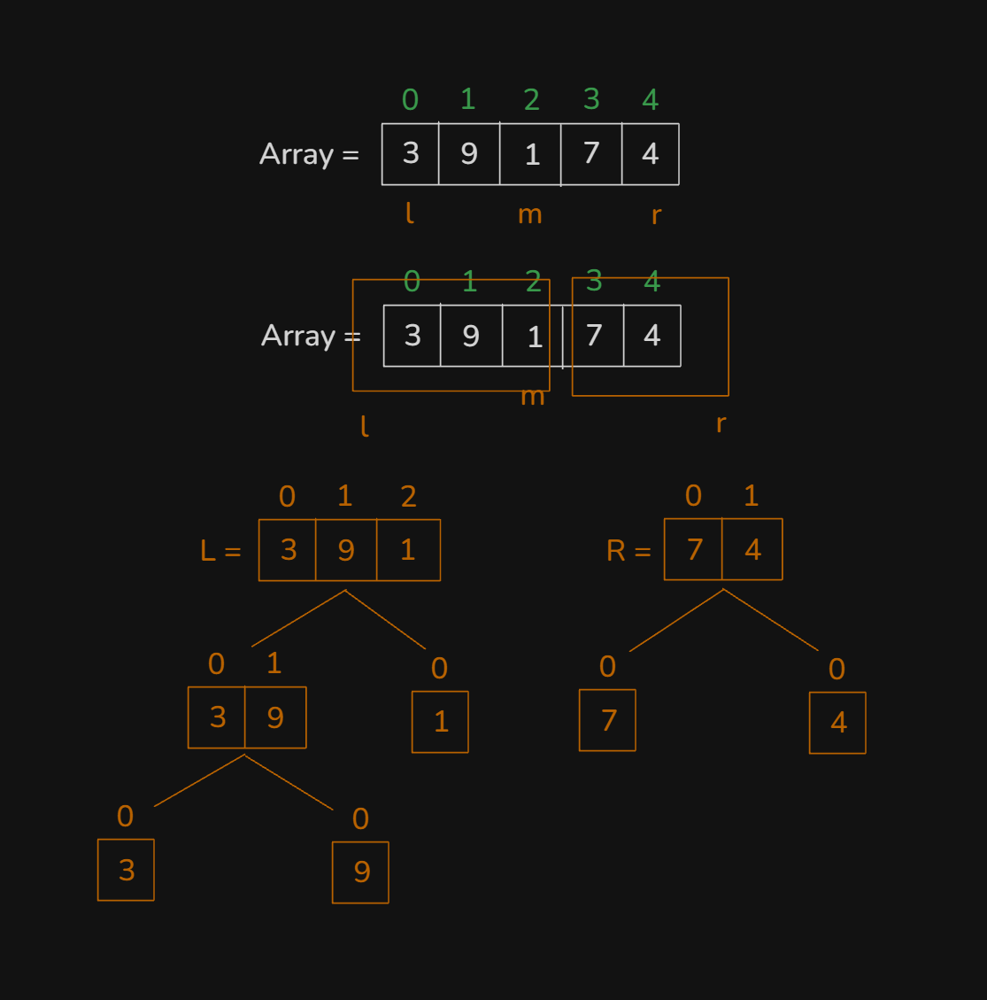

## Topics:
0. Introduction
1. How Merge sort works
2. Conquer Theory
3. Conquer Animated
4. Conquer Implementation
5. Divide theory
6. Divide Implementation
7. Merge sort using Divide & Conquer
8. Merge Sort Animated
9. Complexity of Merge sort
10. Summary
11. Quiz: Module 18
12. Quiz Explanation Module 18

## 0. Introduction
- `A sorting algorithms` name is `Merge Sort`.
- Normally we was learned `Insertion Sort, Bubble Sort - O(N^2)` - This `O(N^2)` complexity was too much bad. There have a `C++` build in `Sort Function`. Because, this `C++` build in `Sort Function` time complexity have `O(NlogN)`. `Merge Sort` time complexity was `O(NlogN)`.
- This `Merge Sort` follow or using concept of `Divide & Conquer`. `Divide & Conquer` this is just a technique, not a algorithms.

## 1. How Merge sort works
- `Merge Sort`:
    - `Divide & Conquer`: Divide an array every part has sorted and then all every single parts combined and make will an sorted array.

## 2. Conquer Theory
- There have two sorted array's and then make a single sorted array with this two array's combination.
    - 

## 3. Conquer Animated
- Explain this theory in this video with animated way:
    - 

## 4. Conquer Implementation
- Program: `conquer.cpp`

## 5. Divide theory
- 

## 6. Divide Implementation
- Program: `divide.cpp`

## 7. Merge sort using Divide & Conquer
- Program: `merge_sort.cpp`

## 8. Merge Sort Animated
- Explain this code in this video:
    ```
    void divide(int a[], int l, int r) {
        if(l >= r)
            return;
        int mid = (l + r) / 2;
        divide(a, l, mid);
        divide(a, mid+1, r);
        conquer(a, l, mid, r);
    }
    ```
- This code was very complicated and not to easy.

## 9. Complexity of Merge sort
- How this work with `O(NlogN)`?
    ```
    void divide(int a[], int l, int r) {
        if(l >= r)
            return;
        int mid = (l + r) / 2;
        divide(a, l, mid); // O(logN)
        divide(a, mid+1, r);
        conquer(a, l, mid, r); // O(NlogN)
    }
    ```

## 10. Summary
- From this module we was learned new algorithms `Merge Sort` and learn also two concept `Divide and Conquer`.
- `Conquer` - There have two sorted array's and then this two array combined make a new single sorted array.
- `Divide` - There have an array and divide until this array will not sorted.
- `Divide and Conquer` = `Merge Sort`

## 11. Quiz: Module 18
- `Total Questions: 10`
- `Total Marks: 10`

## 12. Quiz Explanation Module 18
- [Quiz Explanation:](https://docs.google.com/document/d/1Vv59rkgY2QbvNHxOkXR8rIKBEQFzCgDsHWg9g_VeW08/edit?usp=sharing)