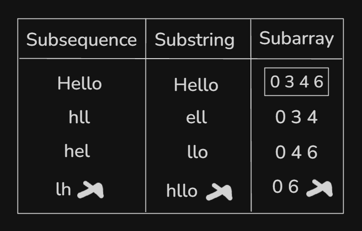
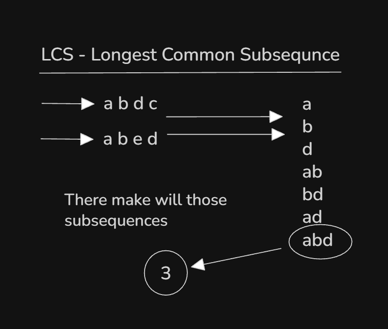

## Topics:
1. What is subsequence
2. What is LCS
3. How to calculate LCS
4. Recursive call of LCS
5. LCS implementation
6. What is MST
7. Kruskals algorithm
8. Kruskals algorithm implementation I
9. Kruskals algorithm implementation II
10. Summary
11. Quiz: Module 19
12. Quiz Explanation Module 19

## 1. What is subsequence
- Learn this first topic name is `LCS - Longest Common Subsequence`. Before learn one more thing `Subsequence`.
- `Subsequence` have to many concepts - `subsequence, substring, subarray, subset`.
- 

## 2. What is LCS
- 