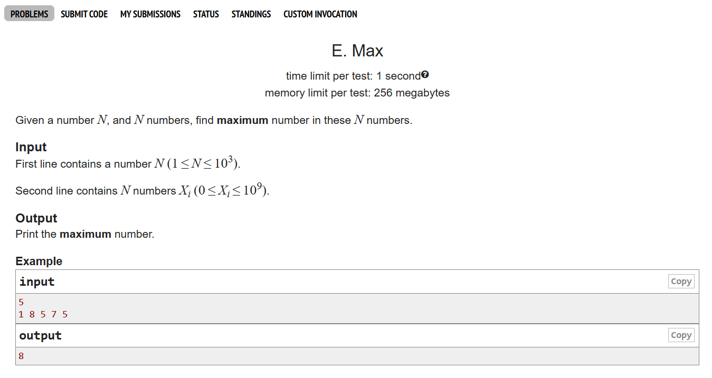
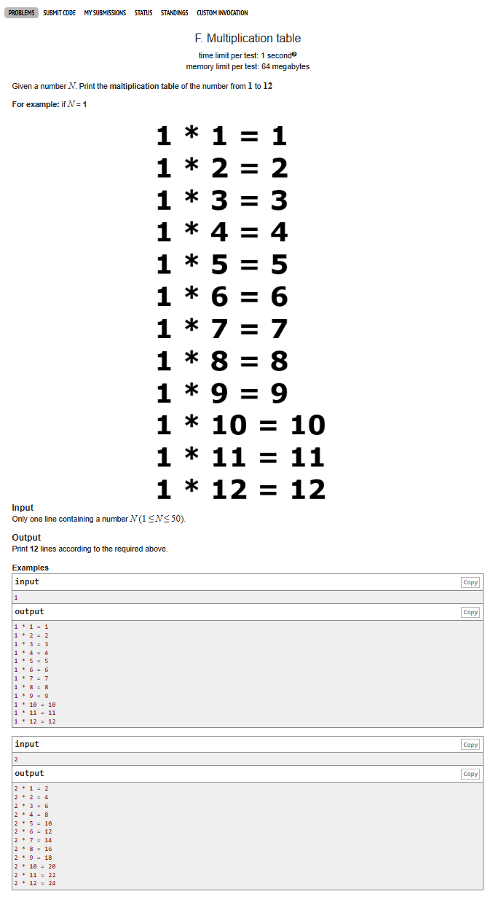
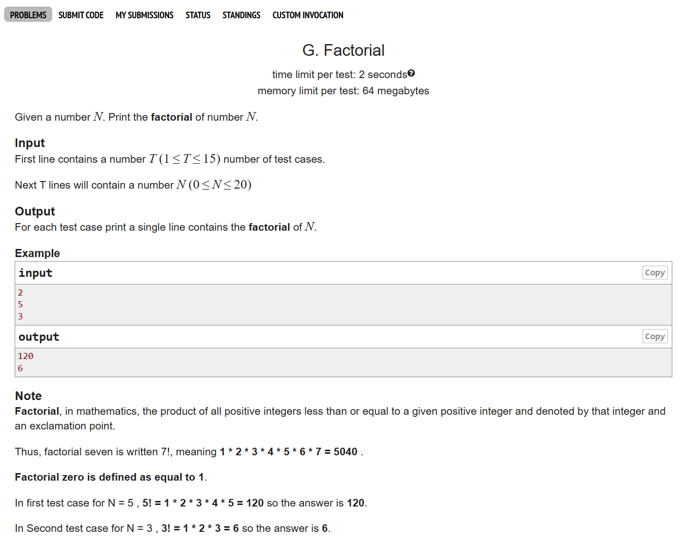
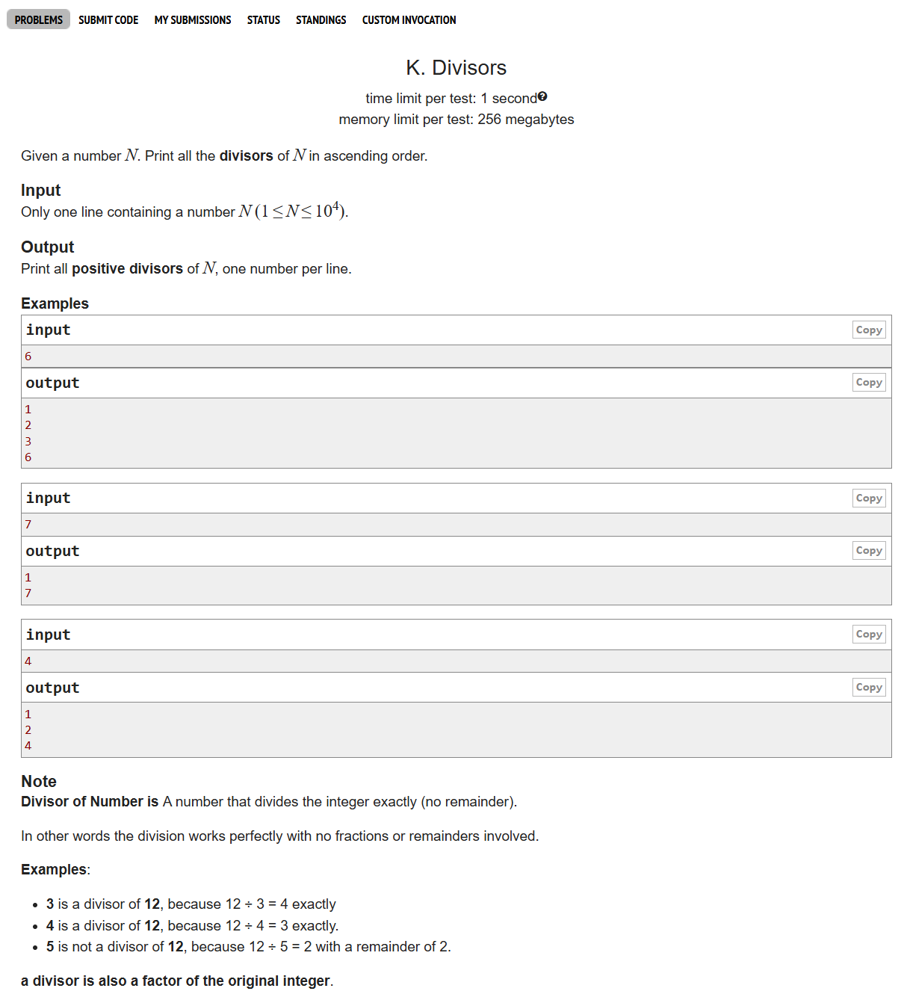
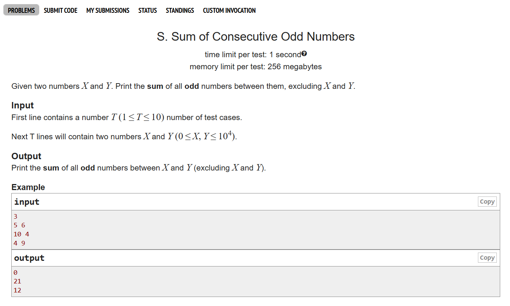

# Date: 13 April, 2025 - Sunday

## Topics:
- Text Instructions: Module 6 [Must Read]
0. Introduction
1. Increment Decrement operator
2. Pre and post increment
3. Even Numbers
4. Even odd pos neg I
5. Even odd pos neg II
6. Fixed Password
7. Finding maximum value Animated
8. Max and Min
9. Multiplication Table
10. Digits
11. Nested loop Animated
12. Nested loop
13. Summary
- Quiz: Module 06
- Practice Extra Problem and Quiz Explanation Module 06
- Feedback Form Module 06

## Text Instructions: Module 6 [Must Read]
- [মডিউলের প্রবলেম লিংক-](https://docs.google.com/document/d/1NDdqTi6fvbM2AZxl8B17XKizAMo2EkbXKOqC5-SXI9o/edit?usp=sharing)
- মডিউল রিলেটেড তোমার যে কোন ফিডব্যাক থাকলে এই ফর্মে লিখে দিতে পারো। আমরা তোমার ফিডব্যাক গুরুত্বসহকার দেখব।
- [Feedback Form Link](https://forms.gle/DH5mjuGD1x2EZ4z29)

## 0. Introduction
- Problem solving with Loop
- One more clear to `increment` and `decrement operator`
    - Have two variation:
        - `Pre increment/decrement`
        - `Post increment/decrement`
- The clear concept of `Nested Loop`

## 1. Increment Decrement operator
- Increment shortcut
    - `i++` = `i = i + 1` It's only can increment 1
    - `i+=1` = `i = i + 1`
    - `i+=2` = `i = i + 2`
    - `i+=3` = `i = i + 3`
    <br><br>
    - `i*=3` = `i = i * 3`
    - `i/=3` = `i = i / 3`

## 2. Pre and post increment
- Pre increment `++i`
- Post increment `i++`
- Program: `pre_post.c`
- `Build Logic`: Program thinking then see the output

## 3. Even Numbers
- 
- Program: `problem_1.c`
- Explanation problem one (1)
- You can easily handle input and output without repeat checking with this two step:
    - `Step 1`: Search to google `competitive companion` Go to `Chrome Web Store` and add to this extension in your web browser and pinned.
    - `Step 2`: Go to your VSCode and go to extension. Here search to `cph (Competitive Programming H)` and install.

    - Go to problems in the web browser and click to `competitive companion extension` and then back to vscode and set the compiler which you will try.

## 4. Even odd pos neg I
- 
- Program: `problem_2.c`
- Explanation problem two (2)

## 5. Even odd pos neg II
- Part I had done 50% code
- And part II have done 50%. Then == 100%

## 6. Fixed Password
- 
- Program: `problem_3.c`
- Explanation problem three (3)

## 7. Finding maximum value Animated
- Check every value and find the maximum value
- It's a example video.

## 8. Max and Min
- 
- Program: `problem_4.c`
- Explanation problem four (4)

## 9. Multiplication Table
- 
- Program: `problem_5.c`
- Explanation problem five (5)

## 10. Digits
- 
- Program: `problem_6.c`
- Explanation problem six (6)

## 11. Nested loop Animated
- Explanation nested loop in short video

## 12. Nested loop
- Program: `nested_loop.c`

## 13. Summary
- Problem solving with loop
- Increment and decrement operators
    - They have two variation:
        - `Pre` and `Post`
- We ware finished six (6) problems
- n'th of file
- problem solve with test case using loop
- For loop, while loop and do-while loop
- Nested loop

## Quiz: Module 06
- `Total Questions: 10`
- `Total Marks: 10`

## Quiz Explanation Module 06
- ## ✅ C Programming MCQ – Loop Based Questions with Explanations

---

### 1. How many times “hi” will be printed for the following code snippet?
```c
for(int i=0; i<=10; i++)
{
    printf("hi ");
    if(i>2)
    {
        break;
    }
}
```
**A)** 2  
**B)** 3  
**C)** 4 ✅  
**D)** 10  
> **Explanation:** লুপটি i=0 থেকে i=3 পর্যন্ত চলবে এবং i এর মান 0, 1, 2, 3 এর জন্য "hi" প্রিন্ট করবে।  যেহেতু, i=3 এ hi প্রিন্ট হওয়ার পরই break হয়, তাই 4 বার hi দেখা যাবে ( i>2 => 3>2 শর্ত সত্য তাই break দ্বারা লুপ থেকে বের হয়ে যাবে )।


---

### 2. How many times (*) will be printed?
```c
int i=3;
while(i<=5)
{
    for(int j=0;j<i;j++)
    {
        printf("*");
    }
    i++;
}
```
**A)** 10  
**B)** 7  
**C)** 12 ✅  
**D)** Infinite loop  
> **Explanation:** বাইরের লুপ (while): i=3 থেকে i=5 পর্যন্ত চলবে (৩ বার)।
ভিতরের লুপ (for): 
যখন i=3 তখন j=0 থেকে j<3 অর্থাৎ 3 বার * প্রিন্ট করবে
যখন i=4 তখন j=0 থেকে j<4 অর্থাৎ 4 বার * প্রিন্ট করবে
যখন i=5 তখন j=0 থেকে j<5 অর্থাৎ 5 বার * প্রিন্ট করবে

মোট: 3 + 4 + 5 = 12 বার * প্রিন্ট করবে।

---

### 3. How many times “#” will be printed?
```c
int i = -3;
while(i<0)
{
    for(int j=0;j<5;j++)
    {
        printf("#");
    }
    i--;
}
```
**A)** 0  
**B)** 22  
**C)** 5  
**D)** Infinite loop ✅  
> **Explanation:** বাইরের লুপ (while): i=-3 দিয়ে শুরু, শর্ত i<0 (সত্য)। প্রতিবার i-- দ্বারা i এর মান কমছে (-3, -4, -5,...), তাই শর্ত i<0 সবসময় সত্য। 

ভিতরের লুপ (for): প্রতিবার j=0 থেকে j<5 পর্যন্ত ৫ বার # প্রিন্ট করে।

যেহেতু বাইরের লুপ কখনই মিথ্যা হবে না, তাই ইনফিনিটি # প্রিন্ট করবে। সুতরাং উত্তর Infinite loop 


---

### 4. How many times “hi” will be printed?
```c
for(int i = -4; i>=0; i++)
{
    for(int j=5; j<2; j++)
    {
        printf("hi ");
    }
}
```
**A)** 4  
**B)** 12  
**C)** 0 ✅  
**D)** Infinite loop  
> **Explanation:** বাইরের for লুপ: i = -4 দিয়ে শুরু, শর্ত i >= 0 (-4 >= 0) অর্থাৎ মিথ্যা। তাই বাইরের লুপ একবারও চলবে না। 
ভিতরের for লুপ: বাইরের লুপ চলেনি, তাই ভিতরের লুপ এক্সিকিউটই হবে না। 
সুতরাং, প্রোগ্রামটি একবারও "hi" প্রিন্ট করবে না। কোনো আউটপুট দেখা যাবে না।


---

### 5. Which one is an infinite loop?
```c
A) for(int i=-4; i>=0; i--)  
B) for(int i=-4; i<=0; i++)  
C) for(int i=-4; i<=0; i--) ✅  
D) None  
```
> **Explanation:**  for(int i=-4; i<=0; i--) লুপ এ i = -4 দিয়ে শুরু, শর্ত i <= 0 (-4 <= 0) সত্য। প্রতিবার i-- দ্বারা i এর মান কমবে (-5, -6, -7,...) এবং শর্ত i <= 0 যা  সর্বদাই সত্য হবে (যেহেতু i ক্রমাগত কমছে) তাই ইনফিনিটি লুপ হবে। 

---

### 6. Print all values from 1 to 10 inclusive:
```c
A) for (int i = 0; i < 10; i++) { printf("%d ", i); }  
B) for (int i = 1; i < 10; i++) { printf("%d ", i); }  
C) for (int i = 1; i <= 10; i++) { printf("%d ", i); } ✅  
D) for (int i = 0; i <= 10; i++) { printf("%d ", i); }  
```
> **Explanation:** for (int i = 1; i <= 10; i++) { printf("%d ", i);} এই লুপটি i=1 থেকে শুরু করে i<=10 শর্ত পর্যন্ত চলবে, ফলে 1 থেকে 10 পর্যন্ত সব সংখ্যা প্রিন্ট করবে।  
i ) অপশন A ও B তে 10 বাদ পড়ে
ii ) D তে 0 সহ প্রিন্ট হয়।


---

### 7. Print all values from 1 to 10 exclusive:
```c
A) int i = 0; while (i < 10) { printf("%d ", i); i++; }  
B) int i = 1; while (i < 10) { printf("%d ", i); i++; } ✅  
C) int i = 2; while (i < 10) { printf("%d ", i); i++; }  
D) int i = 2; while (i <= 10) { printf("%d ", i); i++; }  
```
> **Explanation:** int i = 1; while (i < 10) { printf("%d ", i); i++; } এই লুপটি i=1 থেকে শুরু করে i<10 শর্ত পর্যন্ত চলবে, ফলে 1 থেকে 9 পর্যন্ত সংখ্যা প্রিন্ট করবে (10 exclusive) অর্থাৎ ১০ এখানে প্রিন্ট হবে না । 
i) অপশন A তে ০ থেকে ৯ প্রিন্ট হয়
ii) C তে ২ থেকে ৯
iii) D তে ২ থেকে ১০ প্রিন্ট হয়।


---

### 8. Output of the following code:
```c
for(int i=0;i<5;i++)
{
    if(i==3)
    {
        continue;
    }
    printf("%d ",i);
}
```
**A)** 0 1 2 3 4 5  
**B)** 0 1 2 4 5  
**C)** 0 1 2  
**D)** 0 1 2 4 ✅  
> **Explanation:**  i<5 শর্ত অনুযায়ী, লুপটি i=0 থেকে i=4 পর্যন্ত চলবে। যেহেতু লুপে i=3 হলে continue দেয়া আছে তাই এই  স্টেটমেন্টের কারণে 3 প্রিন্ট হবে না। তাই বাকি মানগুলো (0,1,2,4) প্রিন্ট হবে। 


---

### 9. How many times "hi" will be printed?
```c
for(int i=0; i<=10; i++)
{
    if(i>2)
    {
        break;
    }
    printf("hi ");
}
```
**A)** 2  
**B)** 3 ✅  
**C)** 4  
**D)** 10  
> **Explanation:** লুপটি i=0,1,2 (৩ বার) চলবে, প্রতিবার "hi " প্রিন্ট করবে। যখন i=3 হবে (i>2 এই শর্তটি সত্য) তখন break স্টেটমেন্ট লুপ থামিয়ে দেবে। সুতরাং ৩ বার "hi " প্রিন্ট হবে।

---

### 10. How many times "hi" will be printed?
```c
for(int i=0; i<=10; i++)
{
    if(i>2)
    {
        continue;
    }
    printf("hi ");
}
```
**A)** 2  
**B)** 3 ✅  
**C)** 9  
**D)** 10  
> **Explanation:** লুপটি i=0,1,2 (৩ বার) চলবে এবং প্রতিবার "hi " প্রিন্ট করবে। তারপরও লুপ চলতে থাকবে i=3 থেকে i=10 পর্যন্ত, কিন্তু i এর মান 2 এর চেয়ে বড় হওয়ায় সবসময় continue স্টেটমেন্ট কাজ করবে যার ফলে বাকি লুপের জন্য  আর "hi " প্রিন্ট করা হবে না।
---

## Practice Extra Problem
- Problem 1
    - 

- Problem 2
    - 

- Problem 3
    - 

- [Extra Problems Link](https://docs.google.com/document/d/1k3-3nSz-zHxwdsa1cPcFR9KfFFJdAQIeAQfkdsVoXVI/edit?usp=sharing)

## Feedback Form Module 06
- মডিউল রিলেটেড তোমার যে কোন ফিডব্যাক থাকলে এই ফর্মে লিখে দিতে পারো। আমরা তোমার ফিডব্যাক গুরুত্বসহকার দেখব।
- [Form Links](https://forms.gle/DH5mjuGD1x2EZ4z29)