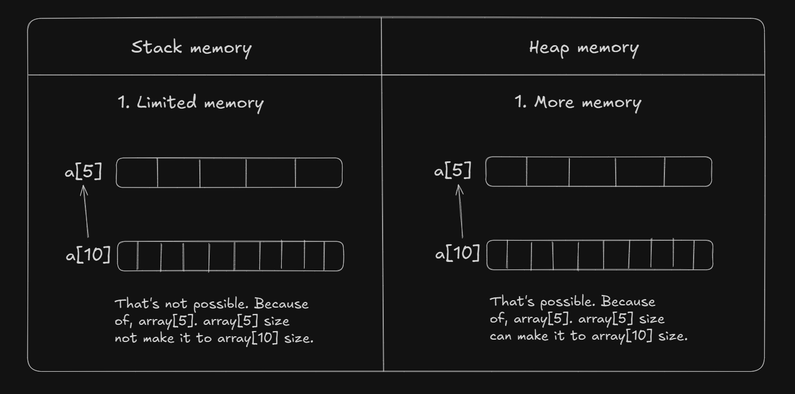
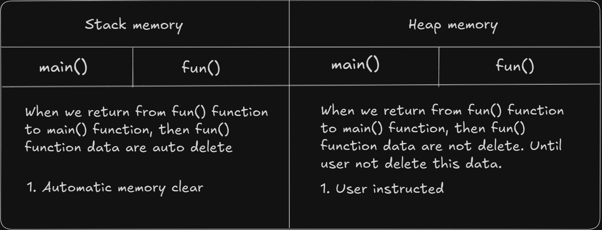

# Date: 25 May, 2025 - Sunday

## Topics:
0. Introduction
1. Static vs Dynamic Memory
2. Dynamic Variable
3. Dynamic variable Animated
4. Dynamic Array
5. Dynamic array Animated
6. Dynamic Array Return From Function
7. Return Array From Function Animated
8. Increase Size of Dynamic Array
9. Why We Need Dynamic Memory Allocation Animated
10. Summary
- Quiz: Module 02
- Feedback Form and Quiz Explanation

## 0. Introduction
- `Dynamic` and `Static` memory in C++
- How to declare dynamic variable in C++
- How to declare dynamic array in C++
- Array return from function in C++
- How to delete dynamic memory in C++

## 1. Static vs Dynamic Memory
- Stack memory in C++. It's also call to `Static` or `Compile Time` memory.
- Heap memory in C++. It's also call to `Dynamic` or `Runtime` memory.
- What is the difference between `stack memory` and `heap memory`?
    - Stack memory have limited memory.
    - Heap memory have more memory.
- Dynamic array and static array syntax are different.
- Dynamic and Static memory difference 1:

- Dynamic and Static memory difference 2:

## 2. Dynamic Variable
- How to declare dynamic variable in C++
- Program: `dynamic_variable.cpp`
- `new` keyword access to heap memory.
    - Syntax: `new datatype`
- Pointer use in dynamic variable.
- Pointer store another variable address.
- Pointer syntax:
    - `datatype *variable_name = new int;`
    - Like: `int *x = new int;`
- Stack memory are auto delete.
- Heap memory are not auto delete.