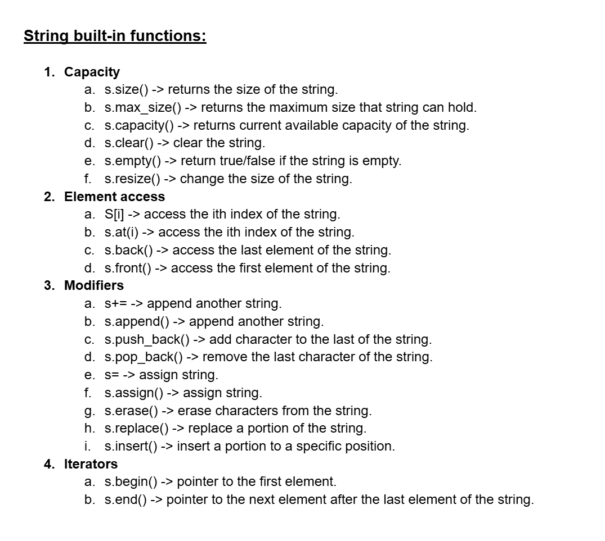
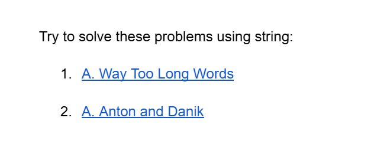

# Date: 31 May, 2025 - Saturday

## Topics:
- Important Links
0. Introduction
1. String in C++
2. String Capacity Functions
3. String Element Access
4. String Modifiers Part I
5. String Modifiers Part II
6. String Iterators
7. String iterator Animated
8. String input with spaces
9. Stringstream
10. Stringstream Animated
11. Summary
- Quiz: Module 05
- Feedback Form and Quiz Explanation

## Important Links
- [String Built In Functions:](https://docs.google.com/document/d/1nxFrcoG_t-hMbeuAw6A5r_CV7I1lYvKLwEpupTQqkrM/edit?usp=sharing)
    - 

- [Extra Practice (Optional):](https://docs.google.com/document/d/14sdQIgBZV29d8cSMPfMasotAc_jhZNgxaqRSOG_yR1c/edit?usp=sharing)
    - 
    - [Problem 1](https://codeforces.com/problemset/problem/71/A)
    - [Problem 2](https://codeforces.com/problemset/problem/734/A)

## 0. Introduction
- String in C++
- Build-in Functions of String - `size()`, `clear()`, `empty()`, `append()` etc.
- Taking Input with Space - `getline()` and `cin.get()`.
- Stringstream in C++
- Iterator in C++
- String Iterators - `begin()`, `end()`, `rbegin()`, `rend()`.

## 1. String in C++
- Program: `string.cpp`

## 2. String Capacity Functions
- Program: `string_capacity.cpp`
- `string` is a build-in class in c++.

## 3. String Element Access
- Program: `element_access.cpp`

## 4. String Modifiers Part I
- Program: `string_modifiers.cpp`
- `append()` and `push_back()` function are expand memory and adding new character.

## 5. String Modifiers Part II
- Program: `string_modifiers2.cpp`

## 6. String Iterators
- Program: `string_iterators.cpp`
- `begin()` and `end()` function also a pointer.