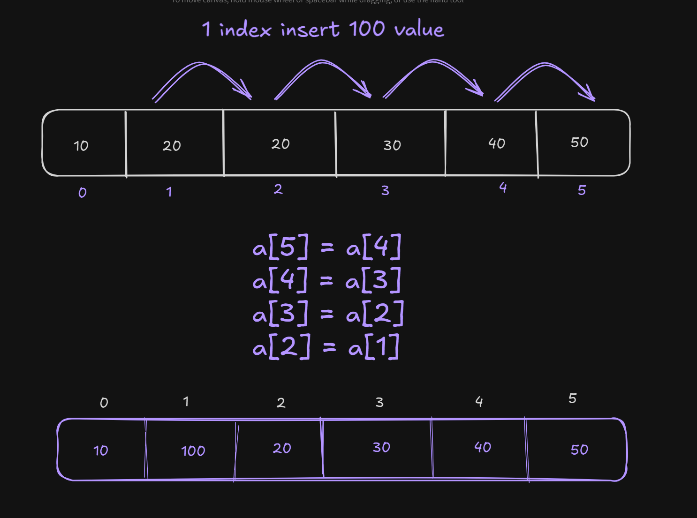
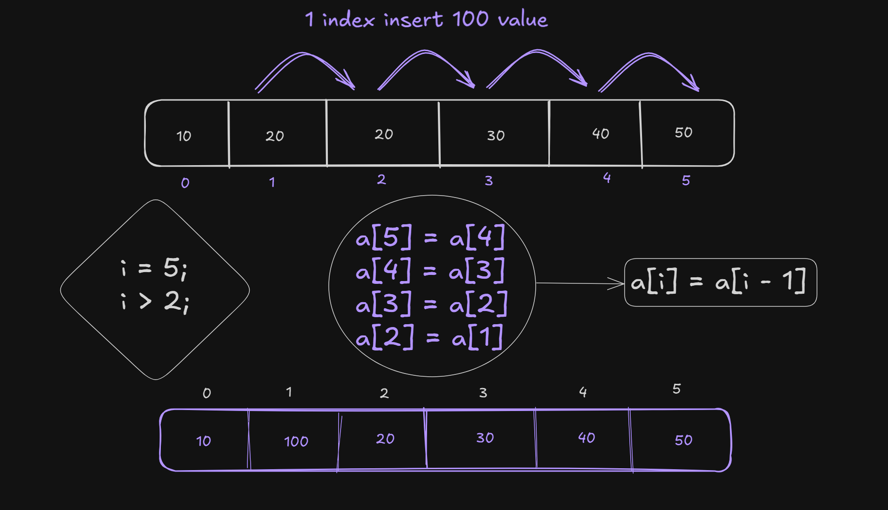
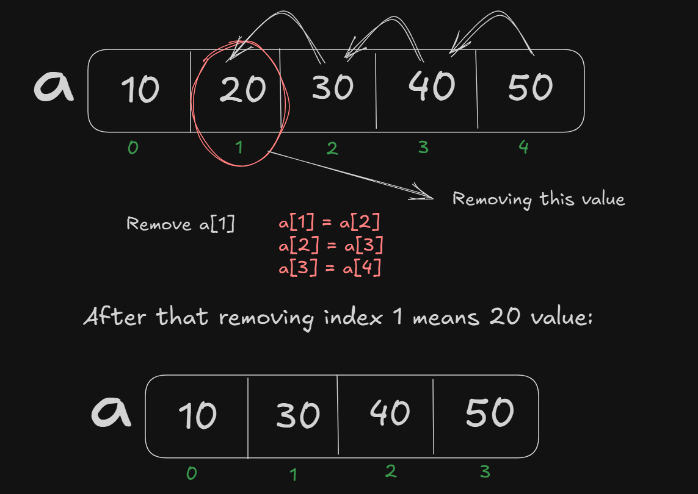

# Date: 19 April, 2025 - Saturday

## Topics:
0. Introduction
1. Insert element in an array Animated
2. Insert a value in an array idea
3. Insert a value in an array implementation
4. Remove element from an Array Animated
5. Removing a value in an array idea
6. Removing a value in an array Implementation
7. Swapping two values
8. Reverse an array Animated
9. Reverse an array
10. Summary
- Quiz: Module 09
- Extra Practice Problem And Quiz Explanation Module 09
- Feedback Form Module 09

## 0. Introduction
- Inserting a value in an array
- Removing a value from an array
- Reversing an array - Swap elements
- Copying elements between arrays

## 1. Insert element in an array Animated
- Now my index are 5. If add a value then my index are 6.
- Insert start with ending.

## 2. Insert a value in an array idea
- Program: `insert_array.c` - `50%`
- If 1 number index insert 100 value. Then this logic are work:
    - `a[5]` = `a[4]`
    - `a[4]` = `a[3]`
    - `a[3]` = `a[2]`
    - `a[2]` = `a[1]`
- The logic build with image: 
    

## 3. Insert a value in an array implementation
- Program are same `insert_array.c` - `100%`
- The logic build with image: 
    

## 4. Remove element from an Array Animated
- Inserting opposite remove. Remove can start with starting

## 5. Removing a value in an array idea
- Program: `remove_array.c` - `50%`
- The logic build with image: 
    

## 6. Removing a value in an array Implementation
- Program are same `remove_array.c` - `100%`
- Thinking the logic and build the program.

## 7. Swapping two values
- Program: `swap_value.c`
- Swap a value with two variables

## 8. Reverse an array Animated
- Reverse an array with `Two Pointer Technique`
- Two men with right and left. Then value right to left and left to right. So, this way go to two men are center. This technique name is two pointer technique

## 9. Reverse an array
- Program: `reversing_array.c`
- `Two Pointer Technique` is very famous. This technique follow and solve to 100k+ problem solving.
- The logic build with image: 
    