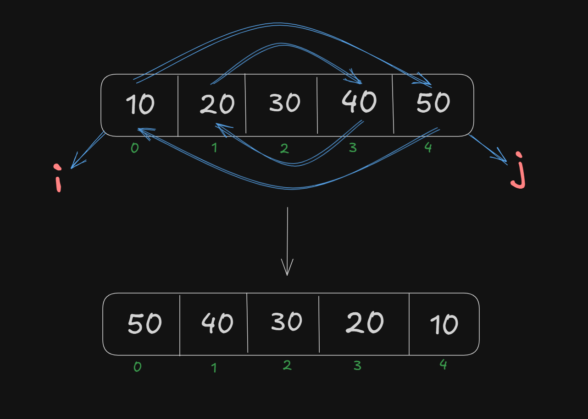
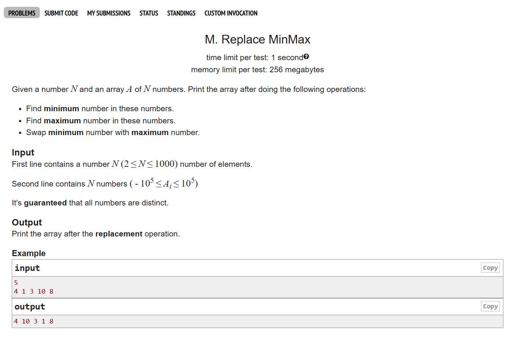
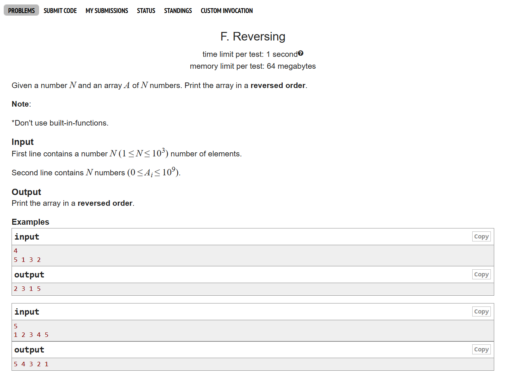

# Date: 19 April, 2025 - Saturday

## Topics:
0. Introduction
1. Insert element in an array Animated
2. Insert a value in an array idea
3. Insert a value in an array implementation
4. Remove element from an Array Animated
5. Removing a value in an array idea
6. Removing a value in an array Implementation
7. Swapping two values
8. Reverse an array Animated
9. Reverse an array
10. Summary
- Quiz: Module 09
- Extra Practice Problem And Quiz Explanation Module 09
- Feedback Form Module 09

## 0. Introduction
- Inserting a value in an array
- Removing a value from an array
- Reversing an array - Swap elements
- Copying elements between arrays

## 1. Insert element in an array Animated
- Now my index are 5. If add a value then my index are 6.
- Insert start with ending.

## 2. Insert a value in an array idea
- Program: `insert_array.c` - `50%`
- If 1 number index insert 100 value. Then this logic are work:
    - `a[5]` = `a[4]`
    - `a[4]` = `a[3]`
    - `a[3]` = `a[2]`
    - `a[2]` = `a[1]`
- The logic build with image: 
    

## 3. Insert a value in an array implementation
- Program are same `insert_array.c` - `100%`
- The logic build with image: 
    

## 4. Remove element from an Array Animated
- Inserting opposite remove. Remove can start with starting

## 5. Removing a value in an array idea
- Program: `remove_array.c` - `50%`
- The logic build with image: 
    

## 6. Removing a value in an array Implementation
- Program are same `remove_array.c` - `100%`
- Thinking the logic and build the program.

## 7. Swapping two values
- Program: `swap_value.c`
- Swap a value with two variables

## 8. Reverse an array Animated
- Reverse an array with `Two Pointer Technique`
- Two men with right and left. Then value right to left and left to right. So, this way go to two men are center. This technique name is two pointer technique

## 9. Reverse an array
- Program: `reversing_array.c`
- `Two Pointer Technique` is very famous. This technique follow and solve to 100k+ problem solving.
- The logic build with image: 
    

## 10. Summary
- How to an array insert new element.
- How to delete element from an array.
- How to swap with two value or two variables.
- How to reverse an array wih `Two Pointer Technique`.
- Clear and understand more an array.
- First understand with animation then hand write build login and then go code implement.

## Quiz: Module 09
- `Total Questions: 10`
- `Total Marks: 10`

## Quiz Explanation Module 09
- [Quiz Explanation Link](https://docs.google.com/document/d/11q5p5_t-oUiZBIciI4XvQkTOBFggO9D0/edit?usp=sharing&ouid=112433310488936743525&rtpof=true&sd=true)
#### 1. We have an array containing these values: 10,20,30,40. We want to insert 2 more values. What will be the size of our array?
**a)** 4  
**b)** 5   
**c)** 6 ✅  
**d)** 7  
> **Explanation:** প্রাথমিক অ্যারের সাইজ 4 (মান: 10,20,30,40)। আরও 2টি মান যোগ করলে মোট সাইজ হবে 4 + 2 = 6
---
#### 2. We have an array containing these values: 10,20,30,40,50. We insert 100 at index 1. Now what will be the value at index 2?
**a)** 30  
**b)** 20 ✅   
**c)** 100   
**d)** 40  
> **Explanation:** প্রাথমিক অ্যারে: [10,20,30,40,50]  
ইনডেক্স 1 এ 100 ইনসার্ট করলে অ্যারে হবে: [10,100,20,30,40,50]  
এখন ইনডেক্স 2 এ থাকবে 20 (কারণ অ্যারে ইনডেক্সিং 0 থেকে শুরু হয়)।
---
#### 3. We have an array containing these values: 10,20,30,40,50. We removed value at index 2. Now what will be the value at index 3?
**a)** 50 ✅  
**b)** 40    
**c)** 30   
**d)** 20  
> **Explanation:** প্রাথমিক অ্যারে: [10,20,30,40,50]  
ইনডেক্স 2 এর মান (30) রিমুভ করলে অ্যারে হবে: [10,20,40,50]  
এখন ইনডেক্স 3 এ থাকবে 50 (কারণ রিমুভের পর পরের মানগুলো বামদিকে চলে আসে)।
---
#### 4. What technique did we use to reverse an array today?
**a)** reverse the loop.   
**b)** swapping values.    
**c)** Two pointers technique ✅   
**d)** None of the above  
> **Explanation:** আজকের মডিউলে আমরা অ্যারে রিভার্স করতে Two pointers technique ব্যবহার করেছি।
---
#### 5. What is array deletion in C programming?
**a)** Removing an element from an array ✅   
**b)** Sorting an array in ascending order    
**c)** Adding an element to an array at a specified position    
**d)** None of the above  
> **Explanation:** অ্যারে ডিলিশন মানে অ্যারে থেকে একটি উপাদান মুছে ফেলা বা রিমুভ করা। এটি করতে হলে, ডিলিট পজিশনের পরের সব উপাদান বাম দিকে সরিয়ে নিয়ে আসতে হয় এবং অ্যারের সাইজ ১ কমিয়ে দিতে হয়।
---
#### 6. We have an array of size 5 with these values 10,20,30,40,50. We want to delete the value at index 1. What will be the value at index 2 after deletion?
**a)** 50   
**b)** 40 ✅    
**c)** 30    
**d)** 20  
> **Explanation:** প্রাথমিক অ্যারে: [10,20,30,40,50]  
ইনডেক্স 1 (মান=20) ডিলিট করলে নতুন অ্যারে: [10,30,40,50]  
সুতরাং ইনডেক্স 2 এ থাকবে 40।
---
#### 7. We have an array containing these values: 10,20,30,40,50. We insert 100 at index 2. Now what will be the value at index 1?
**a)** 100   
**b)** 10     
**c)** 20 ✅    
**d)** 30  
> **Explanation:** প্রাথমিক অ্যারে: [10,20,30,40,50]  
ইনডেক্স 2 এ 100 ইনসার্ট করলে নতুন অ্যারে: [10,20,100,30,40,50]  
ইনডেক্স 1-এর মান 20 অপরিবর্তিত থাকবে।
---
#### 8. We have an array of size 5 with these values 10,20,30,40,50. We want to delete the value at index 2. What will be the value at index 1 before deletion?
**a)** 50   
**b)** 40     
**c)** 30     
**d)** 20 ✅  
> **Explanation:** প্রাথমিক অ্যারে: [10,20,30,40,50]  
যেহেতু ডিলিট করার পূর্বে এরে এর ইনডেক্স 1 এর মান চেয়েছে সুতরাং  ইনডেক্স 1 এর মান 20 থাকবে।
---
#### 9. We have an array of size 5 with these values 10,20,30,40,50. We want to delete the value at index 5. What will be size of the array after deletion?
**a)** 5 ✅   
**b)** 4     
**c)** 3     
**d)** 6   
> **Explanation:** প্রাথমিক অ্যারে: [10,20,30,40,50] (সাইজ 5)  
এই অ্যারেতে ভ্যালিড ইনডেক্স রেঞ্জ 0 থেকে 4 (কারণ সাইজ=5) এবং ইনডেক্স 5 অ্যারেতে নেই, তাই ডিলিশন করা সম্ভব না। সুতরাং, অ্যারের সাইজ অপরিবর্তিত থাকবে।
---
#### 10. What will be the value of 'a' and 'b' after swapping in the following code?
    int a = 5, b = 8, temp;
    temp = a;
    a = b;
    b = temp;
**a)** a=5, b=8    
**b)** a=8, b=5 ✅     
**c)** a=5, b=5     
**d)** a=8, b=8   
> **Explanation:** এই কোডটি a এবং b-এর মান পরস্পর swap করে:  
প্রথমে temp তে a-এর মান (5) সংরক্ষণ করা হয়  
তারপর a তে b-এর মান (8) বসানো হয়  
শেষে b তে temp-এর মান (5) বসানো হয়  
ফলাফল: a-এর নতুন মান = 8, b-এর নতুন মান = 5।  
---

## Extra Practice Problem (Optional):
- [Extra Practice Problem Link](https://docs.google.com/document/d/19OO0JfyCVLeJRT3IIszGUNlzBguXaWW9qE6SQsFTbF4/edit?usp=sharing)
- Problem 1
    - 
- Problem 2
    - 
- Problem 3
    - 
- Problem 4
    - 

## Feedback Form Module 09
- মডিউল রিলেটেড তোমার যে কোন ফিডব্যাক থাকলে এই ফর্মে লিখে দিতে পারো। আমরা তোমার ফিডব্যাক গুরুত্বসহকার দেখব।
- [Form Links](https://forms.gle/DH5mjuGD1x2EZ4z29)