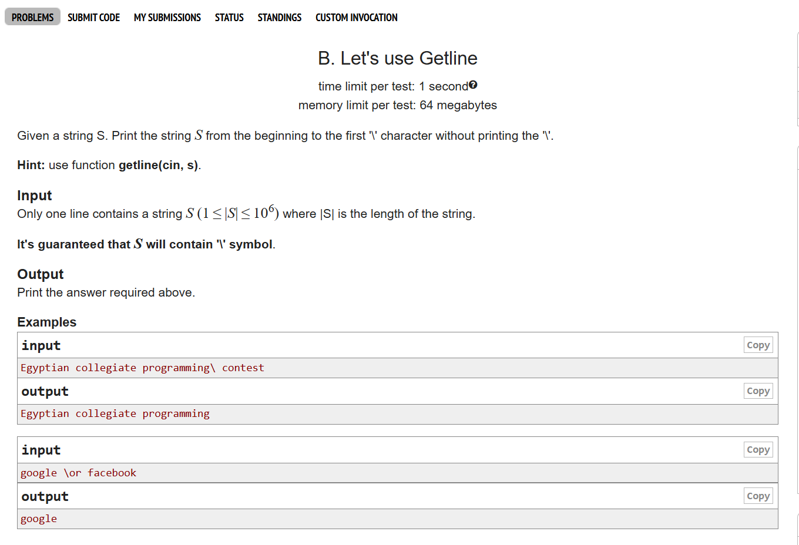
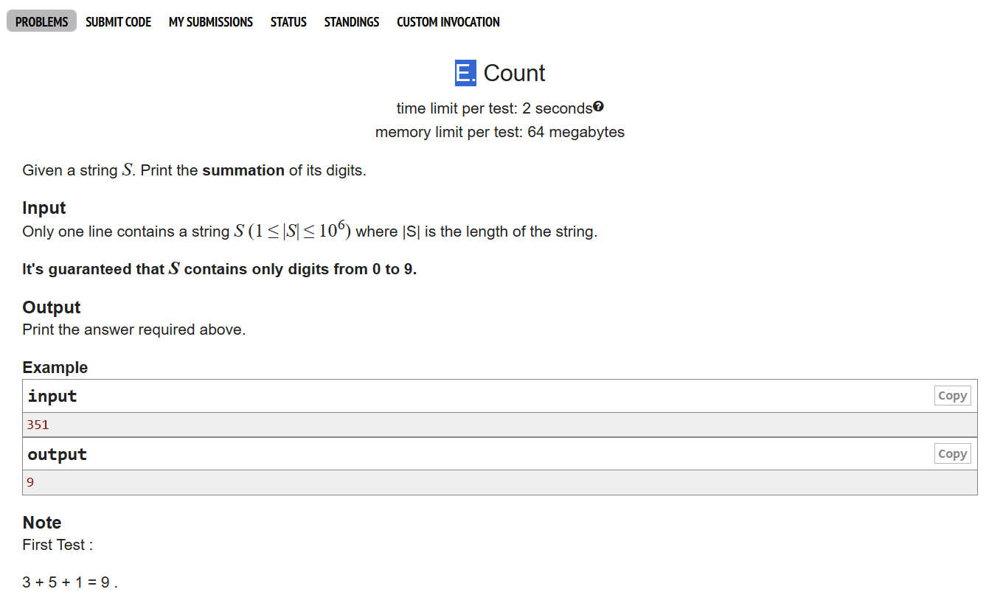

# Date: 20 April, 2025 - Sunday

## Topics:
- Text Instructions
0. Introduction
1. What is string Animated
2. What is string
3. String input and output
4. Null character
5. String input with space
6. String input Animated
7. String initialization
8. String initialization Animated
9. Length of a string
10. Length of a string Animated
11. Length of a string using strlen
12. Lets use getline
13. Count
14. Summary
- Quiz: Module 10
- Extra practice problem and quiz explanation module 10
- Feedback form module 10

## Text Instructions
- [মডিউলের প্রবলেম লিংক-](https://docs.google.com/document/d/1fPnGTrZ_zKMtYs52WO7bNyG7vAdZdQaTBW6N5wPu-Qs/edit?usp=sharing)
- মডিউল রিলেটেড তোমার যে কোন ফিডব্যাক থাকলে এই ফর্মে লিখে দিতে পারো। আমরা তোমার ফিডব্যাক গুরুত্বসহকার দেখব। [Feedback Form:](https://forms.gle/DH5mjuGD1x2EZ4z29)

## 0. Introduction
- What is string?
    - String is a character array
- String input and output
- Length of a string
- Problem solving with strings

## 1. What is string Animated
- String is character type of array
- `char a[5];` - `a = {'a', 'B', '{', ',' '#'};`
- index are same. 0 to start.

## 2. What is string
- Program: `string.c`
- Character string space give to 1 index.
- `%d %lld %f %lf` they are do not give to space`-`
- `%c` are give in to space in index.
- Space is a character value.

## 3. String input and output
- Program: `string_input.c`
- When `%s` character find the null (0) then they have stop.
- Like `a[7]`. `[Hello` - `0, 1, 2, 3, 4`] Hello have 4 index. `[5, 6]` They are `5` is a null value and `6` is a garbage value.
- Null character ASCII value is `0`.

## 4. Null character
- Program: `null_character.c`
- String means every string end have a null character
- String have a space then they are stop are print. `Dipu Ray` they are print to `Dipu` then they are not print. Because they find out the space.

## 5. String input with space
- Program: `string_space.c`
- Two ways to print including space
    - `gets()`
    - `fgets()` - [This is standard]
- If `gets()` and `fgets()` not working then you can add a header file `#include <string.h>`. Then can run easily.
- `gets()` and `fgets()` user input have any `enter` then they are stop the printing. But they can give into input `enter`.
- `scanf()`: if there are no space in string then we are use to scanf() function.
- `fgets()`: If there have space in string then we are use to fgets() function.

## 6. String input Animated
- Explanation with `scanf()` and `fgets()` string input.

## 7. String initialization
- Program: `str_initialize.c`

## 8. String initialization Animated
- Explanation string initialization with video

## 9. Length of a string
- Program: `string_length.c`

## 10. Length of a string Animated
- Explanation this program `string_length.c` in video

## 11. Length of a string using strlen
- Find the string length, have a build in function in c. `strlen()`
- Add to header file `#include <string.h>`

## 12. Lets use getline
- 
- Program: `problem_1.c`

## 13. Count
- 
- Program: `problem_2.c`

## 14. Summary
- Known to string and string basics.
- String super power.
- String one line print with `scanf("%s);`
- Whole array can print with string
- `""` can we are initialization
- Find out the string length or build in function
- String with 2 problem in codeforces:
    - Getline
    - Count