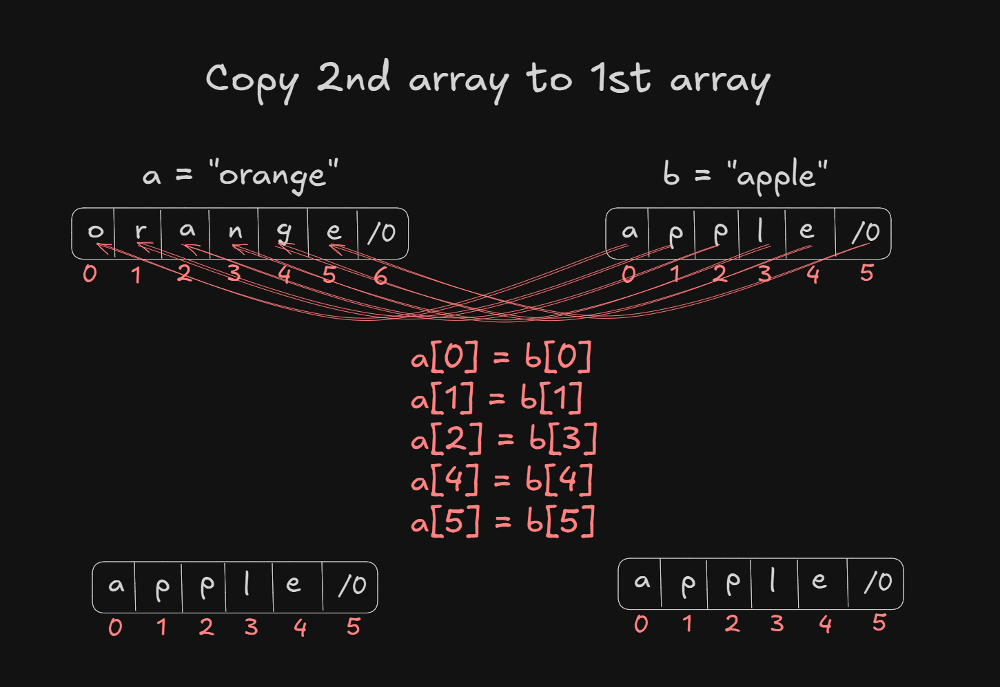
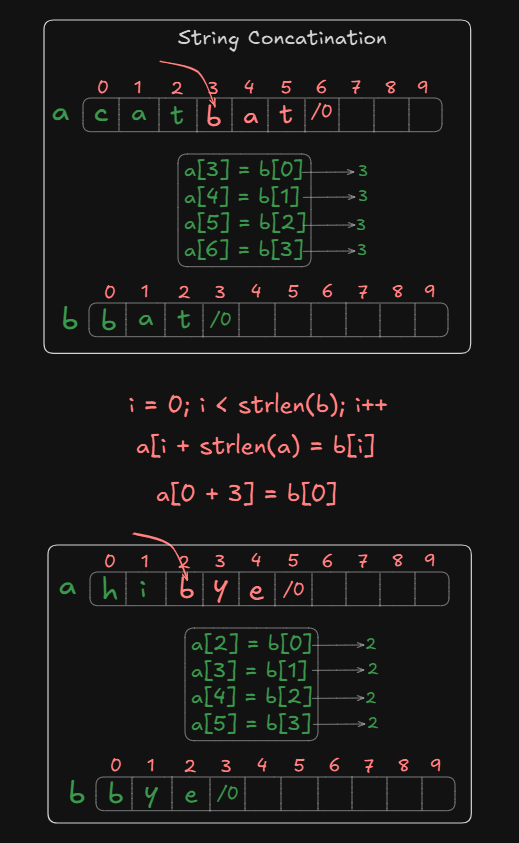
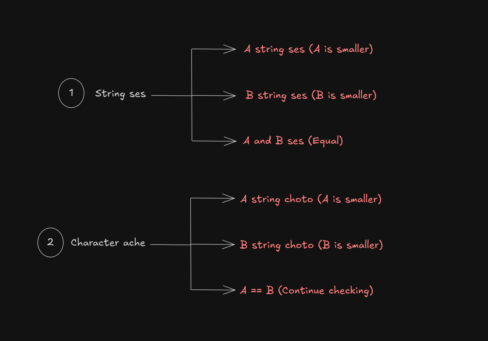

# Date: 22 April, 2025 - Tuesday

## Topics:
0. Introduction
1. String copy
2. String copy Animated
3. String copy using strcpy
4. String concat( I+II)
5. String concat Animated
6. String concat with strcat
7. What is lexicographical comparison
8. String compare
9. String compare Animated
10. String compare using strcmp
11. Summary
- Quiz: Module 11
- Extra Practice Problem and Quiz Explanation Module 11
- Feedback Form Module 11

## 0. Introduction
- String Operations
    - String copy
    - String concatination
    - String compare

## 1. String copy
- Program: `string_copy.c`
- The logic build image:
    
- `a[i] = b[i]`
- Call this function `strlen()` then you will add a header file name is `#include <string.h>`

## 2. String copy Animated
- Explanation this `string_copy.c` program.

## 3. String copy using strcpy
- Program: `string_copy2.c`
- This is build in functions `strcpy`
- Where put = `a` and Which do = `b`.
- Build in function can do whole array print not a single or 2 index array. Therefore, need to build your own logic. Then you can `everything`.

## 4. String concat( I+II)
- Program: `string_concat.c`
- The logic build image:
    
- Concat mean two array summation. Like `a + b`

## 5. String concat Animated
- Explanation this `string_concat.c` program.

## 6. String concat with strcat
- Program: `string_concat2.c`
- This is build in functions `strcat`
- Where put = `a` and Which do = `b`.

## 7. What is lexicographical comparison
- Which one bigger array from two array. With this comparison name is `lexicographical comparison`
- Alphabet wise compare or dictionary wise to compare.
- Example: Which one bigger `apple` or `cat` = `cat`. Because of dictionary wise comparison.
Example 2: Which one bigger `apple` or `apply` = `apply`. Because of dictionary wise comparison.

## 8. String compare
- Program: `string_comparison.c`
- Examples:
    - `apple` < `apply`
    - `bat` < `cat`
    - `abd` > `abc`
    - `abcd` > `ab`
    - `ba` < `bad`
- What will see in comparison:
    
- Example analysis, question analysis and login build are make it `80%`. Code are `20%`.
- `True` or `False` use then you will add you header file `#include <stdbool.h>`

## 9. String compare Animated
- Explanation this `string_comparison.c` program.

## 10. String compare using strcmp
- Program: `string_comparison2.c`
- This is build in functions `strcmp`
- Where put = `a` and Which do = `b`.
- 1st string are small then show to `-1`
- 2nd string are small then show to `1`
- Both strings are same or equal then show to `0`

## 11. Summary
- 3 type of strings operations:
    - How to strings copy
    - How to strings concat
    - How to strings compare
- Operations understand with drawing and build logics. Then this logic build implement with coding or programming. 
- 3 type of strings operations build in functions: `strcpy` `strcat` and `strcmp`.
- Build logic and code implementations

## Quiz: Module 11
- `Total Questions: 10`
- `Total Marks: 10`

## Quiz Explanation Module 11
- [Quiz Explanation Link](https://docs.google.com/document/d/1kRjmpWP0k6XqvZMiAhuRPi-tVOCLaQcql8eJYBmAMy8/edit?usp=sharing)
#### 1. What is the function to copy one string to another in C programming?
**a)** strcpy() ✅  
**b)** memcpy()   
**c)** copy()  
**d)** None of the above  
> **Explanation:** strcpy() এর মাধ্যমে আমরা দুটি স্ট্রিং এর একটি কে অপর টিতে কপি করে রাখতে পারি।
---
#### 2. What is lexicographical comparison of strings in C programming?
**a)** Checking if two strings have the same number of characters.   
**b)** Comparing strings alphabetically using character-by-character comparison. ✅   
**c)** Comparing strings by converting each character to binary.   
> **Explanation:** Dictionary / lexicographical order এ একটি স্ট্রিং এর সাথে অপরটি কম্পারিজন করা হয় ক্যারেক্টার বাই ক্যারেক্টার। কোনো ক্যারেক্টার অর্ডার আগে পরে থাকলে এর উপর স্ট্রিং lexicographically কম্পারিজন করে থাকে।
---
#### 3. What is the function to compare two strings lexicographically in C programming?
**a)** strcmp() ✅  
**b)** memcmp()   
**c)** strncmp()  
**d)** None of the above  
> **Explanation:** দুটি স্ট্রিং কে lexicographical comparison করার স্টিং এর strcmp() এই বিল্ট ইন ফাংশন টি ব্যবহার করা হয়।
---
#### 4. What does the strcmp() function return when the first string is greater than the second string?
**a)** Positive value ✅  
**b)** 0   
**c)** Negative value  
**d)** None of the above  
> **Explanation:** দুটি স্ট্রিং এর প্রথম টি অপরটি হতে lexicographically বড় হলে strcmp() ফাংশন টি একটি পজিটিভ ভ্যালু রিটার্ন করে যা আমরা মডিউলের 11-10 String compare using strcmp অংশে জেনেছি।
---
#### 5. What does the strcmp() function return when the first string is smaller than the second string?
**a)** Positive value   
**b)** 0   
**c)** Negative value ✅  
**d)** None of the above  
> **Explanation:** দুটি স্ট্রিং এর প্রথম টি অপরটি হতে lexicographically ছোট হলে strcmp() ফাংশন টি একটি নেগেটিভ ভ্যালু রিটার্ন করে যা আমরা মডিউলের 11-10 String compare using strcmp অংশে জেনেছি।
---
#### 6. What does the strcmp() function return when both the strings are equal?
**a)** Positive value   
**b)** 0 ✅   
**c)** Negative value   
**d)** None of the above  
> **Explanation:** দুটি স্ট্রিং যদি পরস্পর সমান হয়ে সেক্ষেত্রে strcmp() ফাংশন টি  ভ্যালু হিসেবে ০ রিটার্ন করে যা আমরা মডিউলের 11-10 String compare using strcmp অংশে জেনেছি।
---
#### 7. What is the function to concatenate two strings in C programming?
**a)** strcat() ✅   
**b)** strncat()    
**c)** strccat()   
**d)** None of the above  
> **Explanation:** দুটি স্ট্রিং এর একটির সাথে অপরটি যুক্ত করার জন্য স্ট্রিং এর strcat() বিল্টইন ফাংশন টি ব্যবহৃত হয় যা মডিউলে দেখানো হয়েছে।
---
#### 8. What is string concatenation in C programming?
**a)** Adding two integers    
**b)** Adding two strings ✅    
**c)** Subtracting two strings   
**d)** None of the above  
> **Explanation:** দুটি স্ট্রিং এর একটির সাথে অপরটি যুক্ত করাকে স্ট্রিং concatanation বলা হয়।
---
#### 9. What is the first argument ( the thing we pass in the function) of the strcat() function in C programming?
**a)** The destination string ✅    
**b)** The source string     
**c)** The number of characters to concatenate   
**d)** None of the above  
> **Explanation:** দুটি স্ট্রিং এর একটির সাথে অপরটি করার জন্য আমরা strcat() ফাংশনের প্রথম আরগুমেন্ট হিসেবে ঐ স্ট্রিং কে দিবো যার মধ্যে আমরা অপর স্ট্রিং কে রাখতে চাচ্ছি। বিস্তারিত জানতে 11-6 String concat with strcat এই মডিউল টি দেখুন।
---
#### 10. How to initialize an array of integers with integer 0?
**a)** int ar[size] = {0}; ✅    
**b)** int ar[size] = 0;     
**c)** int ar[size];   
**d)** int ar[size] = {‘0’};  
> **Explanation:** এটি একটি previous quiz. যা array এর মডিউলে দেখানো হয়েছে। এইভাবে আমরা একটি array ডিক্লেয়ার করে তার প্রত্যেকটি ইন্ডেক্স ০ দিয়ে ইনিশিয়ালাইজ করতে পারি।
---