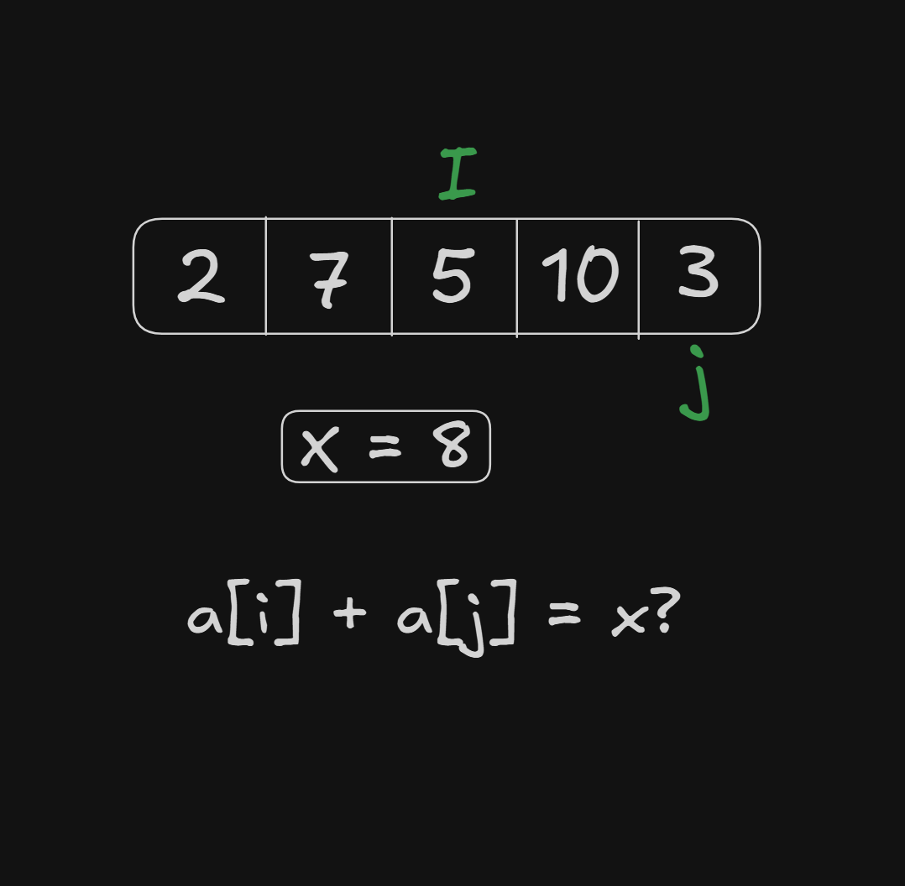
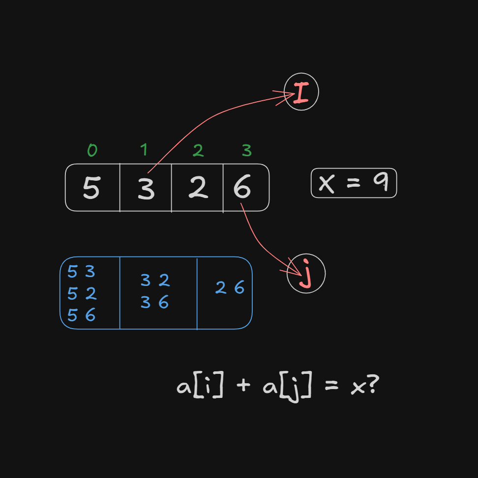

# Date: 03 May, 2025 - Saturday

## Topics:
- Text Instructions Module 13
0. Introduction
1. Star Pattern 1
2. Star Pattern 2
3. Pyramid Pattern
4. More Pattern
5. Sum of 2 values equal X Animation
6. Sum of 2 values equal x
7. Flag variable
8. Selection sort Animated
9. Selection sort
10. Summary
- Quiz: Module 13
- Extra Practice Problem and Quiz Explanation Module 13
- Feedback Form Module 13

## Text Instructions Module 13
- Welcome to the Module 13 of week 04.

## 0. Introduction
- Practice to nested loop and how they work.
- Make pattern with nested loop. Like- star pattern, pyramid pattern etc.
- How think a pattern how to build a pattern with code.
- Some problem solving with nested loop.
- Using nested loop with shorting algorithms

## 1. Star Pattern 1
- Program: `star_pattern.c`

## 2. Star Pattern 2
- Program: `star_pattern2.c`

## 3. Pyramid Pattern
- Program: `pyramid_pattern.c`

## 4. More Pattern
- Program: `pattern4.c`
- Program: `pattern5.c`

## 5. Sum of 2 values equal X Animation
- Any two values summation can equal to x value.
- Example: `a[i] + a[j] = x?`
- 

## 6. Sum of 2 values equal x
- Program: `main.c`
- 