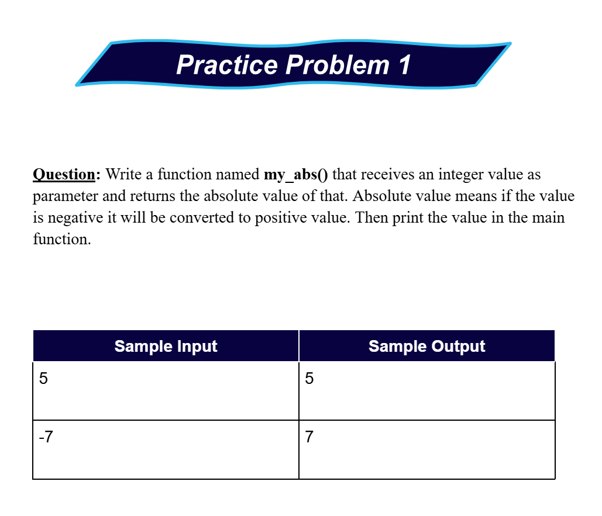
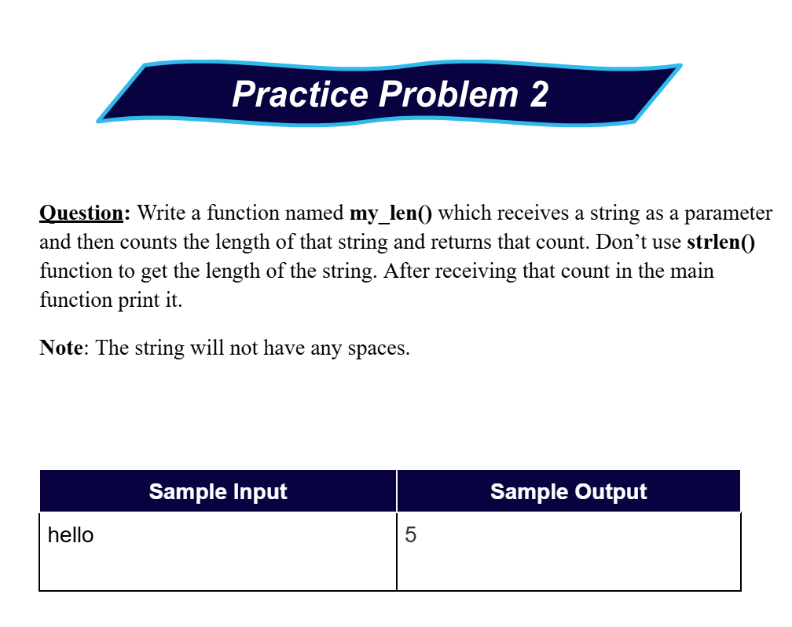
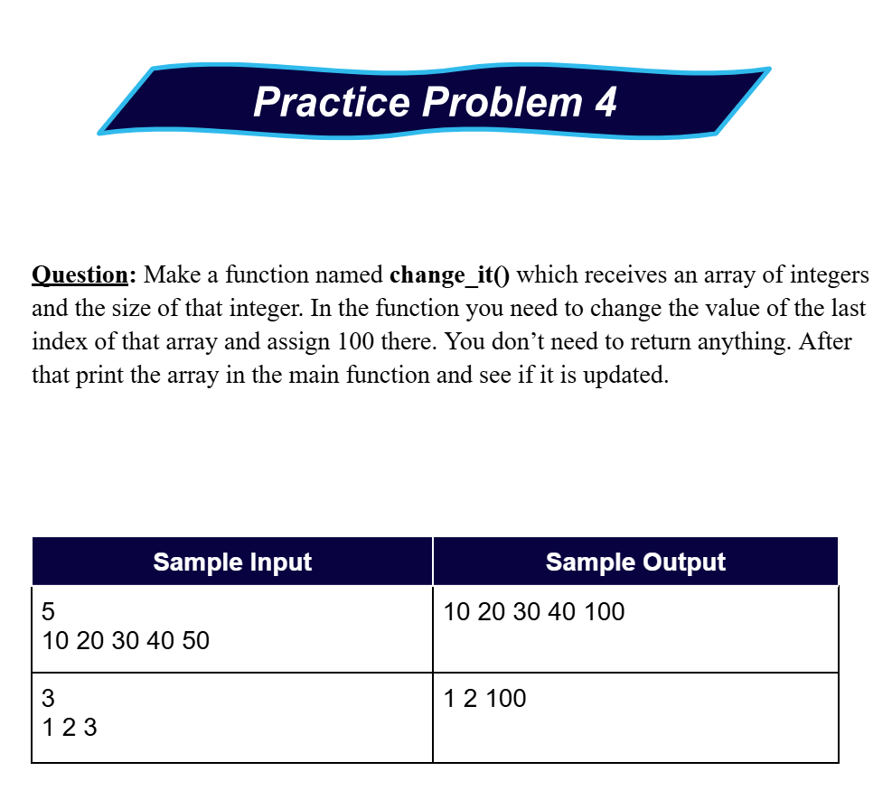

# Date: 07 May, 2025 - Wednesday

## Topics:
- Practice Problem Module 15.5
- Practice Instructions

## Practice Problem Module 15.5
- [Practice Problem Set :](https://docs.google.com/document/d/1xhF5KOCzEu-6HGqsW6X1BFTUpIUekQCZ/edit?tab=t.0)
- Topics:
    - Pointer and Functions
    - Sorting
- [Problem 1](https://codeforces.com/group/MWSDmqGsZm/contest/223205/problem/A)
- [Problem 2](https://codeforces.com/group/MWSDmqGsZm/contest/223205/problem/B)
- [Problem 3](https://codeforces.com/group/MWSDmqGsZm/contest/223205/problem/G)
- [Problem 4](https://codeforces.com/group/MWSDmqGsZm/contest/219158/problem/T)
- More practice problems:
    - 
    - 
    - 
    - 
    - 

## Practice Instructions
- Explanations extra practice problems and more practice problems.