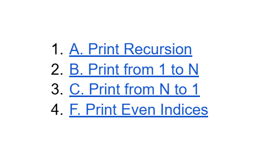

# Date: 10 May, 2025 - Saturday

## Topics:
0. Introduction
1. Call stack
2. What is recursion
3. Recursion Animated
4. Print from 1 to N using recursion
5. Print from 1 to N using recursion Animated
6. Print from N to 1 using recursion
7. Print from N to 1 in reverse way
8. Print from N to 1 using recursion Animated
9. Printing an array using recursion
10. Printing an array using recursion Animated
11. Summary
- Quiz: Module 17
- Extra Practice Problem and Quiz Explanation Module 17
- Feedback Form Module 17

## 0. Introduction
- Understanding Recursion: The Art's of Self-Reference
- The Call Stack Explained
- Recursion Fundamentals
- Printing 1 to 5 Using Recursion
- Printing 5 to 1 Using Recursion
- Printing Array Elements Recursively

## 1. Call stack
- Program: `call_stack.c`
- The topic of stack.
- Example: stack of chair.

## 2. What is recursion
- Program: `recursion.c`
- What is recursion?
    - A function is calling itself.
- When storage are fulled then call the `stack overflow`

## 3. Recursion Animated
- Explanation the `recursion.c` program.

## 4. Print from 1 to N using recursion
- Program: `1_5.c`

## 5. Print from 1 to N using recursion Animated
- Explanation the `1_5.c` program.

## 6. Print from N to 1 using recursion
- Program: `5_1.c`

## 7. Print from N to 1 in reverse way
- Program: `reverse_way.c`

## 8. Print from N to 1 using recursion Animated
- Explanation the `reverse_way.c` program.

## 9. Printing an array using recursion
- Program: `recursion_array.c`

## 10. Printing an array using recursion Animated
- Explanation the `recursion_array.c` program.

## 11. Summary
- Known to recursion
- Known to call stack
- Understand to recursion
- Print 1 to 5 with recursive function
- Print 5 to 1 with recursive function
- Print an array with recursion

## Quiz: Module 17
- `Total Questions: 10`
- `Total Marks: 10`

## Quiz Explanation Module 17
- [Quiz Explanation Link](https://docs.google.com/document/d/1y-o0TJCf3SYAhxVpx-IUh2N9MHH3DShMyHpF8lDVAwc/edit?usp=sharing)
#### 1. What will be the output of the following C code?
```
#include <stdio.h>

void gello() {
    printf("Gello ");
}

void hello() {
    gello();
    printf("Hello ");
}

int main() {
    printf("Main ");
    hello();
}
```
**a)** Main Hello Gello   
**b)** Main Gello   
**c)** Main Gello Hello ✅  
**d)** Main Hello  
> **Explanation:** প্রথমে main() ফাংশন থেকে "Main " প্রিন্ট হয়। তারপর hello() কল হয়, যা gello() ফাংশন কে কল করে, gello() ফাংশন থেকে "Gello " প্রিন্ট করে। পরে gello() ফাংশন থেকে রিটার্ন করে hello() ফাংশন থেকে "Hello " প্রিন্ট হয়। সুতরাং আউটপুট হবে Main Gello Hello।
---
#### 2. “A function is calling itself” What does this process called?
**a)** Call by value.   
**b)** Call by name.   
**c)** Recursion. ✅  
**d)** Call by reference.  
> **Explanation:** যখন কোনো ফাংশন নিজেকে নিজেই কল করে, তখন সেই প্রক্রিয়াকে রিকার্শন (Recursion) বলে। এটি একটি লুপের মতো কাজ করে এবং একটি বেস কেসের মাধ্যমে থামে।
---
#### 3. What will be the problem if we run this code?
```
#include <stdio.h>

void fun() {
    printf("fun\n");
    fun();
}

int main() {
    fun();
}
```
**a)** Syntax error.   
**b)** Compilation error.   
**c)** Infinite Recursion. ✅  
**d)** Both a and b.  
> **Explanation:** এই কোডে fun() ফাংশন বারবার নিজেকে কল করে কোনো Base Case ছাড়াই, যার ফলে এটি ইনফিনিট রিকার্শনে (Infinite Recursion) চলতে থাকে।
---
#### 4. What will be the output, if we run this code?
```
#include <stdio.h>

void fun() {
    printf("fun\n");
}

int main() {
    fun();
}
```
**a)** Syntax error.  
**b)** Compilation error.   
**c)** fun ✅  
**d)** No Output.  
> **Explanation:** এই কোডে main() ফাংশন fun() কে কল করে, যা "fun" প্রিন্ট করে। কোনো সিনট্যাক্স বা কম্পাইলেশন এরর নেই, তাই আউটপুট হবে শুধু fun।
---
#### 5. What will be the output of the following C code?
```
#include <stdio.h>

void f2() {
    printf("f1 ");
}

void f1() {
    printf("f2 ");
    f2();
}

int main() {
    printf("Main ");
    f1();
}
```
**a)** Main f1 f2  
**b)** Main f2 f1 ✅  
**c)** Main   
**d)** No Output  
> **Explanation:** প্রথমে main() থেকে "Main " প্রিন্ট হয়। তারপর f1() কল হয়, যা "f2 " প্রিন্ট করে এবং f1() ফাংশনের ভিতরে f2() কল করে যা "f1 " প্রিন্ট করে। সুতরাং আউটপুট হবে: Main f2 f1।
---
#### 6. Recursion is similar but not exact to which of the following?
**a)** If-else  
**b)** loop ✅  
**c)** Both of the above   
**d)** None of the above  
> **Explanation:** রিকার্শন এবং লুপ উভয়ই পুনরাবৃত্তিমূলক কাজ করে, তবে রিকার্শন ফাংশন কল ব্যবহার করে, আর লুপ কন্ডিশন চেক করে। এদের কাজের ধারণা একই রকম, কিন্তু ইমপ্লিমেন্টেশন ভিন্ন। তাই রিকার্শন লুপের মতো, কিন্তু হুবহু এক নয়।
---
#### 7. Can you print from N to 1 and 1 to N using recursion?
**a)** Yes ✅  
**b)** No   
> **Explanation:** রিকার্শন ব্যবহার করে N থেকে 1 এবং 1 থেকে N প্রিন্ট করা সম্ভব। (যা মডিউলে ভালোভাবে বুঝানো হয়েছে)।
---
#### 8. A recursive function must always have a base case to prevent infinite recursion.
**a)** False   
**b)** True ✅   
> **Explanation:** বেস কেস ছাড়া ফাংশন নিজেকে infinite times কল করতে থাকবে, ফলে স্ট্যাক ওভারফ্লো (Stack Overflow) এরর হবে এবং প্রোগ্রাম ক্র্যাশ করবে। তাই, একটি রিকার্শন ফাংশনে অবশ্যই একটি বেস কেস (Base Case) থাকা প্রয়োজন, যাতে রিকার্শন stop হয়।
---
#### 9. In recursion, the condition for which the function will stop calling itself is?
**a)** Best case   
**b)** Worse case    
**c)** Base case ✅    
**d)** Nothing    
> **Explanation:** রিকার্শনে ফাংশন নিজেকে কল করা বন্ধ করার শর্তকে বেস কেস (Base Case) বলে।
---
#### 10. A base case is not necessary for a recursive function to work correctly.
**a)** True   
**b)** False ✅   
> **Explanation:** বেস কেস (Base Case) ছাড়া রিকার্শন ফাংশন সঠিকভাবে কাজ করতে পারে না। কারণ বেস কেসই রিকার্শনকে থামানোর শর্ত দেয়। এটি না থাকলে ফাংশন নিজেকে অসীমভাবে (infinitely) কল করতে থাকবে। সুতরাং, এই কুইজের উত্তর False হবে।
---

## Extra Practice Problem (Optional):
- [Extra Practice Problem Link](https://docs.google.com/document/d/1Tz47Ov10x7l5d7IIAs4w_fCVVPl11koa4db8FSzcngU/edit?usp=sharing)
- [Problem 1](https://codeforces.com/group/MWSDmqGsZm/contest/223339/problem/A)
- [Problem 2](https://codeforces.com/group/MWSDmqGsZm/contest/223339/problem/B)
- [Problem 3](https://codeforces.com/group/MWSDmqGsZm/contest/223339/problem/C)
- [Problem 4](https://codeforces.com/group/MWSDmqGsZm/contest/223339/problem/F)
- 

## Feedback Form Module 17
- মডিউল রিলেটেড তোমার যে কোন ফিডব্যাক থাকলে এই ফর্মে লিখে দিতে পারো। আমরা তোমার ফিডব্যাক গুরুত্বসহকার দেখব।
- [Form Links](https://forms.gle/DH5mjuGD1x2EZ4z29)