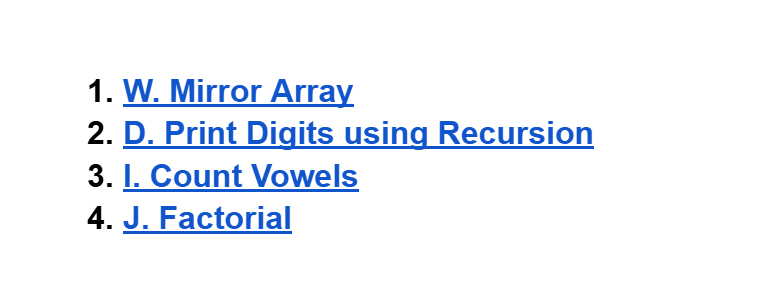

# Date: 13 May, 2025 - Tuesday

## Topics:
- Text Instructions: Module 19 [Must Read]
1. Mirror Array
2. Print digits using recursion
3. Count length of a string using recursion
4. Count vowels
5. Factorial
- Extra Practice Problem Module 19
- Feedback Form Module 19

## Text Instructions: Module 19 [Must Read]
- [মডিউলের প্রবলেম লিংক -](https://docs.google.com/document/d/1xToszvGxaImhClKvkx4vpnhfXW6icqXkVL66D3hSNA8/edit?usp=sharing)
- 
- The Problems:
    - [Problem 1](https://codeforces.com/group/MWSDmqGsZm/contest/219774/problem/W)
    - [Problem 2](https://codeforces.com/group/MWSDmqGsZm/contest/223339/problem/D)
    - [Problem 3](https://codeforces.com/group/MWSDmqGsZm/contest/223339/problem/I)
    - [Problem 4](https://codeforces.com/group/MWSDmqGsZm/contest/223339/problem/J)
- মডিউল রিলেটেড তোমার যে কোন ফিডব্যাক থাকলে এই ফর্মে লিখে দিতে পারো। আমরা তোমার ফিডব্যাক গুরুত্বসহকার দেখব।
- [Feedback Form:](https://forms.gle/DH5mjuGD1x2EZ4z29)

## 1. Mirror Array
- Program: `mirror_array.c`

## 2. Print digits using recursion
- Program: `digit_recursion.c`

## 3. Count length of a string using recursion
- Program: `count_vowel.c`
- Not finished to the program.
- `[Same Program]`

## 4 Count vowels
- Program: `count_vowel2.c`
- Finished to the program.
- `[Same Program]`

## 5. Factorial
- Program: `factorial_recursion.c`

## Extra Practice Problem Module 19
- [Extra Practice Problem (Optional):](https://docs.google.com/document/d/1rN0SXUPf5kpXejNKsy9b1mH8velf7IC0tFdUJwu1hOA/edit?usp=sharing)
- 
- The problems:
    - [Problem 1](https://codeforces.com/group/MWSDmqGsZm/contest/223339/problem/K)
    - [Problem 2](https://codeforces.com/group/MWSDmqGsZm/contest/223339/problem/L)
    - [Problem 3](https://codeforces.com/group/MWSDmqGsZm/contest/223206/problem/J)
    - [Problem 4](https://codeforces.com/group/MWSDmqGsZm/contest/223206/problem/B)

## Feedback Form Module 19
- মডিউল রিলেটেড তোমার যে কোন ফিডব্যাক থাকলে এই ফর্মে লিখে দিতে পারো। আমরা তোমার ফিডব্যাক গুরুত্বসহকার দেখব।
- [Form Links](https://forms.gle/DH5mjuGD1x2EZ4z29)