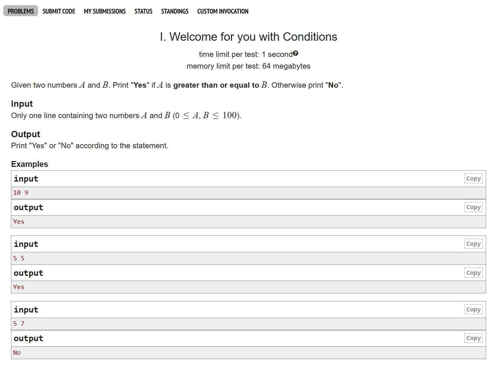

# Date: 12 April, 2025 - Saturday

## Topics:
- Text Instruction: Module 5 [Must Read]
0. Introduction
1. Welcome for you with conditions
2. Multiples
3. First Digit
4. ASCII value
5. Char
6. Capital or small or digit
7. Max and min
8. Summary
- Quiz: Module 05
- Extra Practice Problem and Quiz Explanation Module 05
- Feedback Form Module 05

## Text Instruction: Module 5 [Must Read]
- বাহ, চমৎকার!! তোমরা একটা উইক শেষ করে ফেলছো। শেষের উইকে একসাথে অনেকগুলো টপিক শিখেছো, যেগুলোর কয়েকটা এই উইকে তোমাদের মাথায় এগুলো আরো ভালোভাবে সেট হয়ে যায়। আজ রিলিজ হচ্ছে মডিউল ৫। এই উইকের প্রথম মডিউল।
- মনোযোগ দিয়ে আজকের মডিউলের প্রতিটি জিনিস দেখবা। কোথায় কিভাবে কেন এই জিনিসটা ইউস হচ্ছে সেটা বুঝে নিবা এবং বেশী বেশী প্র্যাক্টিস করবা।
- প্রতি উইকের শুরুতে গোল সেট করে নিবা। এই উইকের মডিউল গুলো যেন ঠিক সময়ে শেষ করতে পারো। আগের থেকে বেশী যেন প্র্যাক্টিস করা হয় এবং কোন টপিক না বুঝে এড়িয়ে যাওয়া যাবেনা। আমাদের কোর্সে আমরা যতো কিছুই করিনা কেন মেইন জিনিস হচ্ছে তোমার পরিশ্রম, চেষ্টা এবং শেষ পর্যন্ত লেগে থাকার মানুষিকতা। এই তিনটা জিনিস যদি তোমার মধ্যে থাকে তাহলে তুমি জীবনে অনেক বড় কিছু হবা ইনশাআল্লাহ।
- [মডিউলের প্রবলেম লিংক-](https://docs.google.com/document/d/1XHI_I6WCOtIKDvKOagV7zkLVPh4iJxogBdYk2w0Eiyg/edit?usp=sharing)
- মডিউল রিলেটেড তোমার যে কোন ফিডব্যাক থাকলে এই ফর্মে লিখে দিতে পারো। আমরা তোমার ফিডব্যাক গুরুত্বসহকার দেখব।
- [Feedback Form:](https://forms.gle/DH5mjuGD1x2EZ4z29)

## 0. Introduction
- There have 6 (six) problems. This problem was practice perpose. Website - `Codeforces`
    - Problem 1: [I. Welcome for you with Conditions](https://codeforces.com/group/MWSDmqGsZm/contest/219158/problem/I)
    - Problem 2: [J. Multiples](https://codeforces.com/group/MWSDmqGsZm/contest/219158/problem/J)
    - Problem 3: [P. First digit](https://codeforces.com/group/MWSDmqGsZm/contest/219158/problem/P)
    - Problem 4: [N. Char](https://codeforces.com/group/MWSDmqGsZm/contest/219158/problem/N)
    - Problem 5: [M. Capital or Small or Digit](https://codeforces.com/group/MWSDmqGsZm/contest/219158/problem/M)
    - Problem 6: [K. Max and Min](https://codeforces.com/group/MWSDmqGsZm/contest/219158/problem/K)
- Problem solve to above all problems
- C programming structure shortcut
    - Copy c program structure and search to google: `snippet generator`
    - Go to the `snippet-generator.app` and click or select to VSCode the paste your code.
    - Then `copy snippet` and then back to VSCode.
    - Click on settings under go to `Snippet` then select for which language. Then click to `c.json`
    - Then paste your `copy snippet` on this `c.json` under. 
    - `copy snippet`:
        ```
            "1": {
                "prefix": "snippet",
                "body": [
                    "#include <stdio.h>",
                    "",
                    "int main() {",
                    "    $0",
                    "    return 0;",
                    "}",
                    ""
                ],
                "description": ""
            }
        ```
    - Then create a new file `main.c` and type to `snippet` then you will get a c program structure.

## 1. Welcome for you with conditions
- 
- Program: `problem_1.c`
- Explain and solve this c program

## 2. Multiples

- Program: `problem_2.c`
- Explain and solve this c program

## 3. First Digit

- Program: `problem_3.c`
- Explain and solve this c program

## 4. ASCII value
- Program: `.c`
- Each every character `(char)` has a value. They called are `ASCII value`.
- The full form of ASCII is `American Standard Code for Information Interchange`.
- Each every data can't store with a char. They are store to ASCII value.
- You can seach to google and see this `ASCII table`.

## 5. Char
- Program: `.c`
- Explain and solve this c program

## 6. Capital or small or digit
- Program: `.c`
- Explain and solve this c program

## 7. Max and min
- Program: `.c`
- Explain and solve this c program

## 8. Summary
- Solve this six problem.
- Then you have a time go to optional problem solving or extra problem solving and solve it.

## Quiz: Module 05
- `Total Questions: 10`
- `Total Marks: 10`

## 🧠 C Programming Multiple Choice Questions with Explanations

## Extra Practice Problem and Quiz Explanation Module 05

## Feedback Form Module 05